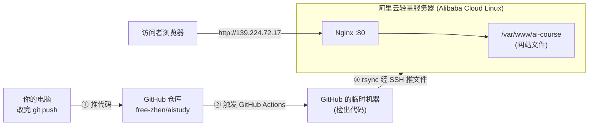

# 部署实战手册 · 把教程站发布到自己的服务器并自动更新

> 本文记录了把这套教程做成网站、部署到阿里云服务器、并实现「**push 代码就自动更新**」的完整过程，
> 同时科普沿途用到的每个东西（Nginx、rsync、SSH 密钥、GitHub Actions…）。
> 写给零运维基础的前端工程师，尽量用你熟悉的概念类比。

---

## 一、最终架构（一张图看懂）



**一句话**：你 `git push` → GitHub 自动把文件用 rsync 推到服务器目录 → Nginx 把这个目录当网站对外提供 → 别人就能访问。

> **关键设计**：为什么是「GitHub 推给服务器」而不是「服务器去 GitHub 拉」？
> 因为国内服务器**访问 github.com 很不稳定**（我们一开始用「服务器 git pull」就卡在连不上 GitHub）。
> 反过来让 GitHub 主动把文件推过来，服务器**全程不需要访问 GitHub**，在国内更可靠。

---

## 二、涉及的概念科普

| 名词 | 它是什么 | 前端类比 / 一句话 |
|------|---------|------------------|
| **服务器 / 轻量应用服务器** | 一台 24 小时开机、有公网 IP 的远程电脑 | 就是别人能访问到的"你的电脑" |
| **SSH** | 远程安全登录服务器的协议（端口 22） | 像给远程电脑开了一个加密的命令行终端 |
| **公钥 / 私钥** | 一对钥匙：私钥自己留着，公钥放服务器 | 私钥=你家钥匙，公钥=装在服务器门上的锁；有私钥才能开锁，**免密码登录** |
| **Nginx** | 一个 Web 服务器软件 | 把磁盘上的文件夹变成"能用网址访问的网站"；类似你本地 `python -m http.server`，但专业、稳定、对外 |
| **rsync** | 高效的文件同步工具 | 像"只传改动部分"的智能复制；比整包上传快，还能删掉服务器上已删除的文件 |
| **GitHub Actions** | GitHub 自带的自动化（CI/CD）流水线 | 类似前端的"提交后自动构建发布"；你 push 后它自动帮你干活 |
| **CI/CD** | 持续集成/持续部署 | "代码一变，自动测试/打包/上线"的统称 |
| **Docsify** | 一个零构建的文档网站工具 | 一个 `index.html` + 你的 Markdown，浏览器里实时渲染成网站，**不用打包编译** |
| **SELinux** | Linux 的强制安全模块 | 一个严格的"门卫"，没贴对标签的文件不让 Nginx 读（所以要 `chcon` 给文件贴标签） |
| **防火墙 / 安全组** | 控制哪些端口能被外网访问 | 像小区门禁；要"放行 80 端口"网站才进得来 |
| **环境变量 / Secret** | 存放密钥等敏感配置的地方 | GitHub Secrets 就是给流水线用的"保险箱"，不会出现在代码里 |

---

## 三、完整部署流程（实际走过的步骤）

### 前提
- 一台能 SSH 的服务器（本例：阿里云轻量应用服务器，系统 Alibaba Cloud Linux，公网 IP `139.224.72.17`）
- 代码已在 GitHub：`https://github.com/free-zhen/aistudy`（public 仓库）
- 本机 Windows，已装 git 和 OpenSSH

### 第 1 步：本机生成「部署专用」SSH 密钥
在自己电脑的 PowerShell：
```powershell
ssh-keygen -t ed25519 -C "github-deploy-aistudy" -f "$env:USERPROFILE\.ssh\deploy_key"
# passphrase 必须留空（自动化用，机器没法输密码）
```
生成 `deploy_key`（私钥）和 `deploy_key.pub`（公钥）。

### 第 2 步：把公钥装到服务器（让这把钥匙能登录）
登录服务器（阿里云用 Workbench 一键登录），把公钥写进 root：
```bash
sudo mkdir -p /root/.ssh
echo "你的 deploy_key.pub 内容" | sudo tee -a /root/.ssh/authorized_keys
sudo chmod 700 /root/.ssh && sudo chmod 600 /root/.ssh/authorized_keys
sudo chown -R root:root /root/.ssh
```
验证（回本机 PowerShell，应能免密进服务器）：
```powershell
ssh -i "$env:USERPROFILE\.ssh\deploy_key" root@139.224.72.17
```

### 第 3 步：把私钥和服务器信息存进 GitHub Secrets
仓库 → Settings → Secrets and variables → Actions → New repository secret，添加 3 个（**名字必须精确**）：

| Name | 值 |
|------|-----|
| `SERVER_HOST` | `139.224.72.17` |
| `SERVER_USER` | `root` |
| `SERVER_SSH_KEY` | `deploy_key` **私钥全文**（含 BEGIN/END 行） |

### 第 4 步：服务器装好 Nginx + rsync 并配好站点
```bash
sudo dnf install -y nginx rsync git          # 装软件（dnf 是 Alibaba Cloud Linux 的包管理器）
sudo mkdir -p /var/www/ai-course             # 网站目录（文件由 GitHub 推过来）

# 配置 Nginx 站点
sudo tee /etc/nginx/conf.d/ai-course.conf > /dev/null <<'EOF'
server {
    listen 80;
    server_name 139.224.72.17;
    root /var/www/ai-course;
    index index.html;
    location / { try_files $uri $uri/ /index.html; }
    location ~ /\. { deny all; }   # 禁止访问 .git/.env 等隐藏文件
}
EOF

sudo chcon -R -t httpd_sys_content_t /var/www/ai-course 2>/dev/null || true  # SELinux 贴标签
sudo nginx -t && sudo systemctl enable --now nginx && sudo systemctl reload nginx
```
再到**阿里云控制台**放行 **80 端口**（轻量服务器：服务器详情 → 防火墙 → 添加 HTTP/80；标准 ECS 是"安全组"）。

### 第 5 步：自动部署流水线（`.github/workflows/deploy.yml`）
这个文件已经在仓库里。核心逻辑：push 到 main 时，GitHub 检出代码 → rsync 推到服务器 → 修标签并重载 Nginx。
```yaml
on:
  push:
    branches: [main]      # 推 main 就触发
jobs:
  deploy:
    runs-on: ubuntu-latest
    steps:
      - uses: actions/checkout@v4                    # ① 在 GitHub 机器上拿到代码
      - uses: burnett01/rsync-deployments@7.0.1       # ② rsync 推到服务器
        with:
          switches: -avzr --delete --exclude='.git' --exclude='.github' --exclude='.workflow'
          path: ./
          remote_path: /var/www/ai-course/
          remote_host: ${{ secrets.SERVER_HOST }}
          remote_user: ${{ secrets.SERVER_USER }}
          remote_key: ${{ secrets.SERVER_SSH_KEY }}
      - uses: appleboy/ssh-action@v1.0.3              # ③ 修 SELinux 标签 + 重载 Nginx
        with:
          host: ${{ secrets.SERVER_HOST }}
          username: ${{ secrets.SERVER_USER }}
          key: ${{ secrets.SERVER_SSH_KEY }}
          script: |
            chcon -R -t httpd_sys_content_t /var/www/ai-course 2>/dev/null || true
            systemctl reload nginx 2>/dev/null || true
```

### 第 6 步：触发首次部署
GitHub 仓库 → Actions → 左侧 "Deploy to server" → "Run workflow"（或随便 push 一次）。绿勾后访问 `http://139.224.72.17`。

### 第 7 步：网站本体（Docsify）
根目录两个文件让 Markdown 变网站：
- `index.html`：引入 Docsify + Mermaid（画图）+ 搜索 + 代码复制；配了 `relativePath` 和 `alias` 让多级目录的侧边栏正常工作。
- `_sidebar.md`：左侧目录（用 `/chapters/...` 绝对路径，保证进入章节后目录不消失）。

---

## 四、日常使用：以后改教程只需 3 句话

```bash
git add .
git commit -m "docs: 更新xxx"
git push
```
push 完，GitHub Actions 自动把改动推到服务器，**十几秒后刷新网页就是最新的**，再也不用手动登录服务器。

---

## 五、我们踩过的坑 & 排错速查

| 现象 | 原因 | 解决 |
|------|------|------|
| 服务器 `git clone` 报 `Empty reply from server` | 国内服务器连不上 GitHub | 改用「GitHub 推给服务器」的 rsync 方案（本文架构） |
| 本机 `git push` 报 `Connection reset` / `RPC failed` | 跨境网络抖动 | 多重试几次；并设 `git config http.version HTTP/1.1`、`git config http.postBuffer 524288000` |
| `ssh` 报 `Permission denied (publickey)` | 公钥没正确写进服务器 `authorized_keys` | 重新追加公钥，确认 `grep -c` 能找到该 key |
| 网页 403 Forbidden | SELinux 拦了 Nginx 读文件 | `sudo chcon -R -t httpd_sys_content_t /var/www/ai-course` |
| 网页打不开（超时） | 80 端口没放行 | 阿里云防火墙/安全组放行 80 |
| 进入章节后左侧目录消失/卡加载 | Docsify `relativePath` 导致侧边栏路径找错 | `index.html` 加 `alias` 映射 + `_sidebar.md` 用绝对路径 |
| 改了内容但网页没变 | 浏览器缓存 | `Ctrl + F5` 强制刷新 |

---

## 六、安全要点

- **私钥**只放在你电脑和 GitHub Secrets，**绝不**提交进仓库、不发给任何人。
- 服务器只对外开放需要的端口（22、80，要 HTTPS 再加 443）。
- 因为 22 对公网开放，建议：**禁用密码登录（只用密钥）** + 装 `fail2ban` 防爆破。
  （你日常用阿里云 Workbench 一键登录走的是内网，不受影响。）
- 想要 `https://`：用 `certbot` 申请免费证书（`sudo dnf install certbot python3-certbot-nginx` 后 `sudo certbot --nginx`），需先有域名并解析到本机。

---

## 附：本项目关键文件清单

| 文件 | 作用 |
|------|------|
| `index.html` | Docsify 网站入口（渲染 Markdown） |
| `_sidebar.md` | 网站左侧目录 |
| `.nojekyll` | 让以后用 GitHub Pages 时不忽略 `_` 开头文件 |
| `.github/workflows/deploy.yml` | 自动部署流水线 |
| `.gitignore` | 防止 `.env` 等敏感文件被提交 |
| `chapters/`、`appendix/` | 教程正文 |

> 全部成本：**0 元额外开销**（GitHub Actions 对公开仓库免费，服务器你已有）。
