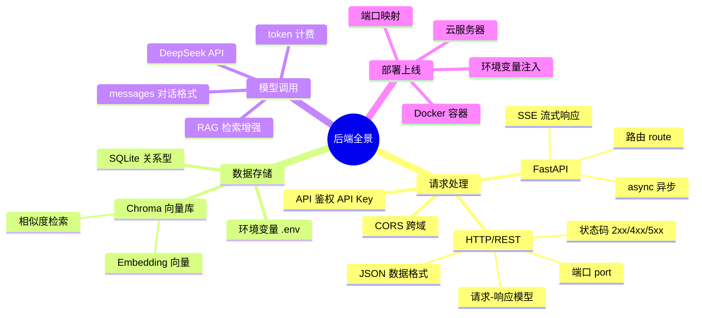
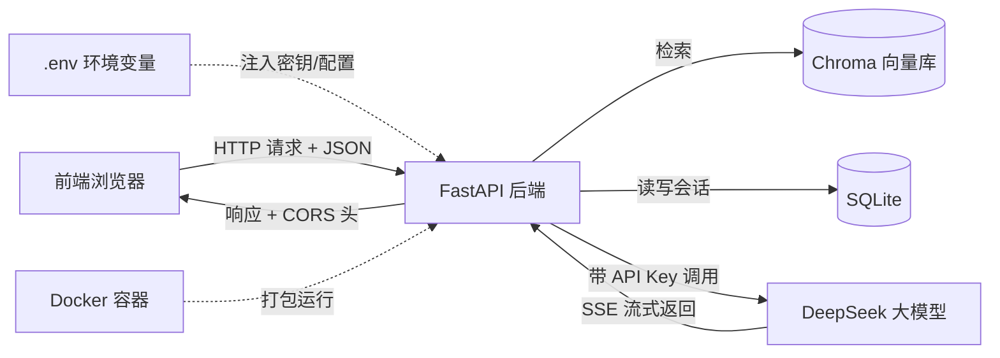

# 附录 · 后端知识地图与排错手册

> 这是一份**查阅型文档**，不用从头读到尾。
> 卡住时按现象查「排错手册」；想不起某个后端概念是哪章学的，查「知识地图」；忘了命令翻「常用命令备忘」。
> 全课穿插的后端知识，在这里统一收口。

---

## 一、后端知识地图（全景图）

前端的世界里，你写的代码跑在浏览器里、由用户的设备执行。后端的世界里，代码跑在**一台一直开着的服务器**上，通过网络对外提供服务。这门课的所有后端知识，都可以归到下面四组：



如果你更习惯看流程，下面这张图是一条「用户提问 → AI 回答」的请求在 RAG 系统里的完整旅程，每一站对应一组后端知识：



### 知识地图速查表

下表把全课涉及的每个后端概念，用一句话定位，并指向它出场的章节。

| 概念 | 一句话定位 | 在哪章学 |
|------|-----------|----------|
| **HTTP / REST** | 前后端之间通信的「协议」，规定了请求长什么样、怎么回 | [第 03 章](../chapters/03-backend-http-fastapi/README.md) |
| **请求-响应模型** | 后端永远是「被动」的：客户端发一个请求，服务器回一个响应 | [第 03 章](../chapters/03-backend-http-fastapi/README.md) |
| **状态码** | 响应里的一个数字，告诉你成功了还是哪种失败（200/401/404/500…） | [第 03 章](../chapters/03-backend-http-fastapi/README.md) |
| **JSON** | 前后端交换数据的通用格式，和你在 JS 里用的 `JSON` 一模一样 | [第 02 章](../chapters/02-first-llm-call/README.md) |
| **端口 (port)** | 一台机器上区分不同服务的「门牌号」，本地后端常用 `8000` | [第 03 章](../chapters/03-backend-http-fastapi/README.md) |
| **FastAPI 路由** | 把「某个 URL + 请求方法」绑定到一个 Python 函数，类似 Express 的 `app.get()` | [第 03 章](../chapters/03-backend-http-fastapi/README.md) |
| **async 异步** | Python 的 `async`/`await`，思路和 JS 的几乎一样，用于不阻塞地等待 IO | [第 03 章](../chapters/03-backend-http-fastapi/README.md) |
| **SSE 流式响应** | 让后端像打字机一样一段段把 AI 回答推给前端，而不是等全部生成完 | [第 04 章](../chapters/04-llm-backend-api/README.md) |
| **CORS 跨域** | 浏览器的安全机制：前端页面默认不能调「不同源」的后端，需后端显式放行 | [第 05 章](../chapters/05-frontend-integration/README.md) |
| **API 鉴权 (API Key)** | 调大模型时带在请求头里的付费凭证，证明「你是谁、你付费了」 | [第 00 章](../chapters/00-env-and-apikey/README.md) |
| **环境变量 / .env** | 把密钥、配置从代码里抽出来，放进一个不提交 Git 的文件 | [第 00 章](../chapters/00-env-and-apikey/README.md) |
| **SQLite** | 一个「一个文件就是一个数据库」的轻量关系型数据库，存多轮对话历史 | [第 07 章](../chapters/07-memory-and-persistence/README.md) |
| **Embedding (向量)** | 把一段文本变成一串数字（向量），让「语义相似」可以用数学计算 | [第 08 章](../chapters/08-embeddings/README.md) |
| **向量数据库 (Chroma)** | 专门存向量、并能「按语义找最相近的几条」的数据库 | [第 09 章](../chapters/09-vector-database/README.md) |
| **RAG** | 「先检索相关资料、再让大模型基于资料回答」的整套链路 | [第 10 章](../chapters/10-rag-fundamentals/README.md) |
| **messages / token** | 调大模型时的对话结构与计费单位（约等于字数） | [第 02 章](../chapters/02-first-llm-call/README.md) |
| **部署 / Docker** | 把后端打包成「到哪都能一键运行」的容器，放到云服务器上 | [第 13 章](../chapters/13-deployment/README.md) |

---

## 二、前端 → 后端术语对照表（速查）

学 Python 后端，你不是从零开始——你已经会的前端概念，几乎都能找到一一对应的「后端版本」。下面这张表是全课最值得贴在显示器边上的一张。

| 前端（你已经会） | 后端（Python 世界） | 说明 |
|------------------|---------------------|------|
| `npm` / `yarn` | `pip` | 包管理器：装第三方库 |
| `node_modules/` | **虚拟环境 (venv)** | 项目独立的依赖隔离空间 |
| `package.json` | `requirements.txt` | 声明项目依赖列表 |
| `npm install` | `pip install -r requirements.txt` | 按清单安装依赖 |
| `node app.js` | `python app.py` | 运行一个脚本 |
| **Node.js / Express** | **Python / FastAPI** | 运行时 + Web 框架 |
| `app.get('/x', fn)` | `@app.get('/x')` | 定义一个路由 |
| `req` / `res` | 函数参数 / `return` | 请求入参 / 响应出参 |
| `async/await` | `async/await` | 异步语法，几乎一模一样 |
| `JSON.parse` / `JSON.stringify` | 自动完成（FastAPI 帮你转） | JSON 序列化 |
| `console.log()` | `print()` | 打印调试 |
| `npx nodemon`（热重载） | `uvicorn ... --reload` | 改代码自动重启 |
| `localStorage` / `IndexedDB` | **SQLite / 数据库** | 持久化存储数据 |
| `fetch()` / `axios` | `requests` / `httpx`（HTTP 客户端） | 主动发起 HTTP 请求 |
| `.env`（前端构建注入） | `.env` + `python-dotenv` | 环境变量配置 |
| `try { } catch { }` | `try: ... except: ...` | 异常捕获 |
| `===` / `!==` | `==` / `!=` | 相等比较（Python 无 `===`） |
| `{ }` 代码块 | **缩进**（4 个空格） | Python 用缩进划分代码块 |
| `// 注释` | `# 注释` | 单行注释 |

> 一个心智模型：**前端开发 = 写「主动去请求别人」的代码；后端开发 = 写「等别人来请求我」的代码。** 这门课你两边都会写。

---

## 三、常见报错速查表（排错手册）

### 遇到报错先做三件事

在查下面的表之前，先养成这个习惯——90% 的问题靠这三步就能定位：

1. **看最后一行**。Python 的报错（traceback）从上往下越来越具体，**最后一行**才是真正的错误类型和原因，先读它。
2. **看状态码 / HTTP 信息**。如果是接口请求出错，看响应的状态码：`4xx` 是「你（客户端）的问题」，`5xx` 是「服务器的问题」。详见下面的状态码表。
3. **二分定位**。不确定哪段代码出错时，在中间加几个 `print()`，看程序跑到哪一步停了，把范围一刀切到一半。

### 状态码速查

| 状态码 | 含义 | 你该怀疑 |
|--------|------|----------|
| `200` | 成功 | 一切正常 |
| `400` | 请求格式错 | 发给后端的 JSON 字段不对 |
| `401` | 未授权 | API Key 错 / 没带 / 失效 |
| `402` | 需付费 | 账户余额不足 |
| `404` | 找不到 | URL 路径写错 / 路由没注册 |
| `422` | 参数校验失败 | FastAPI 收到的参数类型/字段不符 |
| `429` | 请求太频繁 | 触发限流，稍后再试 |
| `500` | 服务器内部错误 | 后端代码抛异常了，去看后端日志 |

---

### A. 环境 / 依赖 / venv 类

| 现象 | 原因 | 解决 |
|------|------|------|
| `python 不是内部或外部命令` | 安装时没勾 Add to PATH | 重装 Python 勾选该项；Mac 用户试 `python3` |
| `ModuleNotFoundError: No module named 'xxx'` | 没装这个库 / 装在了别的环境 | 先**确认 venv 已激活**（命令行前应有 `(venv)`），再 `pip install xxx` |
| `pip install` 后还是 `ModuleNotFoundError` | 装到了系统 Python，但运行用的是 venv（或反过来） | 用 `python -m pip install xxx` 保证装进当前解释器 |
| `pip` 下载极慢 / 超时 | 默认源在国外 | 换国内镜像：`pip install xxx -i https://pypi.tuna.tsinghua.edu.cn/simple` |
| `(venv)` 前缀消失了 | 换了终端窗口，venv 没激活 | 重新激活（见下方命令备忘） |
| `IndentationError: unexpected indent` | 缩进不一致（混用 Tab 和空格） | 全部统一为 **4 个空格**；VS Code 里把 Tab 设为空格 |
| `SyntaxError` | 漏了冒号 `:` / 括号没配对 | 看报错指的那一行，Python 的 `if/for/def` 后面都要 `:` |

### B. DeepSeek / API Key / 计费类

| 现象 | 原因 | 解决 |
|------|------|------|
| `401 Unauthorized` / `Authentication Fails` | Key 错、没读到、或已失效 | 检查 `.env` 里 `DEEPSEEK_API_KEY` 拼写；确认代码用了 `load_dotenv()`；必要时去后台重建 Key |
| `402` / `Insufficient Balance` | 账户余额不足 | 去 [DeepSeek 平台](https://platform.deepseek.com/) 充值（几块钱即可） |
| 读到的 Key 是 `None` | `.env` 不在运行目录 / 没调 `load_dotenv()` | 确认 `.env` 在项目根目录、文件名不是 `.env.txt`，且代码里先 `load_dotenv()` |
| `429 Too Many Requests` | 请求太频繁触发限流 | 降低调用频率，加重试/退避 |
| 模型名报错 / `Model Not Found` | `DEEPSEEK_MODEL` 写错 | 用 `deepseek-chat`（对照第 02 章） |
| `Connection Error` / 超时 | 网络不通 / `BASE_URL` 写错 | 检查网络；确认 `DEEPSEEK_BASE_URL=https://api.deepseek.com` |

### C. FastAPI / 端口 / 路由类

| 现象 | 原因 | 解决 |
|------|------|------|
| `Address already in use` / 端口被占用 | `8000` 端口已被另一个进程占着 | 关掉旧的 uvicorn；或换端口 `--port 8001`（见命令备忘的「查/杀占用端口」） |
| 访问接口 `404 Not Found` | URL 路径写错 / 路由没注册 | 核对路径大小写和前缀；打开 `http://127.0.0.1:8000/docs` 看实际有哪些接口 |
| `422 Unprocessable Entity` | 前端发的 JSON 字段/类型和后端模型对不上 | 看 `/docs` 里接口要求的字段，逐一核对 |
| 改了代码但没生效 | 没开热重载 | 启动时加 `--reload`，或手动重启 uvicorn |
| `uvicorn: command not found` | 没装 / venv 没激活 | 激活 venv 后 `pip install uvicorn`，或用 `python -m uvicorn` |

### D. CORS 跨域类

| 现象 | 原因 | 解决 |
|------|------|------|
| 浏览器控制台：`blocked by CORS policy` | 前端页面和后端不同源，后端没放行 | 在 FastAPI 里加 `CORSMiddleware` 并把前端地址加进 `allow_origins`（第 05 章） |
| `fetch` 报错但 Postman/curl 正常 | 正是 CORS：限制只发生在**浏览器**里 | 同上，问题在后端的 CORS 配置，不在前端代码 |
| 加了 CORS 还是报错 | `allow_origins` 写的地址和实际访问地址不一致（端口/协议/`localhost` vs `127.0.0.1`） | 让两边地址**完全一致**，或调试期临时用 `["*"]` |

### E. 流式（SSE）类

| 现象 | 原因 | 解决 |
|------|------|------|
| 前端拿到的是完整一坨，没有「打字机」效果 | 后端没返回流 / 前端没逐块读 | 后端用 `StreamingResponse`；前端用 `response.body.getReader()` 逐块读（第 04、05 章） |
| 流式中途断掉 / 不完整 | 中间有代理或缓冲 | 确认响应头不被缓冲；本地直连测试排除代理 |
| 收到的数据带 `data:` 前缀解析不出来 | 没按 SSE 格式解析 | 按 `data: {...}\n\n` 规则切分每一行（第 05 章） |

### F. SQLite 类

| 现象 | 原因 | 解决 |
|------|------|------|
| `no such table: xxx` | 表还没建 | 先执行建表 SQL（`CREATE TABLE IF NOT EXISTS ...`），第 07 章 |
| `database is locked` | 同一个 `.db` 被多处同时写 | 用完及时 `commit()` 并 `close()`；避免长时间持有连接 |
| 数据写了但「重启就没了」 | 写完没 `commit()` | 增删改后一定要 `conn.commit()` |
| `sqlite3.OperationalError` | SQL 语句语法错 | 把报错里的 SQL 拷出来逐字检查 |

### G. Embedding / Chroma 向量库类

| 现象 | 原因 | 解决 |
|------|------|------|
| `dimension mismatch` / 维度不一致 | 入库和查询用了**不同的 embedding 模型** | 全程用同一个模型生成向量；换模型要重建集合（第 08、09 章） |
| 重启后向量数据没了 | Chroma 用的是内存模式 | 改用持久化：创建客户端时指定 `path=...`（第 09 章） |
| 检索结果完全不相关 | 文本切分太大/太小，或没归一化 | 调整切分粒度；确认查询和入库走同样的预处理（第 09、10 章） |
| `collection not found` | 集合名写错 / 还没创建 | 用 `get_or_create_collection`，核对集合名 |

### H. Docker / 部署类

| 现象 | 原因 | 解决 |
|------|------|------|
| 容器起来了但访问不到 | 端口没映射 | 运行时加 `-p 主机端口:容器端口`，如 `-p 8000:8000`（第 13 章） |
| 容器里读不到 API Key | `.env` 没进容器 | 用 `--env-file .env` 注入，或在云平台后台配环境变量；**别把密钥打进镜像** |
| `docker: command not found` | 没装 Docker | 装 Docker Desktop（Win/Mac）并启动 |
| 部署后接口 `500` | 线上缺环境变量 / 依赖版本不同 | 看容器/平台日志；确认 `requirements.txt` 锁了版本，线上也配了同样的环境变量 |
| 本地能跑、线上 `404` | 反向代理路径前缀不一致 | 核对部署平台的路由前缀和你的 FastAPI 路径 |

---

## 四、常用命令备忘

> Windows 用 **PowerShell**，Mac/Linux 用 **Terminal**。下面同时给出两种写法。

### 虚拟环境 venv

```bash
# 创建虚拟环境（在项目目录下，只需一次）
python -m venv .venv

# 激活 —— Windows PowerShell
.\.venv\Scripts\Activate.ps1

# 激活 —— Mac / Linux
source .venv/bin/activate

# 退出虚拟环境
deactivate
```

> 激活成功后，命令行最前面会出现 `(.venv)`。**每开一个新终端窗口都要重新激活。**（目录名统一用 `.venv`，与第 01 章和 `.gitignore` 保持一致。）

### pip 安装依赖

```bash
pip install fastapi uvicorn        # 装单个/多个库
pip install -r requirements.txt    # 按清单批量安装
pip freeze > requirements.txt      # 把当前环境依赖导出成清单
pip list                           # 看当前装了哪些库

# 走国内镜像（下载慢时用）
pip install xxx -i https://pypi.tuna.tsinghua.edu.cn/simple
```

### 启动 FastAPI（uvicorn）

```bash
# 假设代码在 main.py，里面有 app = FastAPI()
uvicorn main:app --reload                 # 开发模式，改代码自动重启
uvicorn main:app --reload --port 8001     # 换端口
uvicorn main:app --host 0.0.0.0 --port 8000  # 对外开放（部署时用）

# 启动后打开交互式接口文档
# http://127.0.0.1:8000/docs
```

### 查 / 杀占用端口的进程

```bash
# Windows PowerShell —— 查谁占了 8000
netstat -ano | findstr :8000
taskkill /PID <上面查到的PID> /F

# Mac / Linux
lsof -i :8000
kill -9 <PID>
```

### Docker 基础

```bash
docker build -t my-rag-app .                 # 用 Dockerfile 构建镜像
docker run -p 8000:8000 --env-file .env my-rag-app   # 运行并映射端口、注入环境变量
docker ps                                    # 看正在运行的容器
docker logs <容器ID>                          # 看容器日志（排查线上报错）
docker stop <容器ID>                          # 停止容器
```

---

## 五、下一步学什么

学完本课，你已经能独立做出一个全栈 RAG 系统。想继续往前走，下面是几个高性价比方向（按从易到难大致排序）：

| 方向 | 是什么 / 为什么 | 怎么入手 |
|------|----------------|----------|
| **Function Calling / 工具调用** | 让大模型能「调用你定义的函数」，比如查数据库、调天气 API，是做 Agent 的地基 | 从 DeepSeek/OpenAI 的 `tools` 参数文档开始，先做一个能查天气的小例子 |
| **Agent（智能体）** | 让 AI 自己规划「分几步、每步调什么工具」来完成复杂任务 | 在 Function Calling 基础上加一个「思考-行动」循环 |
| **LangChain / LlamaIndex** | 把本课手写的「切分→向量→检索→生成」封装成现成框架，省样板代码 | 用它重写一遍本课的 RAG，体会哪些是它帮你做了 |
| **更强的模型与多模态** | 换更强的对话模型，或能看图、读 PDF 的多模态模型 | 本课的接口是兼容 OpenAI 标准的，换模型基本只改模型名 |
| **生产级向量库** | 从本地 Chroma 升级到 Milvus / Qdrant / pgvector，支撑更大数据量 | 先理解索引（HNSW）和持久化，再迁移数据 |
| **前端框架接入** | 把本课的原生 JS 聊天界面换成 React / Vue，做更完整的产品 | 用你熟悉的框架重写前端，后端 API 不用动 |
| **可观测与评估** | 给 AI 应用加日志、监控、效果评估，知道它「答得好不好」 | 了解 RAG 评估指标（召回率、忠实度），加请求日志 |

> 一条建议：**别急着上框架。** 你已经手写过一遍底层，这正是你比「只会调 LangChain」的人更值钱的地方。带着「框架到底帮我省了哪一步」的问题去学，会快得多。

---

## 回到总目录

**→ [课程总路线图](../README.md)**
