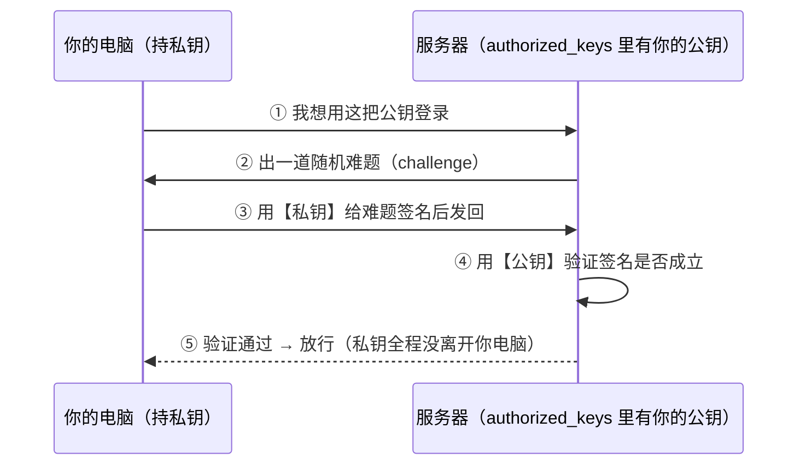
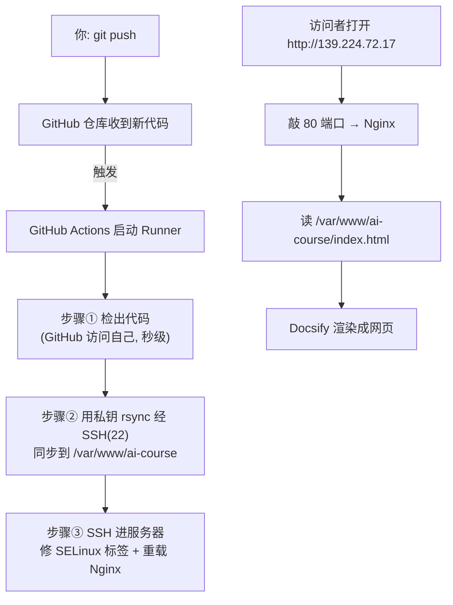

# 运维概念扫盲 · 这次部署用到的东西讲透

> 把部署教程站时用到的"后端/运维"黑盒一个个讲透：公钥私钥、SSH、Nginx、rsync、GitHub Actions…
> 写给零运维基础的前端工程师，每个概念配类比 + "这次具体怎么用到的"。
> 配套阅读：[部署实战手册](/DEPLOY.md)

---

## 1. 公钥 / 私钥（非对称加密）

### 为什么需要"两把"钥匙

普通"密码"是**对称加密**：加密解密用同一个密钥——但你得把它告诉对方，传输途中可能被截走。

**非对称加密**换思路：生成**一对**在数学上配对、却**无法互相推算**的钥匙：

- **私钥（private key）**：自己留着，**绝不外传**。
- **公钥（public key）**：可以随便公开、到处贴。

关系像"锁和钥匙"，但反直觉的一点：**公钥是锁，私钥是钥匙**。锁可以满世界发，谁都能拿；但只有持钥匙（私钥）的人能开。

### SSH 登录时到底怎么用这对钥匙

常见误解："公钥加密密码、私钥解密"——**不对**。真实流程是**挑战-应答（签名验证）**：



**精髓**：私钥从没在网络上传输过，只是用它"签名"证明身份。这就是它比密码安全的根本原因。验证失败时你看到的就是 `Permission denied (publickey)`。

### 几个反复出现的疑问

- **在哪里生成？** → 在**你电脑（客户端）**生成。私钥要留在客户端、永不外传，所以从源头就别让它离开。
- **`authorized_keys` 是什么？** → 服务器上一份"**允许登录的公钥名单**"。把公钥追加进去 = 在服务器门上多装一把认这把钥匙的锁。一台服务器可放多把公钥（你的、GitHub 的）。
- **公钥为什么能公开、私钥不能？** → 公钥泄露顶多让人给你"出题"，没私钥答不出；私钥泄露 = 别人能冒充你。

### 这次具体怎么用的

```
deploy_key      （私钥）→ 存进 GitHub Secrets 的 SERVER_SSH_KEY
deploy_key.pub  （公钥）→ 追加到服务器 /root/.ssh/authorized_keys
```
于是 GitHub Actions 的临时机器能用私钥签名登录你的服务器，全程免密码。

---

## 2. SSH 与"端口"

**SSH**（Secure Shell）= 加密的远程登录协议。你在本机敲命令、在远程服务器执行，全程加密。`ssh root@139.224.72.17`、阿里云 Workbench 网页终端，底层都是它。

**端口（port）**：一台服务器一个 IP（门牌号），上面跑多个服务，端口就是**楼里的房间号**：

| 端口 | 住着谁 |
|------|--------|
| 22 | SSH（远程登录） |
| 80 | HTTP 网站 |
| 443 | HTTPS 网站 |
| 8000 | 教程里的 FastAPI 后端 |

"放行 80 端口" = 允许外面的人敲 80 号房间的门。没放行，请求被门禁（防火墙/安全组）挡在小区外。

**为什么开放 22 给公网有风险**：22 是能发号施令的总控室，对全网开放后机器人会狂试密码。对策：**只用密钥不用密码**，机器人没钥匙就进不来。

---

## 3. Nginx

一个 **Web 服务器**软件，两个常见角色：

**角色 A：静态文件服务器（这次用的）**
把磁盘上一个文件夹变成"能用网址访问的网站"。本地学习时用的 `python -m http.server` 是简易版；Nginx 是专业版（快、稳、扛并发、能配 HTTPS、开机自启）。

你访问 `http://139.224.72.17` 时：
```
浏览器 → 敲服务器 80 端口 → Nginx 接住
       → 去 /var/www/ai-course 找对应文件 → 原样返回给浏览器
```

**角色 B：反向代理（教程第 4 章 RAG 后端会用）**
它自己不处理，而是把请求**转发给后面的程序**（如 FastAPI 跑在 8000），再把结果带回来。好处：对外只暴露 Nginx，后端藏在背后更安全，还能负载均衡、限流。

### 配置含义

```nginx
server {
    listen 80;                       # 监听 80 端口
    server_name 139.224.72.17;       # 对应的域名/IP
    root /var/www/ai-course;         # 网站文件目录
    index index.html;                # 默认首页
    location / {
        try_files $uri $uri/ /index.html;  # 找不到文件就回 index.html（前端路由需要）
    }
    location ~ /\. {
        deny all;                    # 拒绝访问 .git/.env 等隐藏文件
    }
}
```

---

## 4. rsync

= remote sync，**高效文件同步工具**，核心本事：**只传有变化的部分**。

| 方式 | 特点 |
|------|------|
| `scp` | 每次全量复制，慢，不删旧文件 |
| `git pull`（服务器拉） | 需要服务器能访问 GitHub（国内卡） |
| **`rsync`**（我们用的） | 只同步差异，快；`--delete` 还能删掉服务器上已删除的文件，保持和源一致 |

这次：GitHub Actions 的机器用 rsync 经 SSH（同样靠 deploy_key），把代码同步到 `/var/www/ai-course`。`--delete` 保证你删了某章，服务器上对应文件也删掉。

> rsync 也走 SSH 通道，所以密钥登录是它能工作的前提——**一把钥匙，登录和传文件都用它**。

---

## 5. GitHub Actions / CI/CD / Secrets

**CI/CD**（持续集成/持续部署）：代码一变，自动跑流程（测试、打包、上线），不用人工。前端的"提交后自动构建发布"就是它。

**GitHub Actions**：GitHub 自带的 CI/CD。仓库放一个 `.github/workflows/xxx.yml` 就按规则自动干活。
- **触发条件（on）**：我们设的是 `push 到 main` 就触发。
- **Runner**：GitHub 临时分配的一台干净云端机器（用完即焚），流程在它上面跑。
- **Steps**：一步步要做的事，我们三步：① 检出代码 ② rsync 推到服务器 ③ 重载 Nginx。

**Secrets（保险箱）**：IP、私钥不能写进代码（公开仓库会泄露）。GitHub Secrets 是加密保险箱，运行时用 `${{ secrets.XXX }}` 取值，日志里不显示、别人看不到。我们存了 `SERVER_HOST`、`SERVER_USER`、`SERVER_SSH_KEY`。

---

## 6. 串起来：你 `git push` 后发生了什么



---

## 7. 三个配角概念

- **SELinux**：Linux 的严格"门卫"，要求文件贴对"标签"才让 Nginx 读，否则 403。我们用 `chcon -t httpd_sys_content_t` 给网站文件贴上"可被 web 读取"的标签。
- **防火墙 / 安全组**：小区门禁。本地防火墙（firewalld）+ 云端安全组都要放行端口。轻量服务器默认放行了 80/443/22。
- **为什么国内服务器连不上 github.com**：跨境网络 + DNS 污染/链路不稳，`git clone` 报 `Empty reply`。这正是我们改成"GitHub 主动推、服务器不碰 GitHub"的根本原因。

---

> 想再深入某一块（非对称加密的数学原理、Nginx 反向代理实战、HTTPS 证书原理等），可以继续问。
