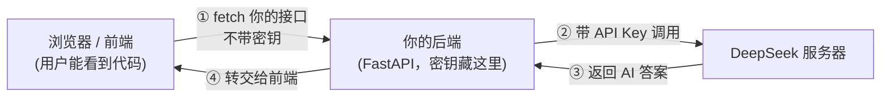
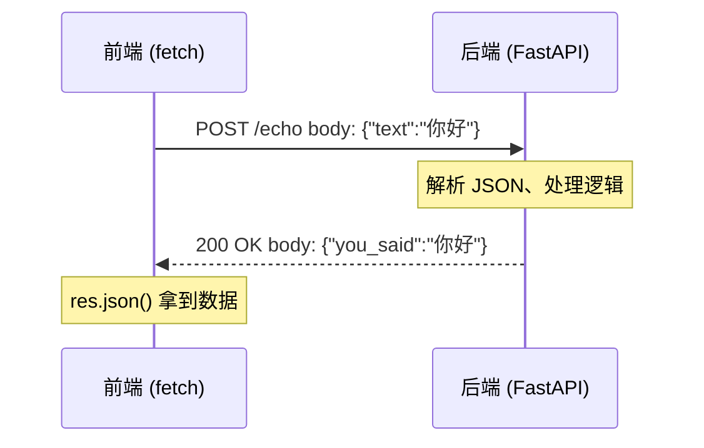

# 第 03 章 · HTTP 与 FastAPI 入门（后端基础①）

> 本章目标：搞懂「后端到底是什么」，并用 FastAPI 写出你人生第一个 API 接口。
> 上一章你在自己的脚本里调通了 AI——这一章开始，我们把它变成一个能被网页调用的「服务」。

---

## 本章目标

- [ ] 说清楚「后端是什么」，以及为什么前端调大模型**必须**经过自己的后端
- [ ] 用前端 `fetch` 和浏览器 Network 面板的经验，把 HTTP 请求/响应模型讲透
- [ ] 看懂常见状态码：200 / 400 / 401 / 404 / 500
- [ ] 安装 `fastapi` + `uvicorn`，分清「框架」和「运行服务器」是两回事
- [ ] 写出第一个服务：GET 接口、路径参数、查询参数、POST 收 JSON body
- [ ] 用 `uvicorn main:app --reload` 启动，并在 `/docs` 自动文档里直接测接口

---

## 核心概念

### 1. 后端到底是什么？

你已经很熟悉「前端」了：跑在**用户浏览器**里的那堆 HTML / CSS / JS，负责画界面、响应点击。

**后端**则是跑在**你自己的服务器**上、用户看不到的那一半程序。它干三件事：

1. 接收前端发来的请求（比如「帮我问下 AI 这个问题」）
2. 做前端不方便/不能做的事（连数据库、调第三方 API、藏密钥、做计算）
3. 把结果打包返回给前端

用一个你熟悉的类比：

| 角色 | 前端（你已会） | 后端（本章要学） |
|------|----------------|------------------|
| 跑在哪 | 用户的浏览器 | 你的服务器 |
| 用户能看到代码吗 | 能（F12 全看得见） | 看不到 |
| 谁来调用 | 用户点击触发 | 前端通过 HTTP 调用 |
| 典型工作 | 渲染界面、收集输入 | 藏密钥、连数据库、调 AI |

### 2. 为什么调大模型必须经过自己的后端？

还记得第 02 章结尾那句**安全铁律**吗——**密钥不能放前端**。

前端代码是公开的：任何人按 F12 都能看到你的 JS 源码、看到 Network 面板里的每一个请求。如果你让浏览器**直接**拿着 DeepSeek 的 API Key 去调模型，那等于把家门钥匙贴在大门上——别人复制走就能拿你的余额疯狂消费。

所以正确的架构是：让前端调**你自己的后端**，由后端（在服务器上，用户看不到）拿着密钥去调 DeepSeek，再把结果转交回前端。后端在这里就是一个**中间人 / 代理**。



> 看懂这张图，你就懂了这门课第 03～05 章在干嘛：本章先把「你的后端」这个框搭起来（先不连 AI），第 04 章往里塞 DeepSeek 调用，第 05 章把前端那个框接上。

### 3. HTTP：前后端之间的「对话协议」

前端和后端怎么通信？答案是 **HTTP**——一套「怎么发请求、怎么回响应」的约定。

你其实早就用过它了，只是没意识到。每次写 `fetch`，你就是在发一个 HTTP 请求：

```javascript
// 你早就写过的前端代码，这就是一个 HTTP 请求
const res = await fetch("https://api.example.com/users/42?verbose=true", {
  method: "POST",                                  // 请求方法
  headers: { "Content-Type": "application/json" }, // 请求头
  body: JSON.stringify({ name: "小明" }),          // 请求体
});
const data = await res.json();                     // 解析响应体
console.log(res.status);                           // 响应状态码，比如 200
```

把这一段拆开，就是 HTTP 请求的全部组成：

| 组成部分 | fetch 里对应 | 作用 | 例子 |
|----------|--------------|------|------|
| **方法 (Method)** | `method` | 你想干什么 | `GET`（取数据）/ `POST`（提交数据） |
| **URL** | 第一个参数 | 找哪个接口 | `/users/42` |
| **查询参数 (Query)** | URL 里 `?` 后面 | 附加条件 | `?verbose=true` |
| **请求头 (Headers)** | `headers` | 元信息 | `Content-Type`、`Authorization` |
| **请求体 (Body)** | `body` | 要提交的数据 | `{ "name": "小明" }` |

响应（response）也有对应的结构：**状态码** + **响应头** + **响应体**。

### 4. GET vs POST

最常用的两个方法，记住这个区分就够入门：

| | GET | POST |
|---|-----|------|
| 用途 | **取**数据 | **提交**数据 |
| 有 body 吗 | 一般没有 | 有（JSON 数据放这） |
| 类比 | 打开一个网页、查询列表 | 提交表单、发一条聊天消息 |

我们这门课调 AI 用的就是 POST——因为要把用户的问题（一段 JSON）提交给后端。

### 5. 常见状态码

每个 HTTP 响应都带一个三位数状态码，告诉你「成没成、为啥没成」。你在 Network 面板里见过它们：

| 状态码 | 含义 | 什么时候出现 |
|--------|------|--------------|
| **200** | OK，成功 | 一切正常 |
| **400** | Bad Request，请求格式不对 | 前端传的数据缺字段/类型错 |
| **401** | Unauthorized，没授权 | 密钥错或没带（第 02 章那个 401 就是它） |
| **404** | Not Found，找不到 | URL 写错了，没这个接口 |
| **500** | Internal Server Error，服务器崩了 | 后端代码报错了 |

> 记忆口诀：**4 开头是「你（前端）错了」，5 开头是「我（后端）错了」**。调试时先看状态码，能立刻判断锅在哪边。

### 6. 一次完整的请求-响应长什么样



请求发出去 → 后端处理 → 响应回来，HTTP 就是这一来一回。整个第 04、05 章的聊天功能，本质上都是这张图的变体。

### 7. 「服务端」「端口」「localhost」是什么

- **服务端（server）**：一个一直在后台运行、等着接收请求的程序。它不会自己结束，而是「监听」请求。
- **localhost / 127.0.0.1**：指「本机」。你在自己电脑上跑后端，前端用 `localhost` 就能访问到它，不用真买服务器。
- **端口（port）**：一台机器上可以同时跑很多服务，用端口号区分。后端常用 `8000`，所以地址是 `http://127.0.0.1:8000`。

> 类比：`localhost` 是一栋楼（你的电脑），端口号是房间号（具体哪个服务）。前端的 Vite 开发服务器通常占 `5173` 房间，我们的后端待会儿住 `8000` 房间。

---

## 动手实践

### 准备：安装 FastAPI 和 uvicorn

确保已经激活第 01 章建好的虚拟环境（命令行前面有 `(.venv)` 字样），然后安装：

```powershell
# Windows PowerShell（Mac 把 pip 换成 pip3 即可，下同）
pip install fastapi uvicorn
```

这里装了**两个东西**，分清楚它们很重要：

| 包 | 是什么 | JS 世界类比 |
|------|--------|-------------|
| **fastapi** | Web **框架**：帮你定义「哪个 URL 由哪段代码处理」 | Express / Koa |
| **uvicorn** | **运行服务器**：真正把你的程序跑起来、监听端口 | `node` 运行时 + http server |

简单说：**FastAPI 负责「写接口」，uvicorn 负责「跑起来」。** 框架本身不会自己启动，得靠 uvicorn 把它「点着」。

### 实践 1：第一个 GET 接口

新建 `main.py`：

```python
# main.py —— 你的第一个后端服务
from fastapi import FastAPI

app = FastAPI()  # 创建一个应用实例，类似 Express 里的 const app = express()


# 装饰器 @app.get("/") 的意思是：当有人 GET 访问根路径 "/" 时，执行下面这个函数
# 等价于 Express 的 app.get("/", (req, res) => { res.json(...) })
@app.get("/")
def read_root():
    return {"message": "Hello，这是我的第一个后端"}  # 返回 dict，FastAPI 自动转成 JSON 响应
```

对照一下你熟悉的 Express，几乎是一一对应的：

```javascript
// Express 写法（仅供对照，不用运行）
const express = require("express");
const app = express();

app.get("/", (req, res) => {
  res.json({ message: "Hello，这是我的第一个后端" });
});
```

最大的区别：FastAPI 里你直接 `return` 一个 dict 就行，不用像 Express 那样手动调 `res.json()`——框架帮你做了。

### 实践 2：启动服务

在 `main.py` 所在目录下运行：

```powershell
uvicorn main:app --reload
```

逐字拆解这条命令（很多人第一次会卡在这）：

- `uvicorn`：用 uvicorn 这个服务器来跑
- `main`：文件名 `main.py`（**不要写 `.py` 后缀**）
- `:app`：文件里那个 `app = FastAPI()` 变量名
- `--reload`：改完代码自动重启，开发时必加（类似前端的热更新 nodemon）

所以 `main:app` 读作「`main.py` 文件里的 `app` 对象」。看到这样的输出就成功了：

```
INFO:     Uvicorn running on http://127.0.0.1:8000 (Press CTRL+C to quit)
INFO:     Application startup complete.
```

打开浏览器访问 **http://127.0.0.1:8000**，你会看到：

```json
{"message":"Hello，这是我的第一个后端"}
```

浏览器地址栏发起的就是一个 GET 请求——这和你前端写 `fetch("http://127.0.0.1:8000")` 收到的是同一个东西。

### 实践 3：FastAPI 的杀手锏——自动文档 `/docs`

不用关服务，直接在浏览器访问 **http://127.0.0.1:8000/docs**。

你会看到一个交互式的接口文档页面（叫 **Swagger UI**），它**自动**列出了你写的所有接口。点开任意接口 → 点「Try it out」→ 点「Execute」，就能**直接在浏览器里测接口**，不用写一行前端、不用装 Postman。

> 这是 FastAPI 最爽的地方：你只管写接口，文档和测试界面它白送。后面每写一个接口，都建议来 `/docs` 点一下验证。这相当于前端的「Network 面板 + 一个现成的测试页」二合一。

### 实践 4：路径参数与查询参数

往 `main.py` 里继续追加两个接口：

```python
# ↓ 路径参数：URL 里 {city} 是一个变量，会作为函数参数传进来
#   访问 /weather/beijing → city 的值就是 "beijing"
@app.get("/weather/{city}")
def get_weather(city: str):
    return {"city": city, "weather": "晴"}


# ↓ 查询参数：函数参数不在路径里出现，FastAPI 自动当作 URL 的 ?key=value
#   访问 /search?keyword=python&limit=10 → keyword="python", limit=10
#   limit 给了默认值 5，所以不传也行
@app.get("/search")
def search(keyword: str, limit: int = 5):
    return {"keyword": keyword, "limit": limit}
```

这两个概念你在前端早就遇到过，只是换了个名字：

```javascript
// 前端发起对应请求（对照理解）
fetch("http://127.0.0.1:8000/weather/beijing");          // 路径参数 city = "beijing"
fetch("http://127.0.0.1:8000/search?keyword=python&limit=10"); // 查询参数
```

注意那个 `limit: int = 5`——FastAPI 看到类型标注 `int`，会**自动**帮你把 URL 里的字符串 `"10"` 转成数字 `10`，转不动（比如传了 `limit=abc`）就自动返回 **422 错误**，根本不用你手写校验。这一点比 Express 省心太多。

### 实践 5：POST 接收 JSON body（重点）

这是后面调 AI 的核心模式：前端把数据 POST 过来，后端收下处理。

接收 body 要先定义「数据长什么样」，用 `pydantic` 的 `BaseModel`（安装 fastapi 时已自带）。继续追加到 `main.py`：

```python
from pydantic import BaseModel  # 把这行加到文件顶部的 import 区


# 定义请求体的「形状」：必须有一个字符串字段 text
# 类似 TypeScript 的 interface { text: string }
class EchoRequest(BaseModel):
    text: str


# POST 接口：参数标注成上面的模型，FastAPI 就会自动解析请求体的 JSON
@app.post("/echo")
def echo(req: EchoRequest):
    # req.text 就是前端传来的 {"text": "..."} 里的值
    return {"you_said": req.text, "length": len(req.text)}
```

`pydantic` 模型相当于给请求数据上了一道「类型 + 校验」的关卡。和 TypeScript interface 对照一下就秒懂：

```typescript
// TypeScript 里你会这么描述请求体（对照理解）
interface EchoRequest {
  text: string;
}
```

区别是：TS 的 interface 只在**编译期**检查，运行时不管；而 pydantic 是**运行时真校验**——前端要是没传 `text`、或传了数字，FastAPI 会自动挡下来返回 422 错误，并告诉你哪个字段错了。这就是后端的「门卫」。

**怎么测这个 POST？** 重启已加 `--reload` 会自动生效，直接去 `/docs`：找到 `POST /echo` → Try it out → 把 body 改成 `{"text": "你好后端"}` → Execute。你会看到返回：

```json
{"you_said": "你好后端", "length": 4}
```

这一来一回，正是本章开头那张时序图。

前端将来会这样调它（第 05 章就这么干）：

```javascript
// 第 05 章前端会写的代码，提前感受一下
const res = await fetch("http://127.0.0.1:8000/echo", {
  method: "POST",
  headers: { "Content-Type": "application/json" },
  body: JSON.stringify({ text: "你好后端" }),
});
console.log(await res.json()); // { you_said: "你好后端", length: 4 }
```

### 实践 6：async/await 顺带一提

你在前端天天写 `async/await`。好消息：**Python 也有，写法几乎一样**，只是 `function` 变成 `def`、`function*` 那套不用管：

```python
# 把 def 换成 async def，就能在函数里用 await
@app.get("/slow")
async def slow_endpoint():
    # 这里如果有 await（比如 await 调用 DeepSeek），就能不阻塞地等结果
    return {"status": "done"}
```

```javascript
// 对照：JS 里的 async 函数
async function slowEndpoint() {
  // await something...
  return { status: "done" };
}
```

现在**不必纠结**什么时候用 `async def`、什么时候用 `def`——FastAPI 两种都支持，你先用普通 `def` 写完全没问题。等第 04 章真正去 `await` 调用 DeepSeek 时，我们再用上 `async def`。心智模型和 JS 完全一致：**涉及「等待 IO（网络/数据库）」就用 async。**

### 本节完整的 main.py

把上面几段拼起来，这是你这一章最终的成品（可直接运行）：

```python
# main.py —— 第 03 章完整示例
from fastapi import FastAPI
from pydantic import BaseModel

app = FastAPI()


@app.get("/")
def read_root():
    return {"message": "Hello，这是我的第一个后端"}


@app.get("/weather/{city}")        # 路径参数
def get_weather(city: str):
    return {"city": city, "weather": "晴"}


@app.get("/search")                # 查询参数（limit 有默认值）
def search(keyword: str, limit: int = 5):
    return {"keyword": keyword, "limit": limit}


class EchoRequest(BaseModel):      # 请求体的形状
    text: str


@app.post("/echo")                 # POST 收 JSON body
def echo(req: EchoRequest):
    return {"you_said": req.text, "length": len(req.text)}


@app.get("/slow")                  # async 写法示例
async def slow_endpoint():
    return {"status": "done"}
```

启动：`uvicorn main:app --reload`，然后去 `/docs` 把每个接口都点一遍。

---

## 常见报错

| 现象 | 原因 | 解决 |
|------|------|------|
| `ERROR: [Errno 10048] ... address already in use` | 8000 端口被占用（可能上次的服务没关） | 换端口 `uvicorn main:app --reload --port 8001`，或关掉旧进程 |
| `Error loading ASGI app. Could not import module "main"` | 命令里文件名写错，或没在 `main.py` 同级目录运行 | 确认当前目录有 `main.py`，命令写 `main:app` 不带 `.py` |
| `Attribute "app" not found in module "main"` | 文件里的变量名不叫 `app`，或 `:app` 写错 | 对齐：`变量名 = FastAPI()` 与命令里 `main:变量名` 一致 |
| `command not found: uvicorn` / 不是内部命令 | 没装 uvicorn，或没激活 venv | 确认有 `(.venv)` 后 `pip install fastapi uvicorn` |
| 访问 `/docs` 提示 422 Unprocessable Entity | POST 的 body 缺字段或类型不对（pydantic 校验没过） | 看返回里的 `detail`，按提示补全字段，如 `{"text": "..."}` |
| `ModuleNotFoundError: No module named 'fastapi'` | 没装包 / 装到了别的环境 | 激活本章的 venv 再 `pip install fastapi uvicorn` |
| 改了代码不生效 | 启动时漏了 `--reload` | 加上 `--reload`，或手动 Ctrl+C 重启 |

---

## 小结

- **后端**是跑在你服务器上、用户看不到的程序；前端调 AI 必须经过它，因为**密钥不能放前端**（呼应第 02 章铁律），后端是藏密钥的「中间人」
- **HTTP** 就是前后端的对话协议，你写 `fetch` 时早就在用它：方法（GET/POST）+ URL + 查询参数 + Header + Body，回来一个状态码 + 响应体
- 状态码记口诀：**4xx 是前端错（400/401/404），5xx 是后端错（500）**
- **FastAPI = 框架（写接口）**，**uvicorn = 运行服务器（跑起来）**，用 `uvicorn main:app --reload` 启动
- 四种接口形态都会写了：GET、路径参数 `{city}`、查询参数 `?key=`、POST 收 `BaseModel` 定义的 JSON body
- FastAPI 杀手锏：`/docs` 自动文档（Swagger UI），写完接口直接在浏览器里点着测，pydantic 还自动帮你做参数校验
- `async def` 和 JS 的 `async` 心智一致，涉及等待 IO 时才需要，本章普通 `def` 足够

## 下一章预告

现在你有了一个**能收能发的空后端**，但它还不会调 AI。下一章我们就把第 02 章那段 DeepSeek 调用代码，塞进本章这个 `POST /echo` 同款接口里——做一个真正的 `POST /chat` 接口，让前端 POST 一个问题、后端带着密钥去问 DeepSeek、再把答案返回。本章那张「前端 ↔ 后端 ↔ DeepSeek」的图，下一章就完整跑通了。

**→ [第 04 章：把 LLM 包成自己的后端 API](../04-llm-backend-api/README.md)**

---

← 上一章：[第 02 章：第一次调用 LLM API](../02-first-llm-call/README.md)
