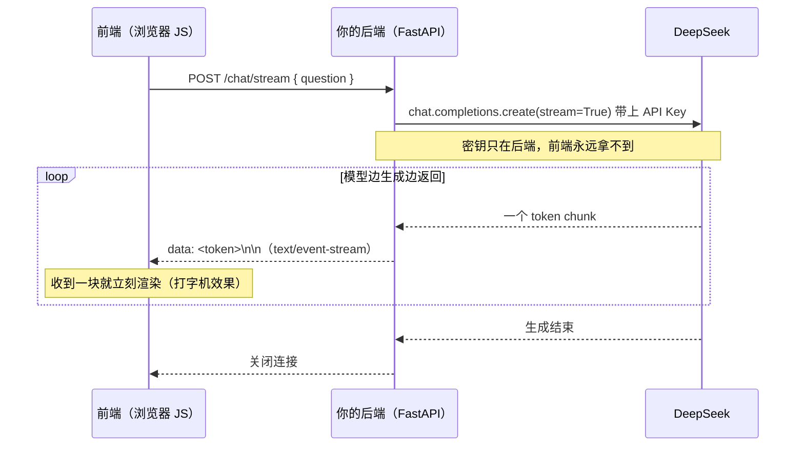

# 第 04 章 · 把 LLM 包成自己的后端 API

> 本章目标：用 FastAPI 把第 02 章的 DeepSeek 调用封装成接口，做出 `/chat` 和**流式** `/chat/stream`。
> 学完这一章，你就有了一个**前端能直接调用**的 AI 后端——下一章接上界面，全栈聊天应用就成型了。

---

## 本章目标

- [ ] 理解：为什么前端**不能**直接调大模型，必须让后端当中间人
- [ ] 复用第 02 章的 `llm.py`，在 FastAPI 里调用 DeepSeek
- [ ] 写 `POST /chat`：用 pydantic 定义请求体，返回 AI 回答的 JSON
- [ ] **重点**：写 `POST /chat/stream`，用 `StreamingResponse` 做 SSE 流式接口，让 token 逐块返回
- [ ] 用 `uvicorn` 启动，用 `/docs` 和 curl 测试
- [ ] 给接口加上错误处理，异常时返回合适的状态码

---

## 核心概念

### 1. 为什么前端不能直接调大模型

你可能会想：第 02 章已经能在 Python 脚本里调通 DeepSeek 了，那前端（浏览器里的 JS）直接调 DeepSeek 不就行了？

**不行。** 三个理由：

| 问题 | 说明 |
|------|------|
| **密钥泄露** | 调 DeepSeek 要带 API Key。前端代码是公开的——任何人按 F12 打开浏览器控制台就能看到你的 Key，然后拿去免费用、刷爆你的余额。 |
| **计费失控** | Key 一旦暴露，调用量和花费你完全管不住。 |
| **无法管控** | 你没法在前端做限流、过滤敏感词、记录日志、统一改 prompt。 |

正确做法是**后端代理模式**：密钥只存在后端，前端把问题发给**你自己的后端**，后端拿着密钥去调 DeepSeek，再把结果转发回前端。

```
前端（浏览器，公开）  →  你的后端（私密，握有 Key）  →  DeepSeek
                      ←                              ←
```

> 这就是上一章 FastAPI 派上用场的地方：后端就是那个「拿着密钥的中间人」。
> 这也是几乎所有 LLM 应用的标准架构——记住它，后面每一章的后端都长这样。

### 2. SSE 是什么，和 WebSocket 有什么区别

第 02 章里 `stream=True` 实现了打字机效果——token 一块一块地冒出来。我们想把这个体验**透传到前端**：前端不要等 AI 全部生成完，而是收到一块就显示一块。

实现这个的标准技术叫 **SSE（Server-Sent Events，服务器发送事件）**：服务器和客户端建立一条连接后，**持续地、单向地**把数据一段一段推给客户端。

它和你可能听过的 WebSocket 的区别：

| | SSE | WebSocket |
|---|---|---|
| 方向 | 单向（服务器 → 客户端） | 双向 |
| 协议 | 就是普通 HTTP | 独立的 ws:// 协议 |
| 复杂度 | 简单，前端一个 `EventSource` 或 fetch 就能读 | 较复杂 |
| 适用场景 | 流式输出、推送通知 | 聊天室、协同编辑等双向实时 |

我们只需要「服务器把 token 单向推给前端」，**SSE 正好够用，而且更简单**——所以本章用 SSE。

### 3. text/event-stream 的数据格式

SSE 有个约定俗成的「电报格式」。服务器每推一段数据，要写成这样：

```
data: 这里是一段内容\n\n
```

规则就两条，**少一条前端都收不到**：

- 每条消息以 `data: ` 开头
- 每条消息以**两个换行符** `\n\n` 结尾（表示「这一条发完了」）

并且响应头的 `Content-Type` 必须是 `text/event-stream`，浏览器才知道「这是一条流，别等它结束，边收边给我」。

> 类比：SSE 就像服务器在不停地发短信，每条短信用 `data:` 起头、用空行结尾。前端的 `EventSource` 收到一条就触发一次回调。

### 4. 这一章的数据流（时序图）

整个 `/chat/stream` 的请求过程是这样的：



记住这张图——你写的每一行代码都对应着图里的一个箭头。

---

## 动手实践

### 准备：项目文件组织

新建一个目录（比如 `chapter04/`），里面只放两个文件：

```
chapter04/
├── llm.py      ← 直接复用第 02 章的封装（大模型调用都在这）
└── main.py     ← FastAPI 应用（接口都在这）
```

**职责分离**是好习惯：`llm.py` 只管「怎么调大模型」，`main.py` 只管「怎么把它暴露成 HTTP 接口」。前端工程师可以这样类比：

| 后端（Python） | 前端（你熟悉的） |
|---|---|
| `llm.py`（调模型的工具模块） | `api.js` / `request.js`（封装 fetch 的工具） |
| `main.py`（路由 + 接口） | 路由 + 页面组件 |

先安装本章要用的包（确保已激活 venv）：

```powershell
pip install fastapi "uvicorn[standard]" openai python-dotenv
```

> Mac 差异：命令完全一样。只是激活 venv 时 Windows 是 `.venv\Scripts\activate`，Mac 是 `source .venv/bin/activate`（第 01 章讲过）。

### 第 1 步：扩展 llm.py，加一个流式版本

第 02 章的 `llm.py` 已经有了 `ask()`（返回完整答案）。现在再加一个**流式生成器** `ask_stream()`，把 `stream=True` 的每一块 `yield` 出去。把第 02 章的 `llm.py` 复制到 `chapter04/`，在末尾补上 `ask_stream()`——下面是补全后的**完整** `llm.py`（`ask()` 原样保留，新增的是 `ask_stream()`）：

```python
# llm.py —— 在第 02 章基础上，新增流式版本
from dotenv import load_dotenv
from openai import OpenAI
import os

load_dotenv()  # 读取项目根目录 .env 里的密钥（第 00 章配好的）

_client = OpenAI(
    api_key=os.getenv("DEEPSEEK_API_KEY"),
    base_url=os.getenv("DEEPSEEK_BASE_URL"),  # https://api.deepseek.com
)
_model = os.getenv("DEEPSEEK_MODEL")          # deepseek-chat


def ask(question: str, system: str = "你是一个乐于助人的助手") -> str:
    """问一个问题，返回完整答案字符串（第 02 章的版本，原样保留）。"""
    response = _client.chat.completions.create(
        model=_model,
        messages=[
            {"role": "system", "content": system},
            {"role": "user", "content": question},
        ],
    )
    return response.choices[0].message.content or ""   # 内容可能为 None，兜底成空串


def ask_stream(question: str, system: str = "你是一个乐于助人的助手"):
    """流式问答：每生成一块文字就 yield 出去（本章新增）。

    这是一个「生成器」(generator)——用 yield 而不是 return，
    调用方可以用 for 循环一块一块地拿到内容，而不必等全部生成完。
    """
    stream = _client.chat.completions.create(
        model=_model,
        messages=[
            {"role": "system", "content": system},
            {"role": "user", "content": question},
        ],
        stream=True,   # ← 关键：开启流式
    )
    for chunk in stream:
        delta = chunk.choices[0].delta.content
        if delta:            # 有些 chunk 的 content 是 None，要跳过
            yield delta      # 把这一块文字「吐」出去
```

> **`yield` 是什么？** 这是 Python 里做「生成器」的关键字。带 `yield` 的函数不会一次返回全部结果，而是**每次产出一块、暂停、等你来要下一块**。
> JS 对照：等价于 JS 的 `function* gen() { yield ...; }`（generator 函数）。`for chunk in stream` 就像 JS 里 `for (const x of gen())`。

### 第 2 步：写普通版接口 POST /chat

先做最简单的一次性返回版本，把流式留到下一步。新建 `main.py`：

```python
# main.py —— 把 DeepSeek 暴露成 HTTP 接口
from fastapi import FastAPI, HTTPException
from pydantic import BaseModel

import llm  # 复用我们自己的封装

app = FastAPI(title="我的 LLM 后端")


# 用 pydantic 定义请求体的「形状」：前端必须发 { "question": "..." }
class ChatRequest(BaseModel):
    question: str
    system: str = "你是一个乐于助人的助手"  # 可选，有默认值


@app.post("/chat")
def chat(req: ChatRequest):
    """普通版：等 AI 全部生成完，一次性返回完整答案。"""
    try:
        answer = llm.ask(req.question, req.system)
        return {"answer": answer}        # FastAPI 自动转成 JSON 返回
    except Exception as e:
        # 调用大模型可能失败（Key 错、余额不足、网络问题……）
        # 捕获后返回 500，并把原因写进 detail，方便前端和你排查
        raise HTTPException(status_code=500, detail=f"调用模型失败: {e}")
```

**逐行看懂关键点：**

- `class ChatRequest(BaseModel)`：pydantic 帮你**自动校验**前端发来的数据。如果前端没传 `question`，FastAPI 会自动返回 422 错误，不用你手写校验。
  - JS 对照：相当于你在 Express 里手动写 `if (!req.body.question) return res.status(400)...`，但 pydantic 全自动。
- `req.question`：直接用点号取字段，有类型提示，写错会被编辑器标红。
- `return {"answer": answer}`：返回一个 dict，FastAPI 自动序列化成 JSON——等价于 Express 的 `res.json({ answer })`。
- `HTTPException(status_code=500, ...)`：抛它就会让 HTTP 返回对应状态码。

### 第 3 步：重点——流式接口 POST /chat/stream

这是本章的核心。我们用 FastAPI 的 `StreamingResponse`，把 `ask_stream()` 吐出来的每一块包装成 SSE 格式 `data: <token>\n\n`，逐块发给前端。

在 `main.py` 顶部的 import 补上 `StreamingResponse`，然后追加这个接口：

```python
# main.py 顶部，补充这一行 import
from fastapi.responses import StreamingResponse


@app.post("/chat/stream")
def chat_stream(req: ChatRequest):
    """流式版：边生成边推，前端能逐字显示（打字机效果）。"""

    def event_generator():
        """生成 SSE 格式的数据流：每块都是 data: ...\n\n"""
        try:
            for token in llm.ask_stream(req.question, req.system):
                # SSE 格式铁律：data: 开头，\n\n 结尾，少一个前端都收不到
                yield f"data: {token}\n\n"
            # 自定义一个结束标记，方便前端知道「发完了」
            yield "data: [DONE]\n\n"
        except Exception as e:
            # 流式过程中出错，也用一条 data 告诉前端
            yield f"data: [ERROR] {e}\n\n"

    # 关键：media_type 必须是 text/event-stream，浏览器才会按流处理
    return StreamingResponse(event_generator(), media_type="text/event-stream")
```

**为什么这样能「流」起来？**

1. `event_generator` 是个生成器（用了 `yield`），它不会一次算完所有数据。
2. `StreamingResponse` 拿到生成器后，**每 `yield` 一块，就立刻通过 HTTP 发给前端一块**，不等全部完成。
3. `media_type="text/event-stream"` 告诉浏览器「这是 SSE 流」，于是前端可以边收边渲染。

整条链路就是开头那张时序图：DeepSeek 吐一块 → `ask_stream` 接一块 → `event_generator` 包成 `data:...\n\n` → `StreamingResponse` 推给前端一块。**全程没有「攒齐再发」，所以是真流式。**

> 埋个伏笔：第 05 章前端会用 `fetch` + `response.body.getReader()` 来消费这条流（POST 带 body 用不了只支持 GET 的 `EventSource`），那个 `[DONE]` 标记就是给前端用来判断「该收尾了」。

### 第 4 步：启动服务

用 `uvicorn` 启动（它是跑 FastAPI 的服务器，上一章见过）：

```powershell
# 在 chapter04/ 目录下运行
# main 指 main.py，app 指里面的 app 对象，--reload 改代码自动重启
uvicorn main:app --reload
```

看到 `Uvicorn running on http://127.0.0.1:8000` 就说明起来了。

> Mac 差异：命令完全一样。

### 第 5 步：测试

**方式一：用自带的交互文档 `/docs`（最省事）**

浏览器打开 http://127.0.0.1:8000/docs ——FastAPI 自动生成了一个可视化测试页。找到 `POST /chat`，点 **Try it out**，把 `question` 填上你的问题，点 **Execute**，下面就能看到 AI 的回答。

> `/docs` 是 FastAPI 白送的，前端调试接口时也很爱用，不用装 Postman。

**方式二：用 curl 命令行测试**

测普通版 `/chat`：

```powershell
curl.exe -X POST http://127.0.0.1:8000/chat `
  -H "Content-Type: application/json" `
  -d '{\"question\": \"用一句话解释什么是 API\"}'
```

> Windows 说明：PowerShell 里建议用 `curl.exe`（而不是 `curl`，因为后者是 PowerShell 的别名，参数不一样）；换行用反引号 `` ` ``。
> Mac 差异：用 `curl`（不带 `.exe`），换行用反斜杠 `\`，JSON 里的引号不用转义：
> ```bash
> curl -X POST http://127.0.0.1:8000/chat \
>   -H "Content-Type: application/json" \
>   -d '{"question": "用一句话解释什么是 API"}'
> ```

测流式版 `/chat/stream`（加 `--no-buffer` 才能看到逐块效果）：

```powershell
curl.exe -N -X POST http://127.0.0.1:8000/chat/stream `
  -H "Content-Type: application/json" `
  -d '{\"question\": \"用三句话讲讲 RAG 是什么\"}'
```

你会看到一行行 `data: ...` 像打字机一样陆续蹦出来，最后是 `data: [DONE]`。**这就是流式接口在工作的样子。**（`-N` / `--no-buffer` 关闭 curl 的缓冲，否则它可能攒齐才显示。）

---

## 常见报错

| 现象 | 原因 | 解决 |
|------|------|------|
| 前端收不到流，要等全部生成完才一次性出现 | 没设 `media_type="text/event-stream"`，或被中间层缓冲 | 给 `StreamingResponse` 加上 `media_type="text/event-stream"`；curl 测试加 `-N` |
| 流能连上但前端解析不出内容 | SSE 数据格式不对，少了 `\n\n` | 每块必须 `yield f"data: {token}\n\n"`，结尾两个换行一个都不能少 |
| 接口能返回，但不是流式（一次性给一大坨） | 用了 `return 完整字符串` 而非生成器 `yield` | 流式接口里必须用 `yield` 逐块产出，并交给 `StreamingResponse` |
| 启动报 `ModuleNotFoundError: fastapi` | 没装包 / 没激活 venv | 确认提示符有 `(.venv)`，再 `pip install fastapi "uvicorn[standard]"` |
| 调接口返回 422 Unprocessable Entity | 请求体不符合 `ChatRequest`（如漏传 `question` 或不是 JSON） | 检查 body 是合法 JSON 且含 `question` 字段；`Content-Type` 设为 `application/json` |
| 调接口返回 500，detail 提示认证/余额 | Key 没读到、余额不足、`base_url` 错 | 回第 00 / 02 章检查 `.env`；确认根目录有 `.env` 且 `llm.py` 能 `load_dotenv()` 到它 |
| 把 API Key 直接写进了 `main.py` | 误把密钥硬编码 | **绝不能**！Key 只能从 `.env` 经 `load_dotenv()` 读取，前端永远拿不到 |

---

## 小结

- **后端代理模式**：前端 → 你的后端（握密钥） → DeepSeek。密钥只在后端，绝不进前端代码。
- 复用第 02 章的 `llm.py`：`ask()` 返回完整答案，新增的 `ask_stream()` 用 `yield` 逐块产出。
- `POST /chat`：pydantic 的 `ChatRequest` 自动校验请求体，返回 dict 自动变 JSON。
- `POST /chat/stream`（重点）：`StreamingResponse(生成器, media_type="text/event-stream")`，每块包成 `data: <token>\n\n`，实现真流式。
- 用 `uvicorn main:app --reload` 启动，用 `/docs` 或 `curl -N` 测试。
- 错误处理：调用失败用 `HTTPException` 返回合适状态码；流式里出错用一条 `data:` 通知前端。

## 下一章预告

后端接口已经就绪——`/chat` 能返回答案，`/chat/stream` 能逐块流式推送。但现在只能用 `/docs` 和 curl 戳它，普通用户可没法这么玩。

下一章我们回到你最熟悉的主场：**用 JavaScript 写一个聊天界面**，用 `fetch` 调 `/chat`，再用 `fetch` + `ReadableStream`（`getReader()`）消费 `/chat/stream` 实现网页上的打字机效果。还会解决一个前端调后端绕不开的拦路虎——**CORS 跨域**。

**→ [第 05 章：前端接入后端](../05-frontend-integration/README.md)**

---

← 上一章：[第 03 章：HTTP 与 FastAPI 入门](../03-backend-http-fastapi/README.md)
