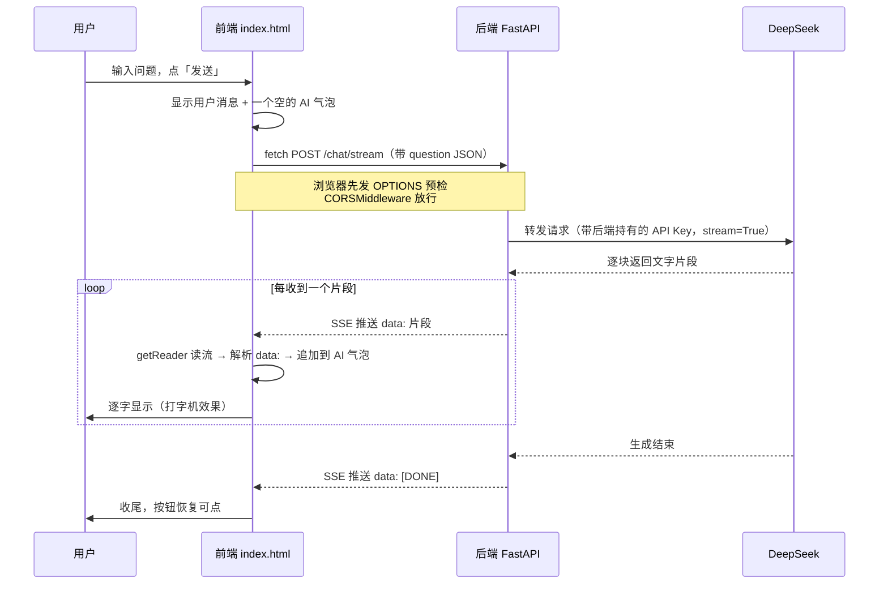

# 第 05 章 · 前端接入后端

> 本章目标：用你最熟的原生 JS 写一个聊天界面，调通第 04 章做好的后端 `/chat` 接口，并实现打字机式的流式渲染。
> 这是整门课「前后端终于打通」的高光时刻——你写的网页第一次和你自己的 AI 后端对上了话。

---

## 本章目标

- [ ] 写一个单文件 `index.html`（原生 JS + 一点 CSS）：输入框 + 发送按钮 + 消息列表
- [ ] 用 `fetch` 调用后端 `POST /chat`，把 AI 的回答显示到页面上
- [ ] 搞懂**跨域 CORS** 是什么、为什么会报错，并在后端用 `CORSMiddleware` 解决
- [ ] 用 `fetch` + `response.body.getReader()` 读取后端的 **SSE 流**，实现逐字显示的打字机效果
- [ ] 知道怎么在本地把前端页面跑起来
- [ ] 牢记：前端只跟自己的后端说话，**密钥永远留在后端**

---

## 核心概念

这一章你本来就熟前端，基础的 DOM 操作、事件绑定就不啰嗦了。我们重点讲**和后端协作时才会碰到的三个新东西**：CORS、读流、安全边界。

### 1. 前端为什么不能直接调 DeepSeek（安全铁律的呼应）

你可能会想：我直接在前端 `fetch` DeepSeek 的接口不就行了，何必绕一圈后端？

**绝对不行。** 前端代码是公开的——任何人按 F12 打开浏览器调试工具，都能看到你写在 JS 里的 API Key。一旦泄露，别人就能拿你的 key 疯狂消费，账单算你的。

这正是第 00 章「安全铁律」的实战体现：

```
浏览器（前端）  →  你的后端（拿着密钥）  →  DeepSeek
   公开、不可信          私密、可信
```

**密钥始终待在后端**。前端只跟自己的后端说话，后端再去跟 DeepSeek 说话。前端自始至终不知道、也不需要知道那把 key。

### 2. CORS：浏览器的「同源」安检

当你的前端页面（比如跑在 `http://localhost:5500`）用 `fetch` 去请求后端（跑在 `http://localhost:8000`）时，浏览器会拦下来，控制台冒出一行红字：

```
Access to fetch at 'http://localhost:8000/chat' from origin
'http://localhost:5500' has been blocked by CORS policy:
No 'Access-Control-Allow-Origin' header is present on the requested resource.
```

这就是**跨域（CORS, Cross-Origin Resource Sharing）**问题。

**为什么会有这个限制？** 浏览器有一条安全规则叫「同源策略」：一个页面默认只能请求**同源**的接口。所谓「同源」=「协议 + 域名 + 端口」三者完全一致。

| 前端地址 | 后端地址 | 同源吗 | 原因 |
|---|---|:---:|---|
| `http://localhost:5500` | `http://localhost:5500` | 是 | 完全一致 |
| `http://localhost:5500` | `http://localhost:8000` | **否** | 端口不同（5500 vs 8000） |
| `http://localhost:5500` | `https://localhost:5500` | **否** | 协议不同（http vs https） |
| `http://localhost:5500` | `http://127.0.0.1:5500` | **否** | 域名不同（localhost vs 127.0.0.1） |

学习阶段，前端和后端跑在不同端口，**必然跨域**。注意：拦截发生在**浏览器**这一侧，后端其实收到了请求，只是浏览器不让前端 JS 读到响应。所以解决办法不在前端，而是**让后端明确告诉浏览器：我允许这个来源访问我**。

> 一个细节：对于 POST + JSON 这类「非简单请求」，浏览器在真正发请求前，会先自动发一个 `OPTIONS` 请求来「打招呼问路」，这叫**预检请求（preflight）**。后端必须正确响应这个预检，浏览器才放行真正的请求。下面用的 `CORSMiddleware` 会自动帮你处理预检，不用手写。

### 3. 流式渲染：从「一次性返回」到「逐字读流」

第 02 章你见过流式输出——AI 一个字一个字往外蹦。第 04 章的后端把这个能力做成了一个 **SSE 接口**（Server-Sent Events，服务器推送事件）。

SSE 的数据格式很简单，就是一行行的纯文本，每条数据以 `data:` 开头、以一个空行结束：

```
data: 你

data: 好

data: ，

data: [DONE]
```

前端要的不是 `fetch` 默认那种「等全部下载完再给你完整字符串」，而是**边下边读**。原生 `fetch` 提供了 `response.body.getReader()`，能拿到一个**可读流**，让你一块一块（chunk）地读，读到一块就往界面上拼一块——这就是打字机效果。

> **两种消费 SSE 的方式：**
> - `EventSource`：浏览器内置、最省事，但**只支持 GET 请求**，不能自定义请求体。
> - `fetch` + `response.body.getReader()`：能用 POST、能带 JSON body、能加自定义 header，灵活度高。
>
> 我们的 `/chat` 是 **POST**（要发 question），所以用 `fetch` + 读流这条路。这也是真实项目里更通用的做法。

---

## 动手实践

### 第 0 步：确认后端在跑

本章假设你已经完成第 04 章，后端提供了两个接口：

- `POST /chat`：一次性返回完整回答（JSON）
- `POST /chat/stream`：流式返回（SSE，逐字推送）

先把第 04 章的后端启动起来：

```bash
# 在第 04 章的目录里，激活 venv 后
uvicorn main:app --reload --port 8000
```

看到 `Uvicorn running on http://127.0.0.1:8000` 就说明后端就绪了。

### 第 1 步：给后端开启 CORS（关键！只改后端）

直接写前端会立刻撞上 CORS 报错。先回到**第 04 章的后端文件**（`main.py`），加上 `CORSMiddleware`。这是 FastAPI 官方提供的中间件，几行就搞定：

```python
# main.py（第 04 章的后端）—— 新增 CORS 配置
from fastapi import FastAPI
from fastapi.middleware.cors import CORSMiddleware   # ← 新增这行

app = FastAPI(title="我的 LLM 后端")   # ← 这行第 04 章已有，保持原样，不要重复创建

# ↓↓↓ 在已有的 app = FastAPI(...) 之后，新增这一整段：允许前端来源跨域访问 ↓↓↓
app.add_middleware(
    CORSMiddleware,
    allow_origins=[
        "http://localhost:5500",    # VS Code Live Server 默认端口
        "http://127.0.0.1:5500",
        "http://localhost:8080",    # 其它常见静态服务器端口，按需增减
    ],
    allow_credentials=True,
    allow_methods=["*"],            # 允许所有方法（含预检的 OPTIONS）
    allow_headers=["*"],            # 允许所有请求头
)
# ↑↑↑ 新增结束 ↑↑↑

# ... 下面是第 04 章已有的 /chat 和 /chat/stream 接口，保持不变 ...
```

改完后端要**重启**（`--reload` 模式会自动重启）。

> ⚠️ **不要图省事写 `allow_origins=["*"]`（允许所有来源）。** 学习阶段也许无所谓，但配上 `allow_credentials=True` 时浏览器会直接拒绝 `"*"`，而且生产环境用 `"*"` 是安全隐患。养成好习惯：**明确列出你信任的前端地址**。

### 第 2 步：写聊天页面 `index.html`

新建一个**单独的文件夹**（比如 `chapters/05-frontend-integration/web/`），里面放一个 `index.html`。整个聊天页就这一个文件——HTML、CSS、JS 全塞在一起，方便直接打开看效果。

```html
<!DOCTYPE html>
<html lang="zh-CN">
<head>
  <meta charset="UTF-8" />
  <meta name="viewport" content="width=device-width, initial-scale=1.0" />
  <title>我的 AI 聊天</title>
  <style>
    * { box-sizing: border-box; }
    body {
      font-family: system-ui, -apple-system, "Microsoft YaHei", sans-serif;
      max-width: 720px; margin: 0 auto; padding: 16px;
      background: #f5f6f8;
    }
    h1 { font-size: 18px; }
    #messages {
      height: 60vh; overflow-y: auto; padding: 12px;
      background: #fff; border-radius: 12px; border: 1px solid #e3e5e8;
    }
    .msg { margin: 8px 0; padding: 8px 12px; border-radius: 10px; line-height: 1.6; white-space: pre-wrap; }
    .msg.user { background: #d9eafe; text-align: right; }
    .msg.ai   { background: #f0f1f3; }
    #inputRow { display: flex; gap: 8px; margin-top: 12px; }
    #input { flex: 1; padding: 10px; border-radius: 10px; border: 1px solid #ccc; font-size: 14px; }
    #send { padding: 10px 18px; border: 0; border-radius: 10px; background: #2f6fed; color: #fff; cursor: pointer; }
    #send:disabled { background: #9bb6ee; cursor: not-allowed; }
  </style>
</head>
<body>
  <h1>🤖 我的 AI 聊天（连着我自己的后端）</h1>

  <div id="messages"></div>

  <div id="inputRow">
    <input id="input" placeholder="问点什么…（回车发送）" autocomplete="off" />
    <button id="send">发送</button>
  </div>

  <script>
    // 后端地址：指向第 04 章跑起来的 FastAPI
    const API_BASE = "http://localhost:8000";

    const messagesEl = document.getElementById("messages");
    const inputEl = document.getElementById("input");
    const sendBtn = document.getElementById("send");

    // 在消息列表里追加一条消息，返回这个 DOM 节点（方便后面往里追加文字）
    function appendMessage(role, text) {
      const el = document.createElement("div");
      el.className = "msg " + role;       // role 是 "user" 或 "ai"
      el.textContent = text;
      messagesEl.appendChild(el);
      messagesEl.scrollTop = messagesEl.scrollHeight;  // 自动滚到底
      return el;
    }

    async function send() {
      const text = inputEl.value.trim();
      if (!text) return;

      // 1) 先把用户消息显示出来，清空输入框，禁用按钮防止重复点击
      appendMessage("user", text);
      inputEl.value = "";
      sendBtn.disabled = true;

      // 2) 先放一个空的 AI 气泡，等会儿逐字往里填
      const aiEl = appendMessage("ai", "");

      try {
        await streamChat(text, aiEl);
      } catch (err) {
        aiEl.textContent = "出错了：" + err.message;
      } finally {
        sendBtn.disabled = false;
        inputEl.focus();
      }
    }

    // 核心：用 fetch + 读流，消费后端的 SSE，逐字渲染
    async function streamChat(userText, aiEl) {
      const resp = await fetch(API_BASE + "/chat/stream", {
        method: "POST",
        headers: { "Content-Type": "application/json" },
        // 第 04 章后端 ChatRequest 要的字段是 question（不是 messages）
        body: JSON.stringify({ question: userText }),
      });

      if (!resp.ok) throw new Error("后端返回状态 " + resp.status);

      // 拿到可读流，用 TextDecoder 把字节解码成文字
      const reader = resp.body.getReader();
      const decoder = new TextDecoder("utf-8");
      let buffer = "";   // 缓存还没凑齐一行的残片

      while (true) {
        const { value, done } = await reader.read();   // 读一块
        if (done) break;                               // 流结束

        buffer += decoder.decode(value, { stream: true });

        // SSE 以「空行」分隔每条事件，按双换行切分
        const events = buffer.split("\n\n");
        buffer = events.pop();   // 最后一段可能不完整，留着下次拼

        for (const evt of events) {
          // 每条事件形如 "data: 你好"，取出 data: 后面的内容
          const line = evt.trim();
          if (!line.startsWith("data:")) continue;
          const data = line.slice(5).trim();    // 去掉 "data:"

          if (data === "[DONE]") return;         // 后端约定的结束标记
          aiEl.textContent += data;              // ← 逐字追加，打字机效果！
          messagesEl.scrollTop = messagesEl.scrollHeight;
        }
      }
    }

    // 绑定事件：点按钮 + 回车都能发
    sendBtn.addEventListener("click", send);
    inputEl.addEventListener("keydown", (e) => {
      if (e.key === "Enter") send();
    });
    inputEl.focus();
  </script>
</body>
</html>
```

> **读流这段是本章的灵魂，逐句说明：**
> - `resp.body.getReader()` 拿到流的「读取器」，之后反复 `reader.read()` 一块块取数据。
> - 网络传来的是**字节**（`Uint8Array`），`TextDecoder` 负责转成文字；`{ stream: true }` 让它能正确处理跨块的半个汉字。
> - 一块数据里可能含**多条** `data:`，也可能某条 `data:` 被切成两块——所以要用 `buffer` 缓存、按空行 `\n\n` 切分，最后一段不完整就留到下次。这是 SSE 解析最容易踩坑的地方。
> - `aiEl.textContent += data` 就是打字机效果的本质：每读到一点，就往同一个气泡里**追加**，而不是新建一条消息。

### 第 3 步：本地把前端跑起来

`index.html` 是个静态文件，理论上双击就能打开。但**强烈建议用一个简单的静态服务器**来跑，原因有二：① 用 `file://` 协议打开时，浏览器对 `fetch` 跨域的限制更严、行为更怪；② 用 `http://localhost:端口` 打开，origin 才是稳定的，CORS 配置才好对得上。

任选一种方式起静态服务器：

```bash
# 方式一：VS Code 装「Live Server」插件，右键 index.html → Open with Live Server
#         默认地址 http://localhost:5500（和上面 CORS 配的端口对应）

# 方式二：用 Python 自带的静态服务器（在 index.html 所在目录执行）
python -m http.server 5500
# 然后浏览器打开 http://localhost:5500

# 方式三：用 Node（如果你装了）
npx serve -l 5500
```

打开页面，输入「用三句话讲讲什么是 RAG」，回车——你应该能看到 AI 的回答**一个字一个字蹦出来**。

**🎉 到这里，前后端就真正打通了：你写的网页 → 你的后端 → DeepSeek → 流式回传 → 你的网页逐字渲染。**

### 补充：完整时序图

把整条链路串起来看一眼，心里就有数了：



### 进阶（可选）：调一次性的 `/chat`

如果你只想要「等全部生成完一次返回」，用普通 `fetch` 就行，写法更简单——可以拿它和上面的流式版对比理解：

```javascript
async function chatOnce(userText) {
  const resp = await fetch(API_BASE + "/chat", {
    method: "POST",
    headers: { "Content-Type": "application/json" },
    body: JSON.stringify({ question: userText }),
  });
  const data = await resp.json();        // 等全部返回，一次拿到完整 JSON
  return data.answer;                    // 第 04 章 /chat 返回的是 { "answer": ... }
}
```

体验上一对比就懂了：一次性返回要干等好几秒，流式则立刻开始往外蹦字。这就是为什么聊天应用都做成流式。

---

## 常见报错

| 现象 | 原因 | 解决 |
|------|------|------|
| 控制台 `blocked by CORS policy` / `No 'Access-Control-Allow-Origin'` | 后端没开 CORS，或 `allow_origins` 没包含你前端的地址 | 按第 1 步给后端加 `CORSMiddleware`，把你前端的 `http://localhost:端口` 加进 `allow_origins`，**重启后端** |
| `localhost` 能跑，换成 `127.0.0.1` 又跨域 | `localhost` 与 `127.0.0.1` 算**不同源** | 两个都加进 `allow_origins`，或前端统一用其中一个 |
| `Failed to fetch` / `ERR_CONNECTION_REFUSED` | 后端没启动，或 `API_BASE` 端口写错 | 确认 `uvicorn ... --port 8000` 在跑，前端 `API_BASE` 与之一致 |
| 流式回答里**夹杂 `data:` 字样**或乱拼 | 没正确解析 SSE：漏了去 `data:` 前缀，或没按空行 `\n\n` 切分 | 检查读流逻辑：`startsWith("data:")` 判断 + `slice(5)` 去前缀 + 用 `buffer` 处理跨块残片 |
| 偶尔出现**半个乱码汉字** | 一个汉字的字节被拆到两块里，解码错位 | `TextDecoder.decode(value, { stream: true })` 加上 `{ stream: true }` 即可正确跨块解码 |
| 回答**一次性整段蹦出**而非逐字 | 前端没读流，用了 `await resp.text()` 等全部下载 | 改用 `resp.body.getReader()` 边读边渲染；也确认调的是 `/chat/stream` 不是 `/chat` |
| `Mixed Content` 报错 | 前端是 `https`，后端是 `http`（协议不一致被拦） | 学习阶段前后端都用 `http`；部署时统一用 `https` |
| 新建了消息但 AI 文字**没追加进去** | 每读一块都 `appendMessage` 新建了节点 | 发送时只建**一个**空 AI 气泡 `aiEl`，之后 `aiEl.textContent += data` 往里追加 |

---

## 小结

- **安全边界**：前端公开、不可信，密钥永远留在后端；前端只跟自己的后端说话，呼应第 00 章安全铁律。
- **CORS** 是浏览器的同源安检（协议+域名+端口三者一致才同源）。前后端不同端口必然跨域，解决方案在**后端**：FastAPI 加 `CORSMiddleware`，明确列出可信前端地址。
- **流式渲染**用 `fetch` + `response.body.getReader()` 读取 SSE 流：循环 `reader.read()`，用 `TextDecoder({stream:true})` 解码，按 `\n\n` 切事件、去 `data:` 前缀，逐块 `+=` 到同一个气泡——这就是打字机效果。
- POST 带 body 的场景用 `fetch` 读流（而非只支持 GET 的 `EventSource`）。
- 本地用静态服务器（Live Server / `python -m http.server`）跑前端，别用 `file://` 直接打开。
- 至此你拥有了一个**能用的全栈聊天应用**：网页 → 后端 → DeepSeek → 流式回传 → 逐字渲染，全链路打通。

## 下一章预告

界面通了、字也能一个个蹦出来了，但你可能发现 AI 的回答**不够听话**——有时太啰嗦、有时不按你要的格式、有时答非所问。这不是代码问题，而是你**没把话跟它讲清楚**。

下一章我们进入 AI 应用真正的「内功」：**提示工程（Prompt Engineering）**——怎么写 system prompt 给 AI 定身份和规则、怎么用 few-shot 举例子教它、怎么逼它稳定输出 JSON。学会这个，同样一个模型在你手里能强好几个档次。

**← 上一章：[第 04 章：把 LLM 包成自己的后端 API](../04-llm-backend-api/README.md)**

**→ [第 06 章：提示工程](../06-prompt-engineering/README.md)**
