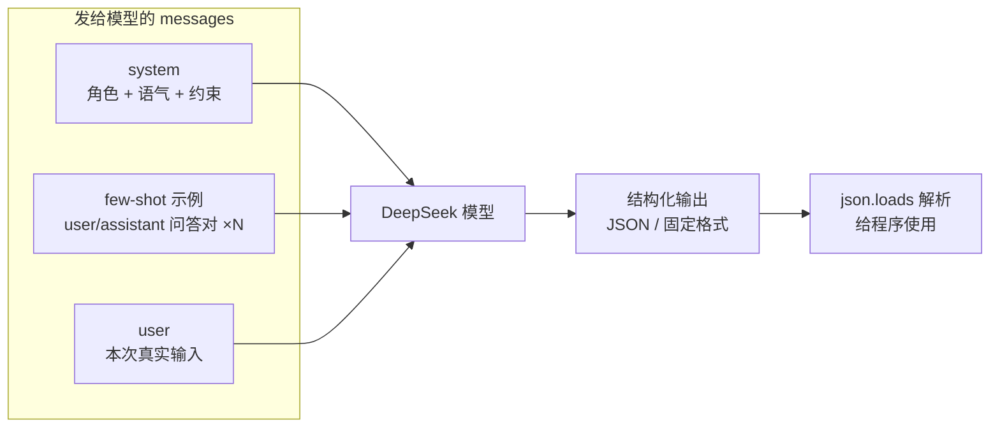

# 第 06 章 · 提示工程 Prompt Engineering

> 本章目标：学会写出「靠谱」的提示词，让模型不仅答得对，还能**稳定输出程序能直接吃下去的结构化结果**。
> 这是后面做 RAG（第 10 章往后）时「拼 prompt」的基础功。

---

## 本章目标

- [ ] 理解 system prompt 的作用：给模型设定角色、语气和约束
- [ ] 会用 few-shot：给几个示例，让模型照着格式输出
- [ ] 让模型稳定输出 **结构化 JSON**，并在 Python 里用 `json.loads()` 安全解析
- [ ] 看懂 `temperature` / `max_tokens` 等常用参数，知道什么时候调大、什么时候调小
- [ ] 掌握几条通用技巧：分步思考、明确格式、给约束、避免歧义

---

## 核心概念

### 1. 提示工程是什么：给模型写「函数契约」

前端工程师对「契约」并不陌生。你调一个函数时，会关心它的**参数约定**和**返回格式**：

```js
// 你期望这个函数返回固定结构，否则后面的代码就崩了
function parseUser(raw) {
  return { name: "张三", age: 18 }; // 调用方依赖这个 shape
}
```

大模型本质上也是一个「函数」：你给它输入（prompt），它给你输出（文本）。但它默认是个**很自由的函数**——同一个问题，它可能用一段话回答，也可能用一首诗回答。

**提示工程（Prompt Engineering）就是：通过精心设计输入，把这个自由的函数「约束」成你想要的样子。** 写好提示词 ≈ 给模型写了一份清晰的参数约定与返回格式契约。

### 2. system prompt：开场前的「导演说明」

回顾第 02 章，`messages` 列表里有三种角色。其中 `system` 是最特殊的一条：它不是对话内容，而是**给模型定调子的全局设定**。

| role | 作用 | 类比 |
|------|------|------|
| `system` | 设定角色、语气、规则（整场对话都生效） | 剧本开头的「导演说明」 |
| `user` | 用户每一轮说的话 | 演员台词 |
| `assistant` | 模型说过的话 | 对手戏 |

一条好的 system prompt 通常包含三件事：

1. **角色**：你是谁？（「你是一位资深前端面试官」）
2. **语气/风格**：怎么说？（「简洁、专业、不寒暄」）
3. **约束**：不能做什么？（「只回答前端相关问题，无关问题礼貌拒绝」）

```python
system = """你是一位资深前端面试官。
- 语气简洁专业，不寒暄、不啰嗦
- 只回答前端工程相关问题
- 遇到无关问题，礼貌地说"这超出了本次面试范围"
"""
```

> 经验法则：**system 写「整场都成立的规则」，user 写「这一轮的具体任务」。** 别把一次性的问题塞进 system，也别把全局规则每轮在 user 里重复。

### 3. few-shot：给几个例子，让它照葫芦画瓢

有时候光用语言描述格式，模型还是「领会不到位」。这时最有效的办法是**直接给几个示例**——这叫 few-shot（少样本）提示。

类比：你教一个新人写 commit message，与其讲一堆规则，不如直接甩给他三条标准的示例，他立刻就懂了。

实现方式就是在 `messages` 里**预先塞几组 `user` / `assistant` 的「问答对」**，假装这些对话已经发生过，模型就会模仿这个模式来回答真正的新问题：

```python
messages = [
    {"role": "system", "content": "你是情感分类器，只输出 正面/负面/中性 三个词之一"},
    # ↓ 这两组是「示例」，不是真实用户在问
    {"role": "user", "content": "这家店太棒了，强烈推荐！"},
    {"role": "assistant", "content": "正面"},
    {"role": "user", "content": "等了一小时菜还没上，差评。"},
    {"role": "assistant", "content": "负面"},
    # ↓ 这才是真正要分类的输入
    {"role": "user", "content": "环境一般，味道还行。"},
]
```

- **0-shot**：不给例子，只靠描述（最省 token，但格式不一定稳）
- **few-shot**：给 2～5 个例子（格式最稳，代价是更费 token）

### 4. 为什么要结构化输出（JSON）

模型默认输出的是「给人看的自然语言」。但在做应用时，输出往往要**给程序消费**——存数据库、传给前端渲染、作为下一步的输入。

这时一段散文是没法用的，你需要的是 JSON。JSON 对前端工程师来说是母语级的熟悉：

```js
// 前端拿到这种结构才好用：直接 data.sentiment、data.score
const data = { sentiment: "正面", score: 0.9, keywords: ["推荐", "棒"] };
```

让模型输出 JSON 有两个层次的手段，**两者要一起用**：

1. **在 prompt 里明确要求**：告诉它「只输出 JSON，不要任何多余文字」，并给出字段说明（最好配 few-shot 示例）。
2. **打开 JSON 模式**：DeepSeek 兼容 OpenAI 的 `response_format={"type": "json_object"}`，开启后模型被强制只产出合法 JSON，能大幅减少「夹带废话」的情况。

> ⚠️ 重要：开启 `json_object` 模式时，**你的 prompt 里必须出现 "json" 这个词**（通常就是要求它输出 JSON 的那句话），否则接口会报错。这是 OpenAI 兼容接口的硬性要求。

### 5. temperature / max_tokens：两个最常用的旋钮

`chat.completions.create()` 还能传一些参数来调节输出行为，最常用的两个：

| 参数 | 含义 | 怎么取舍 |
|------|------|----------|
| `temperature` | 「随机性/创造性」，范围约 0～2 | **要稳定 → 调低（0～0.3）**；要发散/创意 → 调高（0.8～1.2） |
| `max_tokens` | 本次**最多**生成多少 token | 防止跑太长、控成本；但设太小会把答案**截断** |

记住一句话就够了：

- **做分类、抽取、输出 JSON 这类「要确定答案」的任务 → `temperature` 调到 0 或接近 0**，让它每次都给同样的、最稳的结果。
- 做创意文案、头脑风暴这类「要花样」的任务 → 调高。

```python
response = client.chat.completions.create(
    model=_model,
    messages=messages,
    temperature=0,      # 要稳定、可复现
    max_tokens=512,     # 留够空间，别截断 JSON
)
```

### 提示词组成结构图

把上面几块拼起来，一条工程化的提示词长这样：



---

## 动手实践

> 以下代码全部复用第 02 章的 DeepSeek 调用方式：从根目录 `.env` 读取密钥，用 `openai` SDK 指向 DeepSeek。请在已激活 venv 的环境里运行。

### 实践 1：对比实验——「随便问」vs「有 system 约束」

先直观感受 system prompt 的威力。新建 `compare_system.py`：

```python
# compare_system.py —— 对比有无 system prompt 的差别
from dotenv import load_dotenv
from openai import OpenAI
import os

load_dotenv()
client = OpenAI(
    api_key=os.getenv("DEEPSEEK_API_KEY"),
    base_url=os.getenv("DEEPSEEK_BASE_URL"),
)
model = os.getenv("DEEPSEEK_MODEL")

question = "什么是闭包？"

def ask(messages):
    resp = client.chat.completions.create(
        model=model, messages=messages, temperature=0
    )
    return resp.choices[0].message.content

# A. 随便问，没有任何约束
print("===== 无 system =====")
print(ask([{"role": "user", "content": question}]))

# B. 加上 system，设定角色、语气、约束
print("\n===== 有 system =====")
print(ask([
    {"role": "system", "content": "你是前端面试官，只用不超过两句话作答，不举代码例子，语气简洁。"},
    {"role": "user", "content": question},
]))
```

运行：

```bash
python compare_system.py
```

你会看到：无 system 时模型往往长篇大论、带一堆代码；有 system 后回答短小精悍、贴合你设定的「面试官」人设。**同样的问题，输出可控性天差地别——这就是 system prompt 的价值。**

### 实践 2：few-shot 分类器

让模型做一个稳定的情感分类，只输出三个词之一。新建 `few_shot.py`：

```python
# few_shot.py —— 用 few-shot 让输出格式稳定
from dotenv import load_dotenv
from openai import OpenAI
import os

load_dotenv()
client = OpenAI(
    api_key=os.getenv("DEEPSEEK_API_KEY"),
    base_url=os.getenv("DEEPSEEK_BASE_URL"),
)
model = os.getenv("DEEPSEEK_MODEL")

def classify(text: str) -> str:
    messages = [
        {"role": "system", "content": "你是情感分类器，只能输出 正面 / 负面 / 中性 三个词之一，不要任何解释。"},
        # few-shot 示例
        {"role": "user", "content": "这家店太棒了，强烈推荐！"},
        {"role": "assistant", "content": "正面"},
        {"role": "user", "content": "等了一小时菜还没上，差评。"},
        {"role": "assistant", "content": "负面"},
        {"role": "user", "content": "就那样吧，没什么特别的。"},
        {"role": "assistant", "content": "中性"},
        # 真正要分类的输入
        {"role": "user", "content": text},
    ]
    resp = client.chat.completions.create(
        model=model, messages=messages, temperature=0
    )
    return resp.choices[0].message.content.strip()

for s in ["物流超快，包装也很用心！", "客服态度太差了", "价格还能接受"]:
    print(f"{s}  ->  {classify(s)}")
```

运行：

```bash
python few_shot.py
```

期望输出是干干净净的三个词。**有了示例，模型几乎不会再「自由发挥」加上多余的解释。**

### 实践 3：让模型输出结构化 JSON 并安全解析

这是本章最关键的一节——把模型变成一个能产出「可被程序消费的数据」的接口。

需求：给一段商品评论，让模型抽取出 `sentiment`（情感）、`score`（0～1 的分数）、`keywords`（关键词数组）。新建 `to_json.py`：

```python
# to_json.py —— 让模型输出结构化 JSON 并解析
from dotenv import load_dotenv
from openai import OpenAI
import os
import json

load_dotenv()
client = OpenAI(
    api_key=os.getenv("DEEPSEEK_API_KEY"),
    base_url=os.getenv("DEEPSEEK_BASE_URL"),
)
model = os.getenv("DEEPSEEK_MODEL")

# system 里明确字段格式，并出现 "JSON" 字样（开启 json 模式的硬性要求）
SYSTEM = """你是评论分析助手。请分析用户评论，只输出一个 JSON 对象，不要任何多余文字。
字段约定：
- sentiment: 字符串，只能是 "正面" / "负面" / "中性"
- score: 0 到 1 之间的小数，表示正面程度
- keywords: 字符串数组，最多 3 个关键词
"""

def analyze(comment: str) -> dict:
    resp = client.chat.completions.create(
        model=model,
        messages=[
            {"role": "system", "content": SYSTEM},
            {"role": "user", "content": comment},
        ],
        temperature=0,                              # 要稳定、可复现
        response_format={"type": "json_object"},    # ← 关键：强制只输出合法 JSON
    )
    raw = resp.choices[0].message.content

    # ★ 容错：解析失败不要让整个程序崩，返回兜底结构
    try:
        return json.loads(raw)
    except json.JSONDecodeError:
        print("⚠️ JSON 解析失败，原始返回：", raw)
        return {"sentiment": "中性", "score": 0.5, "keywords": []}

if __name__ == "__main__":
    data = analyze("物流飞快，客服也耐心，就是包装稍微简陋了点。")
    print("解析后的字典：", data)
    # 现在可以像用普通字典一样取值，类比前端的 data.sentiment
    print("情感：", data["sentiment"])
    print("分数：", data["score"])
    print("关键词：", data["keywords"])
```

运行：

```bash
python to_json.py
```

你会拿到一个真正的 Python 字典，可以直接 `data["sentiment"]` 取值——就像前端拿到接口返回的 `data.sentiment` 一样自然。**这一步打通后，模型就从「聊天玩具」变成了能接进系统的「数据接口」。**

#### 关于容错：为什么 `try / except` 不能省

即使开了 `json_object` 模式，工程上仍建议保留 `json.loads` 的容错。原因：

- 模型偶尔仍可能输出不完整的 JSON（比如 `max_tokens` 太小被**截断**）；
- 网络/接口异常时返回可能不符合预期；
- 这是「Fix, Don't Hide」原则的正面应用：我们不是假装错误不存在，而是**显式捕获、打印原始返回、给出兜底结构**，让程序不崩、问题也看得见。

> JS 类比：这就像前端 `fetch` 后必须 `try { JSON.parse(text) } catch {}`，永远不要无条件信任「对方一定返回合法 JSON」。

### 实践 4（选做）：没有 JSON 模式时的「兜底提取」

有些场景或模型不支持 `response_format`，模型可能在 JSON 前后夹带 ```` ```json ```` 代码块标记或客套话。可以用一个小工具截取出 `{...}` 部分再解析：

```python
import json, re

def extract_json(raw: str) -> dict:
    # 去掉常见的 ```json ... ``` 包裹，再截取第一个 { 到最后一个 }
    cleaned = re.sub(r"```(json)?", "", raw).strip()
    start, end = cleaned.find("{"), cleaned.rfind("}")
    if start != -1 and end != -1:
        cleaned = cleaned[start:end + 1]
    return json.loads(cleaned)  # 仍建议外层再包一层 try/except
```

> 优先用 `response_format={"type": "json_object"}`；这个 `extract_json` 只是在不支持时的兜底方案。

---

## 常见报错

| 现象 | 原因 | 解决 |
|------|------|------|
| `json.decoder.JSONDecodeError: Expecting value` | 模型输出夹带了多余文字 / 代码块标记，不是纯 JSON | 开启 `response_format={"type":"json_object"}`；保留 `try/except` 兜底；必要时用实践 4 的 `extract_json` |
| `400 ... 'messages' must contain the word 'json'` | 开了 JSON 模式，但 prompt 里没有出现 "json" 字样 | 在 system 或 user 里明确写出「输出 JSON」 |
| JSON 被中途截断（少了 `}` 或 `]`） | `max_tokens` 设得太小，答案没生成完 | 调大 `max_tokens`，给 JSON 留足空间 |
| 模型不照 few-shot 的格式输出 | 示例和真实输入的角色/格式不一致，或示例太少 | 保证示例用 `user`/`assistant` 成对出现，格式与真实输入完全一致，必要时多给几个 |
| 每次结果都不一样、不稳定 | `temperature` 偏高 | 确定性任务把 `temperature` 调到 `0` |
| few-shot 示例「污染」了结果（模型把示例内容当成真数据回答） | 示例和真实输入混淆 | 在 system 里说明示例仅供参考，或把示例文本与真实输入区分得更清楚 |
| `AuthenticationError` / `Connection error` | 密钥或 base_url 问题 | 回看第 02 章「常见报错」，检查 `.env` |

---

## 小结

- **提示工程 = 给模型写函数契约**：用输入约束输出，让自由的模型变得可控、可预测。
- **system prompt** 设定角色、语气、约束，整场对话生效；**user** 放每轮的具体任务。
- **few-shot** 在 `messages` 里预置 `user`/`assistant` 问答对，让模型照着示例的格式输出，是最稳的「教格式」手段。
- 让模型输出 **JSON** 要两手抓：prompt 里明确要求 + 打开 `response_format={"type":"json_object"}`（DeepSeek 兼容 OpenAI），Python 里 `json.loads()` 解析，并**始终用 `try/except` 容错**。
- `temperature` 控随机性（确定性任务调 0），`max_tokens` 控长度（别把 JSON 截断）。
- 通用技巧：明确格式、给约束、给示例、避免歧义、必要时让它分步思考。

## 下一章预告

现在你能让模型「答得准、答得稳、答出能用的数据」了。但你可能注意到：每次调用都是「失忆」的——模型不记得上一轮说了什么。

下一章 🐍 我们补上**记忆**：如何用 `messages` 列表维护多轮对话上下文，并用 **SQLite** 把对话**持久化**存下来，让应用「记得住」。这也是 RAG 系统保存历史与知识的基础。

**← 上一章：[第 05 章：前端接入后端](../05-frontend-integration/README.md)**
**→ 下一章：[第 07 章：多轮对话与记忆](../07-memory-and-persistence/README.md)**
