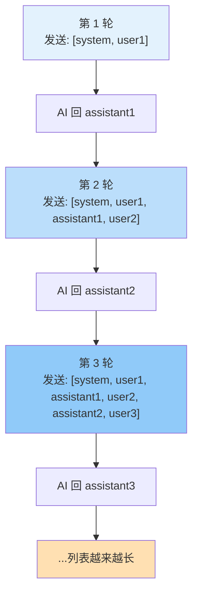
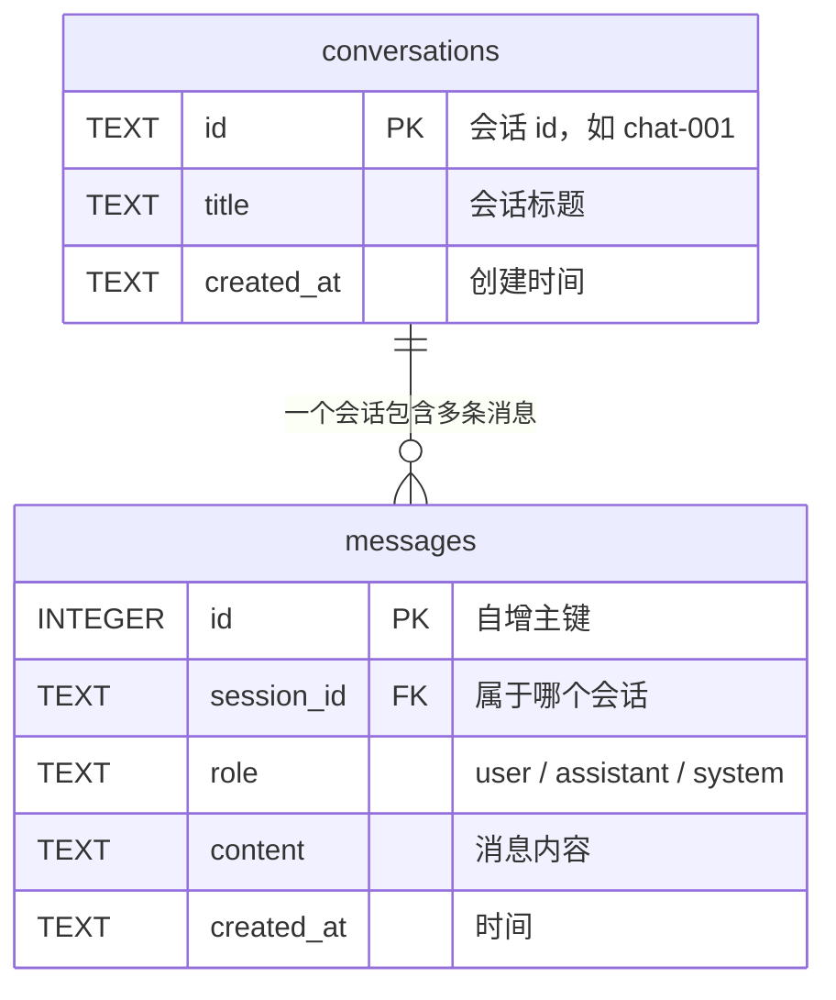

# 第 07 章 · 多轮对话与记忆（🐍 后端基础②：数据持久化）

> 本章目标：让 AI 真正「记住」前面聊过什么，并把对话用 SQLite 存进数据库，重启也不丢。
> 这是后端补给的第二站：你会第一次接触**数据库**。

---

## 本章目标

- [ ] 理解一个反直觉的事实：**大模型本身没有记忆**，每次调用都是「失忆」的
- [ ] 学会多轮对话的真相：把**历史 messages**（user / assistant 交替）一起回传过去
- [ ] 知道为什么历史不能无限长：**上下文窗口（token 上限）**，以及最简单的「只保留最近 N 轮」截断策略
- [ ] 搞懂什么是**数据库**、为什么内存里的变量不够用（重启就没了）
- [ ] 用 Python 自带的 `sqlite3`（零安装）建表、插入、查询
- [ ] 做一个能**记住历史**、并把对话**存进 SQLite** 的小聊天程序

---

## 核心概念

### 1. 大模型是「无状态」的——它根本不记得你

先纠正一个几乎所有人都会有的误解：

> ❌ 「我跟 AI 聊了五句，它应该记得我前面说的话吧？」

**不会。** 大模型 API 是**无状态（stateless）**的。每一次 `chat.completions.create()` 调用，对模型来说都是**全新的、互不相关的一次请求**。它不会偷偷在服务器上帮你存着上一句话。

那 ChatGPT、DeepSeek 网页版为什么看起来「记得」？

> ✅ 因为**客户端**（网页、App）每次都把**之前的全部对话**重新打包，一起发了过去。

用一个 JS 工程师熟悉的类比：

```js
// HTTP 请求是无状态的 —— 跟这个一模一样
// 服务器不记得你上次请求过什么，全靠你这次带上 cookie / token
fetch("/api/chat", { headers: { Authorization: token } });
```

大模型调用就像无状态的 HTTP 请求：**你不带历史，它就不知道历史。**

### 2. 多轮对话的真相：不断往 messages 列表里追加

还记得第 02 章的 `messages` 列表吗？多轮对话就是**把这个列表越堆越长**：

- 第 1 轮：你发 `[user1]`，AI 回 `assistant1`
- 第 2 轮：你要把 `[user1, assistant1, user2]` **全部发过去**，AI 才知道上下文，回 `assistant2`
- 第 3 轮：再发 `[user1, assistant1, user2, assistant2, user3]`……

也就是说，**`user` 和 `assistant` 在列表里交替出现**，把整段历史「复述」给模型听，模型才能接得上。

```python
messages = [
    {"role": "system",    "content": "你是一个简洁的助手"},
    {"role": "user",      "content": "我叫小明"},          # 第 1 轮提问
    {"role": "assistant", "content": "你好，小明！"},        # 第 1 轮回答（要存下来回传）
    {"role": "user",      "content": "我叫什么名字？"},      # 第 2 轮提问
]
# 因为列表里带着「我叫小明」，模型这次才能答出「你叫小明」
```

如果第 2 轮你**只发**「我叫什么名字？」而不带前面的历史，模型会老老实实回答「抱歉，我不知道你的名字」——因为对它来说这确实是第一次见你。

下图展示 messages 列表如何随对话轮次增长：



**记忆 = 你自己维护这个不断增长的列表，每次完整回传。** 模型不帮你记，记忆是你（应用层）的责任。

### 3. 历史不能无限长：上下文窗口与 token

既然每轮都把历史全发过去，问题来了：**列表会越来越长**。这会带来两个麻烦：

1. **超出上下文窗口**：每个模型能一次性「读」的 token 有上限（上下文窗口，context window）。历史太长会被截断甚至报错。
2. **越来越贵**：第 02 章讲过，输入的 token 也算钱。历史每轮都重发，越聊越贵、越聊越慢。

最简单实用的应对策略：**只保留最近 N 轮对话**（再加上始终保留的 system 提示）。

```python
def trim_history(messages, max_rounds=5):
    """保留 system + 最近 max_rounds 轮对话。
    一轮 = 一条 user + 一条 assistant，所以保留 max_rounds*2 条。
    """
    system_msgs = [m for m in messages if m["role"] == "system"]
    chat_msgs   = [m for m in messages if m["role"] != "system"]
    recent = chat_msgs[-max_rounds * 2:]   # 只取末尾若干条
    return system_msgs + recent
```

> 这是最朴素的「滑动窗口」策略。更高级的做法（比如把更早的历史**总结**成一段话再带上）属于进阶话题，本课先用最简单的截断，够用且不易出错。

### 4. 什么是数据库？为什么要持久化

到目前为止，我们可以用一个 Python 变量（比如一个列表）存住对话历史。但有个致命问题：

> **程序一退出，内存里的变量就全没了。** 重启服务，所有人的聊天记录瞬间清零。

用 JS 工程师的经历来理解这个痛点：

```js
// 纯内存变量：刷新页面就没了 —— 跟 Python 重启进程一样
let history = [];

// localStorage：刷新还在，但只存在「这一个浏览器」里，换台电脑就没了
localStorage.setItem("history", JSON.stringify(history));
```

**持久化（persistence）** 就是把数据写到**硬盘**上，让它在程序重启后依然存在。承担这个职责的专门工具，就是**数据库（database）**。

几个最基础的术语，用 JS 对象数组来类比就秒懂：

| 数据库术语 | 含义 | JS 类比 |
|------------|------|---------|
| 表（table） | 一类数据的集合 | 一个对象数组 `messages = [...]` |
| 行（row / record） | 一条具体数据 | 数组里的一个对象 `{ id: 1, role: "user" }` |
| 列（column） | 某个字段 | 对象的一个 key，如 `role` |
| 主键（primary key） | 每行的唯一编号 | 对象里的 `id` 字段 |
| SQL | 操作数据库的语言 | 类似你查数组用的 `.filter()` / `.find()`，但写成一种专门的查询语句 |

### 5. SQLite：最适合入门的「文件型数据库」

数据库种类很多（MySQL、PostgreSQL……），但它们大多要**单独安装、启动一个服务进程**，对新手不友好。

我们选 **SQLite**，因为它对初学者堪称完美：

- **零安装**：Python **标准库自带** `sqlite3`，不用 `pip install` 任何东西
- **零配置**：整个数据库就是**一个文件**（比如 `chat.db`），删掉文件就等于清空数据库
- **够用**：很多正式产品、手机 App 内部都在用它

> 一句话类比：**SQLite 之于数据库，就像 localStorage 之于前端存储**——简单、本地、开箱即用。区别是 SQLite 在**服务端**，能被你的后端程序读写，而不是锁死在某个浏览器里。

本章我们设计两张表，关系如下：



- `conversations`：一行代表一个**会话**（一次完整的聊天），用 `id`（如 `chat-001`）区分。
- `messages`：一行代表一**条消息**，靠 `session_id` 指明它属于哪个会话。

> 这种「一个会话对应多条消息」的结构，就是数据库里典型的**一对多关系**。`messages.session_id` 指向 `conversations.id`，这个「指向」叫**外键（foreign key）**。

---

## 动手实践

> 准备：本章在第 02 章的基础上继续，沿用根目录 `.env` 里的 DeepSeek 密钥。确认已激活 venv。SQLite 不用装任何包。

### 实践 1：第一次用 sqlite3 建表、写入、查询

新建 `db_hello.py`，体会一下数据库的基本操作：

```python
# db_hello.py —— 认识 sqlite3 的三板斧：建表 / 插入 / 查询
import sqlite3

# 连接数据库：文件不存在会自动创建。这就是 SQLite「零配置」的魅力
conn = sqlite3.connect("chat.db")
cursor = conn.cursor()

# 1) 建表（IF NOT EXISTS：已存在就不重复建，避免重跑报错）
cursor.execute("""
    CREATE TABLE IF NOT EXISTS messages (
        id          INTEGER PRIMARY KEY AUTOINCREMENT,  -- 自增主键
        session_id  TEXT    NOT NULL,                   -- 属于哪个会话
        role        TEXT    NOT NULL,                   -- user / assistant / system
        content     TEXT    NOT NULL,                   -- 消息内容
        created_at  TEXT    DEFAULT (datetime('now'))   -- 写入时间，自动填
    )
""")

# 2) 插入一行（注意 ? 占位符，下面「常见报错」会讲为什么必须这么写）
cursor.execute(
    "INSERT INTO messages (session_id, role, content) VALUES (?, ?, ?)",
    ("chat-001", "user", "你好"),
)

# 3) 一定要 commit！否则写入只停留在内存事务里，不会真正落盘
conn.commit()

# 4) 查询：把 chat-001 的所有消息按时间顺序读出来
cursor.execute(
    "SELECT role, content, created_at FROM messages WHERE session_id = ? ORDER BY id",
    ("chat-001",),
)
for role, content, created_at in cursor.fetchall():
    print(f"[{created_at}] {role}: {content}")

conn.close()
```

运行两次看看：

```bash
python db_hello.py
```

你会发现**第二次运行时，第一次写入的数据还在**——这就是持久化。数据被存进了同目录下的 `chat.db` 文件里。

> JS 对照：`CREATE TABLE` 像是声明一个数组的「形状」；`INSERT` 就是 `arr.push({...})`；`SELECT ... WHERE` 就是 `arr.filter(m => m.session_id === "chat-001")`。只不过这些数据存在硬盘文件里，重启不丢。

### 实践 2：把数据库操作封装成两个函数

每次都写 connect / commit / close 太啰嗦。我们封装两个核心函数：**存一条消息**、**读某个会话的全部历史**。新建 `store.py`：

```python
# store.py —— 会话历史的持久化封装
import sqlite3

DB_PATH = "chat.db"


def init_db():
    """初始化两张表，程序启动时调一次。"""
    conn = sqlite3.connect(DB_PATH)
    conn.execute("""
        CREATE TABLE IF NOT EXISTS conversations (
            id          TEXT PRIMARY KEY,
            title       TEXT,
            created_at  TEXT DEFAULT (datetime('now'))
        )
    """)
    conn.execute("""
        CREATE TABLE IF NOT EXISTS messages (
            id          INTEGER PRIMARY KEY AUTOINCREMENT,
            session_id  TEXT NOT NULL,
            role        TEXT NOT NULL,
            content     TEXT NOT NULL,
            created_at  TEXT DEFAULT (datetime('now'))
        )
    """)
    conn.commit()
    conn.close()


def save_message(session_id: str, role: str, content: str):
    """存一条消息到数据库。"""
    conn = sqlite3.connect(DB_PATH)
    # 顺手保证会话存在（INSERT OR IGNORE：已存在就跳过，不报错）
    conn.execute(
        "INSERT OR IGNORE INTO conversations (id, title) VALUES (?, ?)",
        (session_id, content[:20]),  # 拿第一句话的前 20 字当标题
    )
    conn.execute(
        "INSERT INTO messages (session_id, role, content) VALUES (?, ?, ?)",
        (session_id, role, content),
    )
    conn.commit()
    conn.close()


def get_history(session_id: str) -> list[dict]:
    """读出某个会话的完整历史，直接拼成模型要的 messages 格式。"""
    conn = sqlite3.connect(DB_PATH)
    rows = conn.execute(
        "SELECT role, content FROM messages WHERE session_id = ? ORDER BY id",
        (session_id,),
    ).fetchall()
    conn.close()
    # 把每行 (role, content) 变成 {"role": ..., "content": ...}
    return [{"role": role, "content": content} for role, content in rows]
```

注意 `get_history()` 返回的格式，**正好就是模型需要的 `messages` 列表**——这是有意设计的，下一步直接喂给模型。

### 实践 3：能记住历史、并自动存库的聊天程序

现在把三块拼起来：**读历史 → 加新问题 → 调模型 → 把问答都存回库**。复用第 02 章的 `llm.py`。第 02 章的 `ask()` 只接收单个问题，而多轮对话要传**完整 messages 列表**，所以这里**临时**借用 `llm.py` 里的 `_client`/`_model`（带下划线表示「模块内部用」，正常不该外部直接碰）。第 11 章毕业项目会把它正式封装成公开的 `chat(messages)`，到时就不必再这样伸手进内部了。

新建 `chat_with_memory.py`：

```python
# chat_with_memory.py —— 有记忆 + 自动持久化的命令行聊天
from llm import _client, _model          # 临时借用第 02 章的内部对象（第 11 章会换成公开的 chat()）
from store import init_db, save_message, get_history

SESSION_ID = "chat-001"                  # 本次会话的 id（真实项目里每个用户/对话各一个）
SYSTEM_PROMPT = "你是一个友好、简洁的助手。"


def trim_history(messages, max_rounds=5):
    """只保留最近 max_rounds 轮，避免历史过长超 token、变贵。"""
    return messages[-max_rounds * 2:]


def main():
    init_db()                            # 确保表存在
    print("开始聊天（输入 exit 退出）。我会记住我们聊过的内容。\n")

    while True:
        question = input("你: ").strip()
        if question.lower() in ("exit", "quit"):
            break
        if not question:
            continue

        # 1) 存下用户这句话
        save_message(SESSION_ID, "user", question)

        # 2) 从数据库读出完整历史（含刚存进去的这句），并裁剪
        history = trim_history(get_history(SESSION_ID))

        # 3) 拼成发给模型的 messages：system 在最前，后面是历史
        messages = [{"role": "system", "content": SYSTEM_PROMPT}] + history

        # 4) 调模型
        response = _client.chat.completions.create(model=_model, messages=messages)
        answer = response.choices[0].message.content or ""   # 兜底：内容可能为 None

        # 5) 把 AI 的回答也存回库 —— 这样下一轮才"记得"
        save_message(SESSION_ID, "assistant", answer)

        print(f"AI: {answer}\n")


if __name__ == "__main__":
    main()
```

运行，亲自验证「记忆」：

```bash
python chat_with_memory.py
```

试试这段对话：

```
你: 我叫小明，今年 28 岁
AI: 你好小明！很高兴认识你～
你: 我多大了？
AI: 你今年 28 岁呀。
```

第二句没提年龄，AI 却答对了——因为程序从数据库读出了第一句并一起发了过去。

**最关键的一步：退出程序，再重新运行 `python chat_with_memory.py`，接着问「我叫什么名字？」**

```
你: 我叫什么名字？
AI: 你叫小明。
```

即使程序重启过，AI 依然记得——因为历史**存在 `chat.db` 文件里**，而不是内存变量里。这就是持久化的威力。

> 想从头开始？删掉 `chat.db` 文件，或换一个新的 `SESSION_ID` 即可。

### 实践 4（选学）：ORM 长什么样

我们全程用**原生 SQL 字符串**操作数据库，直观、可控，适合学习。但项目大了，手写 SQL 容易出错、也繁琐。于是有了 **ORM（Object-Relational Mapping，对象关系映射）**：用**写 Python 类/对象的方式**操作数据库，框架替你生成 SQL。

Python 里最常见的 ORM 是 **SQLAlchemy**。感受一下它的味道（仅作了解，本章不用安装）：

```python
# 仅示意 ORM 风格，不要求运行
# 一行 = 一个对象，存一条消息就像 new 一个对象再 add
msg = Message(session_id="chat-001", role="user", content="你好")
session.add(msg)
session.commit()

# 查询像链式调用，不用手写 SQL 字符串
history = session.query(Message).filter_by(session_id="chat-001").all()
```

> JS 对照：这就像后端的 **Prisma / TypeORM / Sequelize**——你操作对象，它帮你生成 SQL。**本章用原生 `sqlite3` 足够**，等你做更大的项目时再了解 ORM 也不迟。

---

## 常见报错

| 现象 | 原因 | 解决 |
|------|------|------|
| 程序没报错，但数据库里查不到数据 | 写入后**忘了 `conn.commit()`** | 每次 `INSERT` / `UPDATE` 后调用 `conn.commit()`，否则改动不落盘 |
| `sqlite3.OperationalError: no such table` | 还没建表就去查/插 | 程序启动时先调一次 `init_db()`（含 `CREATE TABLE IF NOT EXISTS`） |
| AI「失忆」、答不出前面说过的内容 | 调模型时**没把历史 messages 一起传** | 确认发送的是 `get_history()` 读出的完整列表，而不只是当前这句 |
| 用户输入含 `'` 等符号后报语法错 / 担心被注入 | 用字符串拼接 SQL（`"... '" + content + "'"`） | **永远用 `?` 占位符 + 参数元组**，让 sqlite3 帮你转义（防 SQL 注入） |
| `context_length_exceeded` / 请求变慢变贵 | 历史太长，超出上下文窗口 | 用 `trim_history()` 只保留最近 N 轮 |
| AI 串了别人的对话 / 历史混在一起 | 查询时 `session_id` 写错或缺失 | 每条消息都要带正确的 `session_id`，查询用 `WHERE session_id = ?` 隔离 |
| `sqlite3.OperationalError: database is locked` | 同一文件被多处同时写 | 单文件聊天场景一般不会遇到；用完及时 `conn.close()` |

> ⚠️ 关于 `?` 占位符再强调一次：**绝不要用 f-string 或字符串相加把用户输入塞进 SQL**。正确写法是 `execute("... VALUES (?, ?)", (a, b))`。这既能正确处理引号等特殊字符，又能防止 **SQL 注入**（恶意用户用输入篡改你的查询）——这是后端最重要的安全习惯之一。

---

## 小结

- 大模型是**无状态**的，自己不记任何东西；多轮对话的「记忆」是**应用层**的责任
- 记忆 = 把历史 `messages`（user / assistant 交替）**每次完整回传**给模型
- 历史不能无限长：受**上下文窗口（token 上限）**限制，且越长越贵，最简单的办法是**只保留最近 N 轮**
- 内存变量重启即失，**数据库**用来把数据**持久化**到硬盘
- **SQLite**（Python 自带 `sqlite3`）零安装、一个文件就是一个库，是入门首选；表 ↔ 对象数组、行 ↔ 对象、SQL ↔ filter/find
- 我们用 `conversations` / `messages` 两张表，靠 `session_id` 把消息归到对应会话
- 关键安全/正确习惯：写入后 **`commit`**、查询/插入用 **`?` 占位符**防注入
- ORM（如 SQLAlchemy）能用对象代替手写 SQL，了解即可，本章用原生 `sqlite3`

---

## 下一章预告

现在你的应用能**记住对话**，还能把历史**存进数据库**永久保留了。但有个新问题在前方等着：当对话历史成千上万条、或者你想做一个「能回答某份文档内容」的助手时，**靠关键字 `WHERE content LIKE '%...%'` 去查根本不够聪明**——它只会死板地匹配字面，不懂「意思相近」。

要让机器理解「语义相似」，就得先把文字变成一串数字——**向量（embedding）**。这是通往 RAG（检索增强生成）的第一块基石。

**← 上一章：[第 06 章：提示工程](../06-prompt-engineering/README.md)**
**→ 下一章：[第 08 章：Embedding 与文本向量](../08-embeddings/README.md)**
