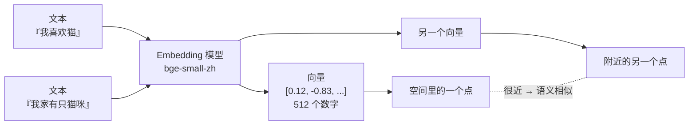

# 第 08 章 · Embedding 与文本向量

> 本章目标：搞懂 AI 怎么「理解」一段文字的意思——把文本变成一串数字（向量），让「语义相近」变成「数字相近」。
> 这是后面 RAG 知识库问答的数学地基。看完你就能算出「两段话有多像」。

---

## 本章目标

- [ ] 用直觉理解 embedding：把一段文本变成一串数字（向量）
- [ ] 理解「语义相近 → 向量也相近」，以及它和「字面匹配」的区别
- [ ] 看懂余弦相似度（cosine similarity）的直觉和公式，会手算一个小例子
- [ ] 用**本地开源中文模型** `BAAI/bge-small-zh-v1.5` 把文本转成向量（免费、离线、不烧 API）
- [ ] 用 numpy 写一个余弦相似度函数，比较几段中文文本的相似度
- [ ] 明白 RAG 为什么离不开它（埋个伏笔：用向量去「找最相关的资料」）

---

## 核心概念

### 1. Embedding 是什么：把文字翻译成一串数字

到目前为止，我们都是把文字直接丢给大模型。但计算机本质上只会算数字，它没法直接「比较两句话像不像」。

**Embedding（嵌入）就是一个翻译器：输入一段文本，输出一串固定长度的数字。** 这串数字就叫**向量（vector）**。

```
"我喜欢猫"   ──→  [0.12, -0.83, 0.45, ... , 0.07]   （比如 512 个数字）
```

给 JS 程序员的类比：你可以把它想成 `embed("我喜欢猫")` 返回了一个 `number[]` 数组，长度固定（本章用的模型是 512）。无论输入是 2 个字还是 200 个字，输出数组长度都一样。

关键不在于数字本身长什么样，而在于这个性质：

> **意思相近的文本，得到的向量也相近；意思差很远的文本，向量也离得远。**

模型在海量文本上训练过，它学会了「猫」和「猫咪」很像、「猫」和「股票」八竿子打不着。这些「意思上的远近」，最后就编码进了这串数字里。

### 2. 向量空间：每段文本是空间里的一个点

一个长度为 512 的向量，就是 512 维空间里的一个**坐标点**。512 维我们脑子想不出来，但可以降到 2 维来找直觉——就当每段文本是平面上的一个点：

```
        语义空间（简化成二维示意）
     ▲ y
     │
     │      ● 猫
     │     ● 猫咪          ← 「猫」「猫咪」「狗」凑成一堆：都是动物
     │   ● 狗
     │
     │                    ● 股票
     │                  ● 基金        ← 「股票」「基金」凑成另一堆：都是金融
     │                ● 理财
     │
     └──────────────────────────────▶ x
```

意思相近的词「抱团」聚在一起，不相关的词分散到别处。**计算两段文本像不像，就变成了计算「两个点离得有多近」。** 这就是 embedding 最妙的地方：把「语义」这种抽象的东西，变成了「距离」这种能算的东西。

整个流程串起来是这样：



### 3. 余弦相似度：怎么衡量「两个向量有多像」

衡量两个向量像不像，最常用的是**余弦相似度（cosine similarity）**。它的直觉是：**只看两个向量「指的方向」像不像，不在乎它们多长。**

想象从原点画出两支箭头（两个向量），看它们的夹角：

- 夹角越小（方向几乎一致）→ 越相似 → 余弦值越接近 **1**
- 夹角 90°（毫不相干）→ 余弦值约等于 **0**
- 夹角 180°（完全相反）→ 余弦值接近 **-1**

```
         ↗ B            A、B 夹角很小 → 很相似（≈1）
        ↗
       ↗ A
原点 ●──────────▶          C 跟 A 夹角约 90° → 不相干（≈0）
       │
       ▼ C
```

公式长这样（别怕，下面就用小例子算一遍）：

```
                    A · B
cos(A, B) = ─────────────────────
              |A| × |B|
```

拆开看就三步：

- **分子 `A · B`**：点积（dot product）= 对应位置相乘再求和。`A·B = a₁b₁ + a₂b₂ + …`
- **分母 `|A|`**：向量的长度（模）= 各元素平方和再开根号。`|A| = √(a₁² + a₂² + …)`
- 相除，把长度的影响除掉，只剩「方向有多一致」。

**手算一个迷你例子**（假装向量只有 2 维，方便心算）：

```
A = [1, 2]   B = [2, 4]   C = [-2, 1]

A 和 B：
  点积 = 1×2 + 2×4 = 10
  |A| = √(1²+2²) = √5 ≈ 2.236
  |B| = √(2²+4²) = √20 ≈ 4.472
  cos = 10 / (2.236 × 4.472) = 10 / 10 = 1.0   ← 完全同方向，极相似

A 和 C：
  点积 = 1×(-2) + 2×1 = 0
  cos = 0 / (...) = 0      ← 垂直，毫不相干
```

记住结论就够了：**余弦相似度越接近 1，两段文本越像。** RAG 里就是靠它从一堆资料里挑出「跟你的问题最像」的那几段。

### 4. 和「关键词匹配」有什么不一样

传统搜索是**字面匹配**：你搜「手机」，它只找含「手机」二字的内容。问题是：

- 「苹果手机」和「iPhone」字面没一个字相同，但意思几乎一样 —— 关键词匹配抓不到
- 「苹果」既可能指水果，也可能指手机品牌 —— 关键词匹配分不清

embedding 是**语义匹配**：它比的是意思，不是字。后面实践里我们就会看到，「苹果手机很好用」和「iPhone 体验不错」的向量很近，而和「这个苹果真甜」的向量较远——哪怕后两句都带「苹果」二字。

---

## 动手实践

### 为什么本章用「本地模型」而不是调 API

前面几章我们调的是 DeepSeek 的对话接口。算 embedding 当然也可以调云端接口（很多服务商提供 OpenAI 兼容的 embedding 接口，调法和第 02 章几乎一样，本章末尾会提一句）。但本章我们**改用本地开源模型**，原因很实在：

- **免费**：跑在你自己电脑上，不花一分钱、不消耗 API 额度
- **离线**：模型下载一次后断网也能用
- **稳定**：不用担心某家服务到底提不提供 embedding 接口

我们用的是 `BAAI/bge-small-zh-v1.5`——智源研究院开源的中文向量模型，专门为中文优化，体积小（约 100MB），笔记本就能跑。

### 实践 0：安装依赖

```bash
# 确保已激活 venv（命令行前面有 (.venv)），然后安装
pip install sentence-transformers numpy
```

> `sentence-transformers` 是一个把「下载模型 + 把文本转成向量」都包好了的库。第一次用会自动从网上下载模型文件，**初次会慢一点（几分钟），之后就走本地缓存，秒开**。

### 实践 1：把一段文本变成向量

新建 `embed_hello.py`：

```python
# embed_hello.py —— 第一次把文本变成向量
from sentence_transformers import SentenceTransformer

# 加载本地中文向量模型（第一次会自动下载，约 100MB，请耐心等待）
model = SentenceTransformer("BAAI/bge-small-zh-v1.5")

text = "我喜欢猫"
vector = model.encode(text)   # 把文本编码成向量

print("文本：", text)
print("向量维度：", len(vector))      # 512
print("前 5 个数字：", vector[:5])    # 看看长什么样
```

运行：

```bash
python embed_hello.py
```

你会看到向量维度是 `512`，以及一串小数。**恭喜——你刚刚亲手把一句中文变成了 AI 能比较的数字。** 那串数字你看不懂没关系，重点是下一步：用它来比相似度。

### 实践 2：用 numpy 算余弦相似度

新建 `similarity.py`，先写一个通用的余弦相似度函数，再喂几段文本进去比：

```python
# similarity.py —— 计算两段文本的语义相似度
from sentence_transformers import SentenceTransformer
import numpy as np

model = SentenceTransformer("BAAI/bge-small-zh-v1.5")


def cosine_similarity(a, b):
    """计算两个向量的余弦相似度，返回 -1 ~ 1 的数，越接近 1 越相似。"""
    a = np.array(a)
    b = np.array(b)
    # 分子：点积；分母：两个向量的长度相乘
    return float(np.dot(a, b) / (np.linalg.norm(a) * np.linalg.norm(b)))


def text_similarity(text1: str, text2: str) -> float:
    """直接比较两段文本的相似度。"""
    v1 = model.encode(text1)
    v2 = model.encode(text2)
    return cosine_similarity(v1, v2)


if __name__ == "__main__":
    pairs = [
        ("我喜欢猫", "我家有只猫咪"),     # 意思很近
        ("我喜欢猫", "今天股市大涨"),     # 毫不相干
        ("苹果手机很好用", "iPhone 体验不错"),   # 字面不同，意思相同
        ("苹果手机很好用", "这个苹果真甜"),       # 字面都有「苹果」，意思却不同
    ]
    for t1, t2 in pairs:
        score = text_similarity(t1, t2)
        print(f"{score:.3f}  |  「{t1}」 vs 「{t2}」")
```

运行：

```bash
python similarity.py
```

你大致会看到这样的结果（具体数值因模型版本略有差异）：

```
0.85x  |  「我喜欢猫」 vs 「我家有只猫咪」
0.3xx  |  「我喜欢猫」 vs 「今天股市大涨」
0.8xx  |  「苹果手机很好用」 vs 「iPhone 体验不错」
0.5xx  |  「苹果手机很好用」 vs 「这个苹果真甜」
```

读懂这张表，本章核心就拿下了：

- 「猫」和「猫咪」分数高 → 语义相近，向量也近
- 「猫」和「股市」分数低 → 不相干
- **「苹果手机」和「iPhone」分数高**，但**「苹果手机」和「甜苹果」分数偏低** → 这正是 embedding 比关键词搜索强的地方：它看的是**意思**，不是字面是否都有「苹果」。

> `numpy` 是 Python 里做数值计算的标配库，`np.dot` 算点积、`np.linalg.norm` 算向量长度，比自己写循环又快又简洁。`model.encode` 返回的本来就是 numpy 数组，所以可以直接算。

### 实践 3：一句话从一堆候选里找「最像」的（RAG 的雏形）

这其实就是 RAG 检索的核心动作：给一个问题，从一堆资料里挑出最相关的那条。新建 `find_best.py`：

```python
# find_best.py —— 从多段资料里找出与问题最相关的一段
from sentence_transformers import SentenceTransformer
import numpy as np

model = SentenceTransformer("BAAI/bge-small-zh-v1.5")

# 假装这是我们知识库里的几段「资料」
docs = [
    "猫是一种常见的宠物，喜欢睡觉和抓老鼠。",
    "Python 是一门适合初学者的编程语言。",
    "RAG 通过检索相关资料来增强大模型的回答。",
    "今天北京天气晴朗，适合出门散步。",
]

question = "什么是检索增强生成？"

# 把问题和所有资料一次性编码成向量（批量传 list 更高效）
q_vec = model.encode(question)
doc_vecs = model.encode(docs)


def cosine_similarity(a, b):
    return float(np.dot(a, b) / (np.linalg.norm(a) * np.linalg.norm(b)))


# 算问题和每段资料的相似度，按高到低排序
scored = [(cosine_similarity(q_vec, dv), doc) for dv, doc in zip(doc_vecs, docs)]
scored.sort(reverse=True)

print(f"问题：{question}\n")
print("按相关度排序：")
for score, doc in scored:
    print(f"  {score:.3f}  {doc}")

print(f"\n最相关的资料是：{scored[0][1]}")
```

运行：

```bash
python find_best.py
```

你会看到关于 RAG 的那句资料排在最前面——尽管问题里说的是「检索增强生成」，资料里写的是「RAG」，字面几乎对不上，但 embedding 知道它俩是一个意思。

**记住这个画面：把问题和所有资料都变成向量，谁离问题最近就用谁。** 这就是 RAG 检索的全部精髓。

### 为什么 RAG 需要它（伏笔）

大模型有两个硬伤：不知道你的私有资料（公司文档、个人笔记），也记不住超长内容。RAG 的解法是：

1. 提前把你的资料切成小段，每段算好 embedding 存起来
2. 用户提问时，把问题也算成 embedding
3. **用余弦相似度找出最相关的几段资料**，连同问题一起塞给大模型
4. 大模型「带着资料」回答，又准又有依据

第 2 步、第 3 步靠的正是本章的 embedding + 相似度。下一章我们就来解决「这些向量存哪、怎么快速检索」的问题——这就是**向量数据库**。

---

## 常见报错

| 现象 | 原因 | 解决 |
|------|------|------|
| 第一次运行卡很久没反应 | 在后台下载模型（约 100MB） | **正常现象**，耐心等几分钟，下完会缓存，之后秒开 |
| 下载报错 / 连接超时 / `ConnectionError` | 网络访问 HuggingFace 不稳 | 配国内镜像：运行前设环境变量 `HF_ENDPOINT=https://hf-mirror.com`（见下方说明） |
| `ModuleNotFoundError: sentence_transformers` | 没装包 / 没激活 venv | 确认命令行有 `(.venv)`，再 `pip install sentence-transformers` |
| `ModuleNotFoundError: numpy` | 没装 numpy | `pip install numpy` |
| 相似度算出来是 `nan` | 向量全为 0，分母为零 | 检查输入文本是否为空字符串；本章模型不会返回全零，传空串才会出问题 |
| 相似度全都偏高（0.6 以上） | 正常 | 中文模型对短文本的基线相似度本来就偏高，**看相对高低**而非绝对值 |
| `model.encode` 传一个字符串却想当多条 | 把多段文本放进 `list` 一次传 | 传 `list` 返回的是「向量的数组」，每行对应一条文本 |

> **配国内镜像**（下载慢/失败时）：在代码最前面加两行，或在终端先设环境变量。
> ```python
> import os
> os.environ["HF_ENDPOINT"] = "https://hf-mirror.com"   # 必须在 import sentence_transformers 之前
> ```

---

## 小结

- **Embedding = 把文本翻译成一串固定长度的数字（向量）**；意思相近，向量就相近
- 每段文本是高维空间里的一个点，「比较意思」就变成了「比较距离/方向」
- **余弦相似度**衡量两个向量的方向有多一致：越接近 1 越像，接近 0 不相干；公式就是「点积 ÷ 两者长度之积」
- 本章用本地开源中文模型 `BAAI/bge-small-zh-v1.5`，免费、离线、专为中文优化
- 用 `model.encode()` 拿向量，用 numpy 的 `np.dot` / `np.linalg.norm` 三行算出相似度
- embedding 看的是**语义**而非字面，这是它强过关键词搜索的根本原因——也是 RAG 检索的基石
- （补充）想用云端：调 OpenAI 兼容的 embedding 接口即可，写法类似第 02 章，把文本传进去拿回向量，本课为省心和离线主用本地模型

## 下一章预告

现在你能把任意文本变成向量、还能算它们有多像了。但真实的知识库可能有**成千上万段**资料——每次提问都把所有资料重新编码、挨个算相似度，太慢了。

我们需要一个专门「存向量 + 快速找最近邻」的工具：**向量数据库**。下一章我们用 `Chroma`，几行代码就把向量存进去、毫秒级检索出最相关的内容。

**← 上一章：[第 07 章 · 多轮对话与记忆](../07-memory-and-persistence/README.md)**
**→ 下一章：[第 09 章 · 向量数据库](../09-vector-database/README.md)**
