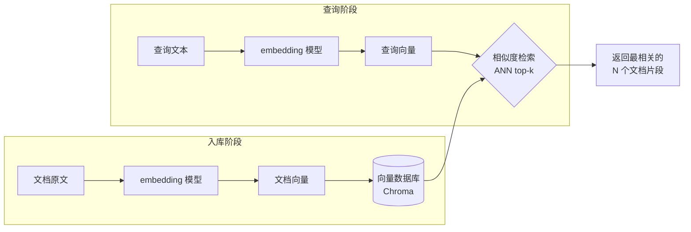

# 第 09 章 · 向量数据库

> 本章目标：把第 08 章生成的向量**存起来**，并能在成千上万条里**秒级找出最相似的几条**。
> 这是从「玩具脚本」走向「真实 RAG 系统」的关键一步——你会用到一个叫 **Chroma** 的向量数据库。

---

## 本章目标

- [ ] 想明白：为什么不能用第 07 章的 SQLite 来存向量、为什么要专门的向量数据库
- [ ] 装上 Chroma：`pip install chromadb`
- [ ] 用**持久化客户端**把数据真正写到本地硬盘（重启不丢）
- [ ] 创建 collection，并接入第 08 章的 embedding 模型（`BAAI/bge-small-zh-v1.5`）
- [ ] 用 `collection.add(...)` 入库、`collection.query(...)` 做 top-k 相似检索
- [ ] 看懂返回结果的结构（documents / distances / ids）

---

## 核心概念

### 1. 为什么需要向量数据库

第 08 章你已经会了：把一段文本变成一串数字（向量），再用余弦相似度比较两段文本「意思有多近」。

问题来了——**比较一次是简单的，比较一万次就不简单了。**

假设你的知识库有 1 万段文档，每段都已经算好了向量。现在用户问一个问题，你想找出**最相关的 3 段**。手写的做法是：

```python
# 朴素做法：把问题向量和每一条都算一遍相似度，再排序
scores = [cosine(query_vec, doc_vec) for doc_vec in all_10000_vecs]
top3 = sorted(...)[:3]
```

这有几个现实问题：

- **慢**：1 万条还能忍，100 万条呢？每次提问都要全量算一遍。
- **占内存**：所有向量都得加载进内存。
- **重启就没了**：脚本一关，算好的向量全丢，下次还得重算。
- **要自己维护**：增删改、和原文的对应关系、id 管理，全得手写。

**向量数据库**就是专门解决这件事的工具。你把向量「存进去」，它帮你：

1. **持久化**——写到硬盘，重启还在；
2. **高效检索**——用 **ANN（Approximate Nearest Neighbor，近似最近邻）** 算法，不用全量比较也能快速找出最相似的几条；
3. **管理元数据**——每条向量可以挂上原文、来源、id，查出来直接能用。

> 「近似」最近邻：为了快，它允许极小概率不是数学上最精确的前几名，但对 RAG 这种场景完全够用，换来的是百倍千倍的速度。

### 2. 向量数据库 vs 普通数据库（你熟悉的「增删查」）

前端做过列表页就知道：数据库无非是「增、删、改、查」。向量数据库也一样，只是**「查」的方式不同**——普通数据库按字段精确匹配，向量数据库按**相似度**匹配。

| 维度 | SQLite（第 07 章） | 向量数据库（Chroma） |
|------|------|------|
| 存什么 | 结构化数据（用户、消息、字段） | 向量 + 原文 + 元数据 |
| 怎么查 | `WHERE name = '张三'`（精确/范围匹配） | 「找出和这句话**最像**的前 3 条」 |
| 适合 | 账号、订单、会话记录 | 语义检索、RAG 知识库 |
| 类比 | MySQL 风格的关系查询 | 搜索引擎的「相关结果」 |

它们**不是替代关系，而是搭档**：真实项目里，SQLite 存用户和会话，向量库存知识片段，各干各的。

### 3. Chroma 的几个核心名词

| 名词 | 是什么 | 前端类比 |
|------|------|------|
| **client** | 数据库连接入口 | 一个数据库实例 |
| **collection** | 一组同类数据的集合 | 一张「表」 |
| **documents** | 原始文本 | 表里的一列（原文） |
| **embeddings** | 文本对应的向量 | 自动生成的「索引列」 |
| **ids** | 每条数据的唯一标识 | 主键 |
| **metadatas** | 附加信息（来源、标签等，可选） | 额外字段 |

关键点：**embedding 可以让 Chroma 帮你自动生成**。你只要告诉它用哪个 embedding 模型，之后 `add` 文本时它自动算向量、`query` 时自动把问题也转成向量——你不用再手动调第 08 章的模型。

### 4. 整体数据流

下面这张图就是本章（以及后面整个 RAG）的核心链路：左边是「入库」，右边是「查询」，**两边共用同一个 embedding 模型**，这样向量才在同一个空间里、才能比较。



> 注意图里入库和查询用的是**同一个** embedding 模型——这非常重要。如果两边模型不同，向量维度和语义空间对不上，检索结果就是乱的。所以本章我们继续用第 08 章的 `BAAI/bge-small-zh-v1.5`。

---

## 动手实践

### 准备：安装 Chroma

确保已激活 venv（命令行前面有 `(.venv)`），然后安装：

```bash
pip install chromadb
```

> 第一次安装稍慢，它会带上一些依赖。第 08 章已经装过 `sentence-transformers`，这里 Chroma 会复用它来生成向量。（如果你跳过了第 08 章，需要再 `pip install sentence-transformers`，否则 Chroma 自动算向量时会报缺包。）

### 实践 1：创建持久化客户端和 collection

新建 `vector_store.py`。我们用**持久化客户端** `PersistentClient`，把数据写到本地 `chroma_db` 目录（这个目录已经在项目 `.gitignore` 里，不会被提交）。

```python
# vector_store.py —— 创建一个持久化的向量库
import chromadb
from chromadb.utils.embedding_functions import SentenceTransformerEmbeddingFunction

# 1. 持久化客户端：数据会写到 ./chroma_db 目录，重启不丢
client = chromadb.PersistentClient(path="chroma_db")

# 2. 指定 embedding 模型——和第 08 章保持一致，这样向量空间才对得上
embed_fn = SentenceTransformerEmbeddingFunction(model_name="BAAI/bge-small-zh-v1.5")

# 3. 创建（或获取已存在的）collection，相当于建一张「表」
#    get_or_create_collection：有就拿来用，没有就新建，重复运行也不报错
collection = client.get_or_create_collection(
    name="my_docs",
    embedding_function=embed_fn,
    metadata={"hnsw:space": "cosine"},  # 用余弦距离，和第 08 章的余弦相似度对应
)

print("collection 就绪，当前条数：", collection.count())
```

```bash
python vector_store.py
```

第一次运行会打印 `当前条数： 0`，并在目录下生成一个 `chroma_db` 文件夹——这就是落在硬盘上的数据库。

> 为什么用 `get_or_create_collection` 而不是 `create_collection`？因为 `create_collection` 在 collection 已存在时会报错。`get_or_create` 让脚本可以反复运行，这是「好品味」的写法——消除了「第一次 vs 第二次运行」这个边界情况。

### 实践 2：把文档入库（增）

向 collection 里塞几条文档。注意：**我们只传 `documents` 和 `ids`，向量由 Chroma 用上面指定的模型自动生成**——你完全不用手动算 embedding。

```python
# 接着 vector_store.py 往下写
docs = [
    "Python 是一门简洁易学的编程语言，常用于 AI 开发。",
    "FastAPI 是一个高性能的 Python Web 框架，适合写后端接口。",
    "RAG 是一种让大模型先检索资料再回答的技术。",
    "向量数据库用于存储文本向量并支持相似度检索。",
    "前端工程师通常用 JavaScript 编写网页交互逻辑。",
]
ids = ["doc1", "doc2", "doc3", "doc4", "doc5"]

# add：把文档存进去（Chroma 自动调 embedding 模型算好向量再入库）
collection.add(documents=docs, ids=ids)

print("入库完成，当前条数：", collection.count())
```

再次运行 `python vector_store.py`，应看到 `当前条数： 5`。

> ⚠️ `ids` 必须唯一。如果用同样的 id 再 `add` 一次，Chroma 不会报错但也不会重复插入（同 id 视为已存在）。想更新内容用 `collection.update(...)`，想删除用 `collection.delete(ids=[...])`——增删改查它都有。

### 实践 3：相似度检索（查）

这是向量库的灵魂。我们问一个问题，让它返回**最相关的 3 条**。注意我们传的是 `query_texts`（自然语言问题），Chroma 会自动把它转成向量再去检索：

```python
# 接着往下写：检索
result = collection.query(
    query_texts=["怎么用 Python 做网站后端？"],
    n_results=3,   # top-k：要最相关的前 3 条
)

print(result)
```

运行后，`result` 大致长这样（数字会有出入）：

```python
{
    "ids": [["doc2", "doc1", "doc3"]],
    "documents": [[
        "FastAPI 是一个高性能的 Python Web 框架，适合写后端接口。",
        "Python 是一门简洁易学的编程语言，常用于 AI 开发。",
        "RAG 是一种让大模型先检索资料再回答的技术。",
    ]],
    "distances": [[0.41, 0.58, 0.79]],
    "metadatas": [[None, None, None]],
}
```

问「怎么用 Python 做网站后端」，排第一的是 FastAPI 那条——**它做到了按语义找最相关，而不是按关键词匹配**（注意问题里根本没出现「FastAPI」三个字）。

### 实践 4：看懂返回结构

`query` 的返回是个字典，每个值都是**二维列表**——因为你可以一次查多个问题，外层对应「第几个问题」，内层对应「该问题的 top-k 结果」。我们只查了一个问题，所以都取 `[0]`：

```python
# 优雅地取出第一个问题的结果
docs_found = result["documents"][0]
dists = result["distances"][0]
ids_found = result["ids"][0]

print("=== 最相关的 3 条 ===")
for rank, (doc, dist, _id) in enumerate(zip(docs_found, dists, ids_found), start=1):
    print(f"[{rank}] id={_id}  距离={dist:.3f}")
    print(f"    {doc}")
```

返回字段说明：

| 字段 | 含义 | 怎么用 |
|------|------|------|
| `ids` | 命中文档的 id 列表 | 回溯到原始数据 |
| `documents` | 命中文档的原文 | 直接拿去拼进 prompt（第 10 章） |
| `distances` | **距离**，越小越相似 | 判断相关度、可设阈值过滤 |
| `metadatas` | 入库时附带的元数据 | 标注来源、做引用展示 |

> ⚠️ 注意是「距离（distance）」不是「相似度（similarity）」：上面建 collection 时指定了 `hnsw:space="cosine"`，返回的就是**余弦距离 ≈ 1 − 余弦相似度**，所以**越小代表越相似**——和第 08 章「余弦相似度越大越像」正好方向相反，别搞反了。（若不指定 space，Chroma 默认用 L2 欧氏距离，数值范围不同，但同样是越小越相似。）

### 实践 5（可选）：带元数据入库

真实 RAG 里，你往往想知道某段文字「来自哪个文件、哪一页」。`add` 时多传一个 `metadatas` 即可，查询时它会一起返回，方便后面做「引用来源」展示（毕业项目第 12 章会用到）：

```python
collection.add(
    documents=["Chroma 默认把数据存在内存，用 PersistentClient 才会落盘。"],
    ids=["doc6"],
    metadatas=[{"source": "第09章笔记", "page": 1}],
)
```

---

## 常见报错

| 现象 | 原因 | 解决 |
|------|------|------|
| `ModuleNotFoundError: chromadb` | 没装包 / 没激活 venv | 确认前缀有 `(.venv)`，再 `pip install chromadb` |
| 第二次运行报 collection 已存在 | 用了 `create_collection` | 改用 `get_or_create_collection` |
| 重启后数据没了 | 用了内存客户端 `chromadb.Client()` | 改用 `chromadb.PersistentClient(path="chroma_db")` |
| 检索结果完全不相关 | 入库和查询用了不同 embedding 模型 | 两处必须用同一个模型（本章统一 `bge-small-zh-v1.5`） |
| `add` 后 `count()` 没增加 | `ids` 和已有的重复了 | id 必须唯一；想改内容用 `update` |
| 首次运行卡在下载 | 在下载 embedding 模型（几十 MB） | 等它下完，之后会缓存，不用重复下 |
| `Expected embeddings to be of length N` 维度报错 | 自己手传了维度不一致的向量 | 要么全交给 embedding_function 自动生成，要么保证手传向量维度一致 |

---

## 小结

- **手算相似度在大数据量下不现实**：慢、占内存、重启就丢。向量数据库负责高效存储 + 近似最近邻（ANN）检索。
- 向量库和 SQLite 是**搭档不是替代**：SQLite 存结构化数据按字段精确查，向量库存向量按**语义相似度**查。
- Chroma 用 `PersistentClient(path="chroma_db")` 把数据**落到硬盘**，重启不丢。
- 给 collection 指定 `SentenceTransformerEmbeddingFunction`（沿用第 08 章的 `bge-small-zh-v1.5`），入库和查询的向量化就**全自动**了。
- 核心三招：`add(documents, ids)` 入库 → `query(query_texts, n_results)` 检索 → 取 `result["documents"][0]` 拿原文。
- 返回的 `distances` 是**距离，越小越相似**，别和余弦相似度搞反。
- 生产环境还有 Pinecone、Milvus、pgvector 等更重的选择，但**本课程用 Chroma 足够**——零配置、本地可跑、毕业项目直接能用。

## 下一章预告

现在你手里有了完整的两件武器：**会把文本变成向量**（第 08 章），也**会高效地存和检索向量**（本章）。

把它们串起来，再接上第 02 章的大模型调用，就是大名鼎鼎的 **RAG（检索增强生成）**：用户提问 → 去向量库**检索**最相关的资料 → 把资料拼进 prompt → 让大模型**带着资料回答**。这样 AI 就能回答它原本不知道的、你私有知识库里的内容了。

下一章我们就把这条链路完整跑通，做出本课程第一个真正的 RAG 最小实现。

**← 上一章：[第 08 章：Embedding 与文本向量](../08-embeddings/README.md)**

**→ [第 10 章：RAG 原理与最小实现](../10-rag-fundamentals/README.md)**
