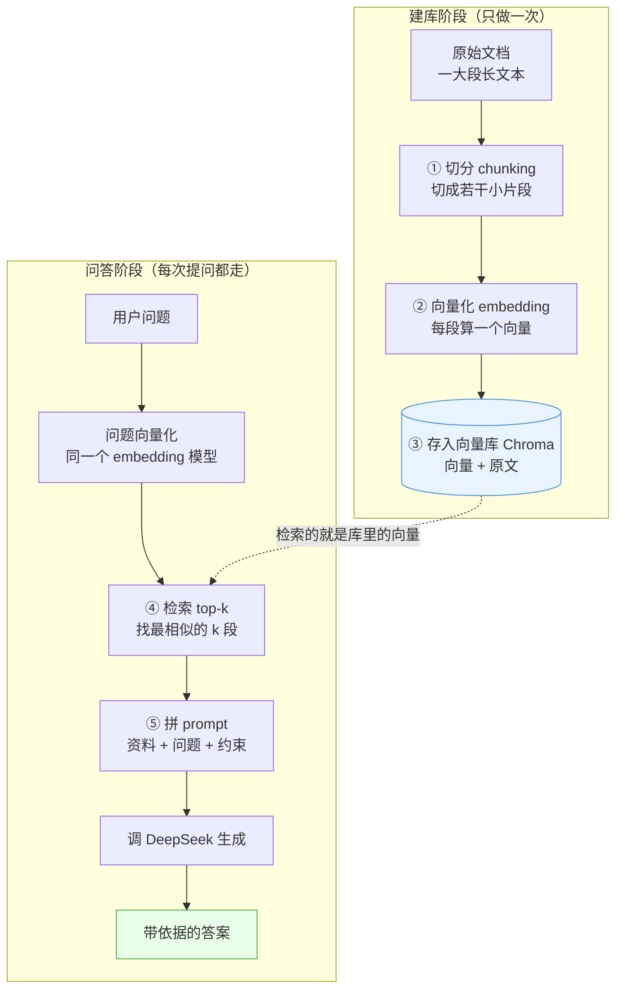

# 第 10 章 · RAG 原理与最小实现

> 本章目标：把第 06、08、09 章的知识串成一条完整链路，做一个命令行版的「文档问答」最小可运行 demo。
> 这是你毕业项目的核心原型——跑通它，你就真正理解了什么叫「让大模型读你自己的文档」。

---

## 本章目标

- [ ] 说清楚 RAG（检索增强生成）到底解决什么问题
- [ ] 掌握完整链路五步：切分 → 向量化 → 入库 → 检索 → 拼 prompt 生成
- [ ] 理解文档切分（chunking）的策略：chunk 大小与重叠（overlap）怎么设、为什么
- [ ] 跑通一个端到端可运行的最小 RAG：入库一段示例文档 → 提问 → 检索 top-3 → 拼 prompt → 调 DeepSeek 作答
- [ ] 学会用 prompt 约束模型「只依据资料回答，没有就说不知道」，把幻觉压下去

---

## 核心概念

### 1. RAG 解决什么问题：让模型「带着资料回答」

到目前为止，你调 DeepSeek 时，它的回答全靠**训练时记住的知识**。这有两个硬伤：

1. **它不知道你的私有数据**——你公司的产品手册、内部 wiki、昨天写的会议纪要，模型从没见过。
2. **它的知识有截止日期**——训练之后发生的事、更新的文档，它一概不知。

如果你直接问「我们公司的退款政策是几天」，模型要么老实说不知道，要么**一本正经地编一个**——这就是「幻觉」（hallucination）。

**RAG（Retrieval-Augmented Generation，检索增强生成）** 的思路特别朴素，用一句话概括：

> **先去你的资料库里「检索」出和问题相关的片段，再把这些片段塞进 prompt，让模型「看着资料」来回答。**

类比一下：闭卷考试时，学生只能靠脑子里背的（容易记错、编答案）；RAG 相当于把考试改成**开卷**——先翻书找到相关那几页，再照着写答案。模型还是那个模型，但因为手里有了「正确资料」，答案就靠谱多了，幻觉也少了。

### 2. 完整链路五步

RAG 分成两个阶段。**建库阶段**只做一次（把文档处理好存起来）；**问答阶段**每次提问都走一遍。

| 步骤 | 阶段 | 在干什么 | 用到的章节 |
|------|------|----------|------------|
| ① 文档切分 chunking | 建库 | 把长文档切成一小段一小段 | 本章 |
| ② 向量化 embedding | 建库 | 每段文本算出一个向量 | 第 08 章 |
| ③ 存入向量库 | 建库 | 把向量 + 原文存进 Chroma | 第 09 章 |
| ④ 按问题检索 top-k | 问答 | 把问题也变成向量，找出最相似的 k 段 | 第 08/09 章 |
| ⑤ 拼 prompt 让模型回答 | 问答 | 把检索到的片段作为「资料」拼进 prompt | 第 06 章 |

下面这张图是本章最重要的图，把两个阶段画全了——建议你对着它读后面的代码：



记住一个关键点（后面「常见报错」会反复强调）：**建库时和检索时，必须用同一个 embedding 模型**。否则两边的向量「坐标系」不一样，算出来的相似度毫无意义。

### 3. 切分策略：chunk 大小与重叠 overlap

为什么不能把整篇文档当成「一段」直接向量化？两个原因：

1. **检索粒度**：一篇万字长文压成一个向量，等于把一本书的内容糊成一个点，检索时根本分不清你问的是哪一节。切小了，才能精准命中相关那一小段。
2. **prompt 长度**：模型的上下文有 token 上限（第 02 章讲过 token），也要省钱。检索出几小段塞进 prompt，比把整篇文档塞进去划算得多。

**怎么切？** 最简单实用的两种：

- **按段落切**：用空行 / 换行分段，符合人类写作的自然边界，语义最完整。
- **按长度切**：每 N 个字符切一刀，简单粗暴、长度可控。本章用这种，方便你看懂逻辑。

**chunk 大小（chunk size）**：太大，一段里混了好几个话题，检索不精准、还浪费 token；太小，一句话被切断，语义不完整，模型看不懂。中文文档常见 **300～500 字**一段，是个不错的起点。（注意：本章下面的 demo 文档很短，代码里特意用了较小的 `chunk_size=120` 好切出多段、看清效果；实战按 300~500 这个经验值调即可，第 11 章毕业项目就用了 300。）

**重叠（overlap）**：相邻两段**故意重复一小部分内容**（比如 50 字）。为什么？因为硬切可能正好把一句关键的话切成两半，分到两个 chunk 里，哪段都不完整。让边界处重叠一点，就能保证关键信息至少在某一段里是完整的。类比：裁布料时多留一点缝边，免得正好剪断花纹。

```
原文： [........................................]
chunk1：[............]
chunk2：       [............]      ← 开头和 chunk1 结尾重叠
chunk3：              [............]
                 ↑ 重叠区，防止关键句被切断
```

---

## 动手实践

我们写**一个文件** `rag_demo.py`，从头到尾把五步串起来，直接能跑。

### 准备：安装依赖

沿用前几章的环境（确保 venv 已激活，看到命令行前面有 `(.venv)`）：

```powershell
# 第 08/09 章应该已经装过，这里列全以防万一
pip install openai python-dotenv chromadb sentence-transformers
```

- `chromadb`：第 09 章的向量数据库。
- `sentence-transformers`：第 08 章用来加载 BGE 中文向量模型 `BAAI/bge-small-zh-v1.5`（首次运行会自动下载模型，需要联网，请耐心等一下）。
- `openai` + `python-dotenv`：第 02 章封装的 DeepSeek 调用，复用根目录 `.env`。

### 完整脚本

新建 `rag_demo.py`，完整内容如下。每一段都标了它对应链路里的第几步：

```python
# rag_demo.py —— 命令行版「文档问答」最小 RAG demo
# 链路：① 切分 → ② 向量化 → ③ 入库 → ④ 检索 → ⑤ 拼 prompt 生成
import os
from dotenv import load_dotenv
from openai import OpenAI
import chromadb
from sentence_transformers import SentenceTransformer

load_dotenv()  # 读根目录 .env（第 00 章配好的 DeepSeek 密钥）

# ---------- 0. 准备：DeepSeek 客户端 + 中文向量模型 ----------
client = OpenAI(
    api_key=os.getenv("DEEPSEEK_API_KEY"),
    base_url=os.getenv("DEEPSEEK_BASE_URL"),  # https://api.deepseek.com
)
MODEL = os.getenv("DEEPSEEK_MODEL")  # deepseek-chat

# 第 08 章的 BGE 中文向量模型。建库和检索必须用同一个，所以只加载一次
embedder = SentenceTransformer("BAAI/bge-small-zh-v1.5")


def embed(texts: list[str]) -> list[list[float]]:
    """把一批文本转成向量列表（复用第 08 章思路）。"""
    # normalize_embeddings=True：把向量归一化到单位长度，配合下面的余弦距离检索更稳定
    return embedder.encode(texts, normalize_embeddings=True).tolist()


# ---------- 示例文档：假装这是你公司的「私有资料」，模型本来不知道 ----------
DOCUMENT = """
小柚科技成立于 2021 年，是一家专注于智能家居的创业公司，总部位于杭州。
公司的明星产品是「小柚台灯 Pro」，支持语音控制和护眼调光，售价 399 元。
关于退货：商品自签收之日起 7 天内，在不影响二次销售的前提下可无理由退货，运费由买家承担。
关于保修：小柚台灯 Pro 提供 2 年质保，质保期内非人为损坏免费维修，人为损坏只收取材料费。
客服工作时间为每天早上 9 点到晚上 9 点，可通过官方 App 或 400 电话联系。
公司目前有员工约 80 人，研发团队占比超过一半，2024 年完成了 A 轮融资。
"""


# ---------- ① 文档切分 chunking ----------
def split_text(text: str, chunk_size: int = 120, overlap: int = 30) -> list[str]:
    """按长度切分：每 chunk_size 个字符一段，相邻段重叠 overlap 个字符。

    overlap 的作用：防止一句关键的话正好被切断，分到两段都不完整。
    """
    text = text.strip()
    chunks = []
    start = 0
    step = max(1, chunk_size - overlap)  # 防止 overlap >= chunk_size 时原地死循环
    while start < len(text):
        end = start + chunk_size
        chunk = text[start:end].strip()
        if chunk:
            chunks.append(chunk)
        # 下一段的起点往前挪，留出 overlap 重叠区
        start += step
    return chunks


# ---------- ②③ 向量化 + 入库 Chroma（建库阶段，只做一次）----------
def build_index():
    chunks = split_text(DOCUMENT)
    print(f"① 切分完成，共 {len(chunks)} 段")

    # 内存版 Chroma（第 09 章）：脚本退出就清空，方便反复试验
    chroma = chromadb.Client()
    # get_or_create：重复运行不报错；指定 cosine 距离，与第 09 章一致
    collection = chroma.get_or_create_collection(
        name="xiaoyou_docs",
        metadata={"hnsw:space": "cosine"},
    )

    # ② 把每段算成向量；③ 连同原文一起存进 Chroma
    collection.add(
        ids=[f"chunk-{i}" for i in range(len(chunks))],  # 每段一个唯一 id
        documents=chunks,                                 # 原文（检索后要拿回来拼 prompt）
        embeddings=embed(chunks),                         # 对应的向量
    )
    print("②③ 向量化并入库完成")
    return collection


# ---------- ④ 按问题检索 top-k ----------
def retrieve(collection, question: str, k: int = 3) -> list[str]:
    """把问题向量化，从库里找最相似的 k 段原文。"""
    result = collection.query(
        query_embeddings=embed([question]),  # 问题用同一个 embedder！
        n_results=k,
    )
    # query 返回的是「批量」结构，我们只问了一个问题，取第 0 个
    return result["documents"][0]


# ---------- ⑤ 拼 prompt 让模型基于资料回答 ----------
def answer(question: str, contexts: list[str]) -> str:
    """把检索到的片段作为「资料」拼进 prompt，约束模型只依据资料回答。"""
    # 把多段资料编号拼成一块文本
    context_text = "\n\n".join(f"【资料{i+1}】{c}" for i, c in enumerate(contexts))

    # 关键：system 里立规矩——只准用资料，没有就说不知道（呼应第 06 章约束提示）
    system_prompt = (
        "你是一个严谨的文档问答助手。"
        "你必须【只依据下面提供的资料】回答用户问题，不要使用你自己的知识、不要编造。"
        "如果资料里找不到答案，就直接回答「根据现有资料，我无法回答这个问题」。"
    )
    user_prompt = f"以下是可参考的资料：\n\n{context_text}\n\n请根据上述资料回答问题：{question}"

    response = client.chat.completions.create(
        model=MODEL,
        messages=[
            {"role": "system", "content": system_prompt},
            {"role": "user", "content": user_prompt},
        ],
    )
    return response.choices[0].message.content


# ---------- 把五步串起来 ----------
if __name__ == "__main__":
    # 建库（只需一次）
    collection = build_index()

    # 问答循环：输入问题，回车提问，输入 q 退出
    print("\n文档问答已就绪，输入问题试试（输入 q 退出）")
    while True:
        question = input("\n你问：").strip()
        if question.lower() == "q":
            break
        if not question:
            continue

        # ④ 检索 top-3 相关片段
        contexts = retrieve(collection, question, k=3)
        print("④ 检索到的相关片段：")
        for i, c in enumerate(contexts):
            print(f"   [资料{i+1}] {c[:40]}...")

        # ⑤ 拼 prompt 调 DeepSeek 生成
        print("\nAI 答：", answer(question, contexts))
```

### 运行与验证

```powershell
python rag_demo.py
```

试着问这几个问题，体会 RAG 的效果：

- **「小柚台灯保修几年？」** → 检索会命中那段保修说明，模型答「2 年质保」。
- **「退货运费谁出？」** → 命中退货那段，模型答「运费由买家承担」。
- **「小柚科技的 CEO 是谁？」** → 资料里没写，模型会老实说「根据现有资料，我无法回答」——这正是我们想要的，**不编**。

你可以亲自验证 RAG 的价值：把同样的问题（比如「小柚台灯保修几年」）直接丢给第 02 章的 `llm.py` 里的 `ask()`，模型只会瞎猜，因为它从没见过这家虚构公司。**有没有那段检索到的资料，就是「编」和「答对」的区别。**

### 这段代码做了什么（对照流程图回顾）

| 函数 | 对应链路 | 一句话 |
|------|----------|--------|
| `split_text()` | ① 切分 | 长文按长度切片，相邻重叠 30 字 |
| `embed()` | ② 向量化 | BGE 中文模型把文本变向量 |
| `build_index()` | ②③ 入库 | 向量 + 原文存进 Chroma |
| `retrieve()` | ④ 检索 | 问题向量化，取 top-3 最相似片段 |
| `answer()` | ⑤ 生成 | 资料拼进 prompt，约束后调 DeepSeek |

---

## 常见报错

| 现象 | 原因 | 解决 |
|------|------|------|
| 答案像在编、和资料对不上 | prompt 没约束「只依据资料」 | 在 system 里明确「只用资料、没有就说不知道」（见 `answer()`） |
| 检索回来的片段不相关 | chunk 太大，一段混了多个话题 | 调小 `chunk_size`（如 300→150），让每段话题更集中 |
| 关键句被切断、答不全 | chunk 太小 或 overlap 太小 | 适当加大 `chunk_size`，或把 `overlap` 调大（如 30→50） |
| 检索结果太少 / 漏掉答案 | `k` 太小 | 把 `retrieve` 的 `k` 调大（如 3→5），但别太大，会塞爆 prompt |
| 相似度全乱、检索完全不准 | 建库和检索用了**不同**的 embedding 模型 | 全程只用同一个 `embedder`（本章只加载一次就是这个原因） |
| `ModuleNotFoundError: chromadb / sentence_transformers` | 没装包 / 没激活 venv | 确认 `(.venv)` 后重跑上面的 `pip install` |
| 首次运行卡在下载模型 | 在下载 BGE 模型权重 | 正常，联网等待即可；下载一次后会缓存 |
| `AuthenticationError` / 余额不足 | DeepSeek 密钥或余额问题 | 回第 02 章「常见报错」排查 `.env` 与余额 |

---

## 小结

- **RAG = 检索 + 生成**：先从你的资料库检索相关片段，再让模型「看着资料」回答，解决「模型不知道你的私有/最新数据」和「幻觉」两大问题。
- **完整五步**：① 切分 chunking → ② 向量化 embedding（第 08 章）→ ③ 入库 Chroma（第 09 章）→ ④ 检索 top-k → ⑤ 拼 prompt 生成（第 06 章约束提示）。
- **切分有讲究**：chunk 不能太大（检索不准、费 token）也不能太小（语义断裂）；用 **overlap** 重叠防止关键句被切断。
- **两条铁律**：建库与检索**必须用同一个 embedding 模型**；prompt 必须约束**「只依据资料回答，没有就说不知道」**，否则白做。
- 你已经有了一个端到端可跑的最小 RAG——这就是毕业项目的核心原型。

## 下一章预告

现在这个 demo 是命令行版、文档还写死在代码里。毕业项目要的是：**用户上传自己的文件 → 自动解析 → 切分入库 → 在线问答**，还要把它做成一个真正的后端服务。

下一章 🐍 我们正式进入毕业项目：把本章这条 RAG 链路**工程化**，用 FastAPI（第 03/04 章）做成「上传 → 解析 → 向量化 → 入库 → 检索 → 问答」的完整 RAG 后端。

**← 上一章：[第 09 章：向量数据库](../09-vector-database/README.md)**
**→ 下一章：[第 11 章：毕业项目① RAG 后端](../11-capstone-backend/README.md)**
