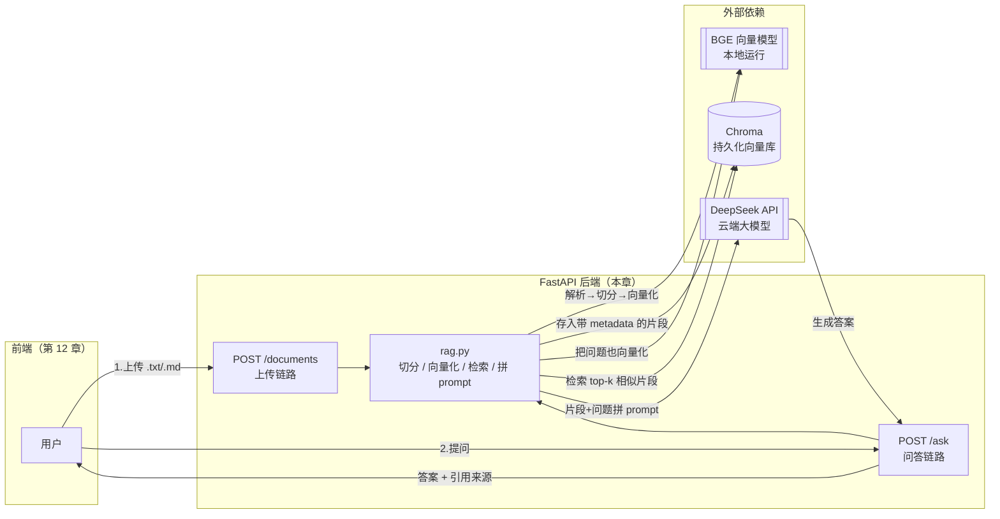
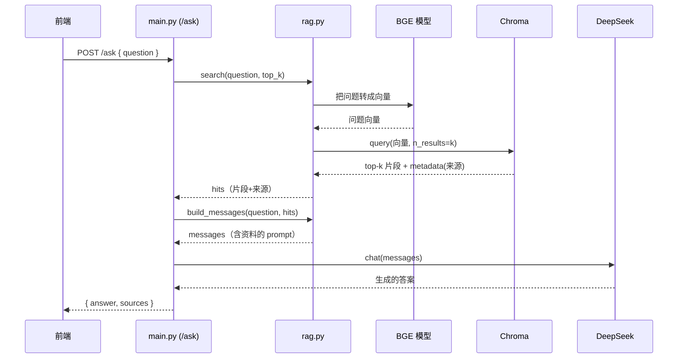

# 第 11 章 · 毕业项目① RAG 后端

> 本章目标：把第 10 章的 RAG 原型工程化为一个**完整、可运行、能给前端调用**的 FastAPI 后端服务。
> 这是毕业项目的「服务端」部分——上传文档、入库、提问、带引用作答，全部跑通。

---

## 本章目标

- [ ] 规划一个清晰的后端项目结构（main / rag / 存储目录 / requirements.txt）
- [ ] 写出 `POST /documents` 上传接口：接收文件 → 解析 → 切分 → BGE 向量化 → 存入 Chroma（持久化）
- [ ] 写出 `POST /ask` 问答接口：检索 top-k → 拼 prompt → 调 DeepSeek → 返回**答案 + 引用来源**
- [ ] 给文档片段打上 metadata（文件名/来源），让答案能「说出它是从哪段文字得出的」
- [ ] 配好 CORS、错误处理，为第 12 章前端铺好路
- [ ]（可选）实现流式问答接口 `POST /ask/stream`

> 这一章会把前面所有零件组装起来：FastAPI（第 03/04 章）、Chroma + BGE（第 09 章）、RAG 拼接（第 10 章）、流式（第 04 章）。你之前学的每一块，这里都会用上。

---

## 核心概念

### 1. 从「脚本」到「服务」：本章到底升级了什么

第 10 章你写的 RAG 是一个**脚本**：跑一次、读固定文件、问一个固定问题、打印答案、退出。这没法给前端用——前端需要的是一个**一直在运行、随时能接收请求**的服务。

本章要补齐三件脚本没有、但服务必须有的能力：

| 脚本（第 10 章） | 服务（本章） |
|------------------|--------------|
| 读硬编码的几段文本 | 用户**上传任意文件**，运行时动态入库 |
| 数据在内存里，跑完就没了 | Chroma **持久化到磁盘**，重启还在 |
| 直接 print 答案 | 通过 HTTP **返回 JSON** 给前端 |
| 只有答案 | 答案 + **引用来源**（哪段文字支撑了它） |
| 出错就崩 | 统一**错误处理**，返回友好提示 |

### 2. 两条核心链路

整个后端就两条链路，先在脑子里建立全景图：



- **上传链路**（`/documents`）：把知识「喂」进系统。文件 → 文本 → 切成小块 → 每块转成向量 → 连同来源信息存进 Chroma。
- **问答链路**（`/ask`）：从系统里「问」出答案。问题 → 转成向量 → 在 Chroma 里找最相似的几块 → 把这几块和问题一起拼成 prompt → 交给 DeepSeek 生成答案 → 把答案和**这几块的来源**一起返回。

### 3. metadata：让答案「可追溯」是本章的灵魂

第 10 章的 RAG 只回答了「是什么」，但用户会追问「**你凭什么这么说？**」。一个负责任的知识库必须能指出：这个答案是基于**哪个文件、哪一段文字**得出的。这就是「引用来源（citation）」。

实现起来不难——Chroma 在存每个片段时，允许你附带一个 `metadata` 字典。我们存的时候记下来源：

```python
# 存片段时，每块都带上它来自哪个文件
metadata = {"source": "员工手册.md", "chunk_index": 3}
```

检索时 Chroma 会把命中片段的 `metadata` 一起还给你。于是 `/ask` 就能在返回答案的同时，附上一份「我参考了这些片段」的清单。**这是 RAG 系统区别于「裸调大模型」的关键价值——可信、可查证。**

### 4. 项目结构：把脚本拆成模块

服务变复杂了，不能再全堆在一个文件里。我们按职责拆分：

```
rag-backend/
├── main.py            # FastAPI 应用：定义路由、CORS、错误处理（薄薄一层）
├── rag.py             # RAG 核心逻辑：切分、向量化、入库、检索、拼 prompt
├── llm.py             # 复用第 02 章封装的 DeepSeek 调用
├── requirements.txt   # 依赖清单
├── .env               # 复用根目录的全局密钥（第 00 章）
└── storage/
    └── chroma/        # Chroma 持久化目录（自动生成，存向量数据）
```

> 这是后端最常见的分层思路：**main.py 只管「接活和派活」（路由层），rag.py 管「真正干活」（业务逻辑层）。** 类比前端，main.py 像路由 + 组件，rag.py 像抽出去的 hooks / service。好处是逻辑能单独测试、单独复用，路由文件保持清爽。

---

## 动手实践

### 准备：建项目、装依赖

新建一个 `rag-backend` 目录，激活你的 venv（第 01 章建的），然后准备 `requirements.txt`：

```text
# requirements.txt —— 第 11 章 RAG 后端依赖
fastapi              # Web 框架（第 03/04 章）
uvicorn[standard]    # 运行 FastAPI 的服务器
python-dotenv        # 读取 .env 密钥（第 00 章）
openai               # 调 DeepSeek（兼容 OpenAI 接口，第 02 章）
chromadb             # 向量数据库（第 09 章）
sentence-transformers  # 加载 BGE 向量模型（第 08/09 章）
python-multipart     # FastAPI 接收文件上传必须装它
pypdf                # 解析 PDF（进阶可选）
```

安装：

```bash
pip install -r requirements.txt
```

> ⚠️ `python-multipart` 容易被忘记。FastAPI 接收上传文件（`UploadFile`）依赖它，没装的话一上传就报错。`sentence-transformers` 第一次运行会自动下载 BGE 模型（几百 MB），需要耐心等一次，之后会用本地缓存。

### 第 1 步：复用大模型调用（llm.py）

复用第 02 章 `llm.py` 的思路。但 RAG 要传入的是**完整的 messages**（system 里塞了检索到的资料），所以这里把封装升级为接收 messages 列表的 `chat()`，并额外加一个**流式版本** `chat_stream()` 给后面可选的流式接口用。新建 `llm.py`：

```python
# llm.py —— 复用第 02 章的 DeepSeek 封装，并补一个流式版本
from dotenv import load_dotenv
from openai import OpenAI
import os

# 从项目根目录 .env 读密钥（第 00 章配好的全局密钥）
load_dotenv()

_client = OpenAI(
    api_key=os.getenv("DEEPSEEK_API_KEY"),
    base_url=os.getenv("DEEPSEEK_BASE_URL"),
)
_model = os.getenv("DEEPSEEK_MODEL")


def chat(messages: list[dict]) -> str:
    """传入完整 messages，返回完整答案字符串。"""
    resp = _client.chat.completions.create(model=_model, messages=messages)
    return resp.choices[0].message.content


def chat_stream(messages: list[dict]):
    """流式版本：逐块 yield 文本片段（供 /ask/stream 用）。"""
    stream = _client.chat.completions.create(
        model=_model, messages=messages, stream=True
    )
    for chunk in stream:
        delta = chunk.choices[0].delta.content
        if delta:
            yield delta
```

### 第 2 步：RAG 核心逻辑（rag.py）

这是本章的心脏。它封装了第 08/09/10 章的所有知识：加载 BGE、连接持久化的 Chroma、切分、入库（带 metadata）、检索、拼 prompt。新建 `rag.py`：

```python
# rag.py —— RAG 核心：向量化 / 入库 / 检索 / 拼 prompt
import os
import chromadb
from sentence_transformers import SentenceTransformer

# ---------- 一、全局加载一次（昂贵资源只初始化一次）----------

# BGE 中文向量模型（第 08/09 章）。加载较慢，所以放在模块顶层只加载一次
_embedder = SentenceTransformer("BAAI/bge-small-zh-v1.5")

# 持久化的 Chroma 客户端：数据写到磁盘 storage/chroma，重启不丢（第 09 章）
_STORAGE_DIR = os.path.join(os.path.dirname(__file__), "storage", "chroma")
_client = chromadb.PersistentClient(path=_STORAGE_DIR)

# get_or_create：有就拿、没有就建，跨重启复用同一个 collection
# 指定 cosine 距离，与第 09/10 章一致（配合 _embed 的归一化）
_collection = _client.get_or_create_collection(
    "knowledge", metadata={"hnsw:space": "cosine"}
)


def _embed(texts: list[str]) -> list[list[float]]:
    """把一批文本转成向量。normalize 后用余弦相似度更准（第 08 章）。"""
    return _embedder.encode(texts, normalize_embeddings=True).tolist()


# ---------- 二、切分（第 10 章的 chunk 逻辑）----------

def split_text(text: str, chunk_size: int = 300, overlap: int = 50) -> list[str]:
    """按字符数切分，块之间留 overlap 重叠，避免把一句话拦腰切断。"""
    text = text.strip()
    if not text:
        return []
    chunks = []
    start = 0
    step = max(1, chunk_size - overlap)  # 防止 overlap >= chunk_size 时原地死循环
    while start < len(text):
        end = start + chunk_size
        chunks.append(text[start:end])
        start += step  # 下一块往回退 overlap 个字，制造重叠
    return chunks


# ---------- 三、入库（带 metadata 记录来源）----------

def add_document(text: str, source: str) -> int:
    """把一篇文档切分、向量化、存入 Chroma。返回切了多少块。"""
    chunks = split_text(text)
    if not chunks:
        return 0

    embeddings = _embed(chunks)
    # 每块给一个全局唯一 id（用文件名+序号，重复上传同名文件会覆盖旧块）
    ids = [f"{source}::{i}" for i in range(len(chunks))]
    # 关键：metadata 记录来源，检索时能原样拿回来用于引用
    metadatas = [{"source": source, "chunk_index": i} for i in range(len(chunks))]

    _collection.add(
        ids=ids,
        documents=chunks,        # 原文（检索时返回，用于拼 prompt + 展示引用）
        embeddings=embeddings,   # 向量（用于相似度检索）
        metadatas=metadatas,     # 来源信息（用于引用）
    )
    return len(chunks)


# ---------- 四、检索 top-k（第 10 章）----------

def search(question: str, top_k: int = 4) -> list[dict]:
    """检索与问题最相似的 top_k 个片段，返回片段文本 + 来源。"""
    query_vec = _embed([question])
    result = _collection.query(query_embeddings=query_vec, n_results=top_k)

    # Chroma 返回的是嵌套列表（因为支持一次查多个问题），取第 0 个问题的结果
    docs = result["documents"][0]
    metas = result["metadatas"][0]
    dists = result["distances"][0]

    hits = []
    for doc, meta, dist in zip(docs, metas, dists):
        hits.append({
            "text": doc,
            "source": meta["source"],
            "chunk_index": meta["chunk_index"],
            "distance": dist,   # 距离越小越相似
        })
    return hits


# ---------- 五、拼 prompt（第 10 章 + 第 06 章约束技巧）----------

def build_messages(question: str, hits: list[dict]) -> list[dict]:
    """把检索片段和问题拼成 messages，约束模型只依据资料作答。"""
    # 把每段资料编号，方便模型在答案里引用「资料1/资料2」
    context = "\n\n".join(
        f"【资料{i + 1}｜来自 {h['source']}】\n{h['text']}"
        for i, h in enumerate(hits)
    )

    system = (
        "你是一个严谨的知识库助手。只能依据下面提供的【资料】回答问题。"
        "如果资料里找不到答案，就直说「根据现有资料无法回答」，不要编造。"
        "回答时可以引用资料编号。"
    )
    user = f"已知资料如下：\n\n{context}\n\n---\n请回答问题：{question}"

    return [
        {"role": "system", "content": system},
        {"role": "user", "content": user},
    ]
```

> 注意 `_embedder` 和 `_client` 放在模块顶层、只初始化一次。BGE 模型加载和 Chroma 连接都是昂贵操作，**绝不能在每次请求里重新加载**——否则每次提问都卡几秒。这是把脚本改成服务时最容易踩的性能坑。

### 第 3 步：FastAPI 应用与两个接口（main.py）

现在写路由层。它很「薄」——只负责接收请求、调用 `rag.py`、组织返回。新建 `main.py`：

```python
# main.py —— FastAPI 应用：路由 + CORS + 错误处理
from fastapi import FastAPI, UploadFile, HTTPException
from fastapi.middleware.cors import CORSMiddleware
from pydantic import BaseModel

import rag
import llm

app = FastAPI(title="RAG 知识库后端")

# ---------- CORS：允许前端（第 12 章）跨域访问 ----------
# 前端跑在 localhost:5173 等端口，和后端不同源，必须显式放行
app.add_middleware(
    CORSMiddleware,
    allow_origins=["*"],        # 学习阶段用 *；上线请改成你的前端域名（第 13 章）
    allow_methods=["*"],
    allow_headers=["*"],
)


# ---------- 请求体模型（第 03 章 Pydantic）----------
class AskRequest(BaseModel):
    question: str
    top_k: int = 4


# ---------- 接口一：上传文档 ----------
@app.post("/documents")
async def upload_document(file: UploadFile):
    """接收 .txt / .md 文件，解析→切分→向量化→存入 Chroma。"""
    filename = file.filename or "unnamed"

    # 1. 只支持纯文本类（PDF 见进阶部分）
    if not filename.lower().endswith((".txt", ".md")):
        raise HTTPException(status_code=400, detail="目前仅支持 .txt / .md 文件")

    # 2. 读取文件内容（UploadFile 是异步的，要 await）
    raw = await file.read()
    try:
        text = raw.decode("utf-8")  # 大多数文本是 UTF-8
    except UnicodeDecodeError:
        # 退而求其次：用 gbk 再试一次（部分 Windows 记事本存的是 GBK）
        text = raw.decode("gbk", errors="ignore")

    if not text.strip():
        raise HTTPException(status_code=400, detail="文件内容为空")

    # 3. 切分 + 向量化 + 入库（rag.py 一行搞定）
    n_chunks = rag.add_document(text, source=filename)

    return {"filename": filename, "chunks": n_chunks, "message": "上传并入库成功"}


# ---------- 接口二：问答（返回答案 + 引用来源）----------
@app.post("/ask")
def ask(req: AskRequest):
    """检索 top-k → 拼 prompt → 调 DeepSeek → 返回答案 + 引用。"""
    # 1. 检索
    hits = rag.search(req.question, top_k=req.top_k)

    # 2. 检索为空的降级处理：库里没东西就别浪费一次大模型调用
    if not hits:
        return {
            "answer": "知识库还是空的，请先上传一些文档再提问。",
            "sources": [],
        }

    # 3. 拼 prompt 并调用大模型
    messages = rag.build_messages(req.question, hits)
    answer = llm.chat(messages)

    # 4. 组织引用来源：把命中的片段整理成清单一起返回
    sources = [
        {
            "source": h["source"],
            "chunk_index": h["chunk_index"],
            "preview": h["text"][:80],   # 给前端展示一小段预览
        }
        for h in hits
    ]

    return {"answer": answer, "sources": sources}


# ---------- 健康检查（部署时常用，第 13 章）----------
@app.get("/health")
def health():
    return {"status": "ok"}
```

启动服务：

```bash
uvicorn main:app --reload
# 启动后访问 http://127.0.0.1:8000/docs 看自动生成的接口文档（第 03 章）
```

### 第 4 步：用自动文档跑通全流程

打开 `http://127.0.0.1:8000/docs`，FastAPI 自动生成的交互页面让你不写前端也能测试：

1. **先上传**：展开 `POST /documents`，点 `Try it out`，选一个 `.txt` 或 `.md` 文件（比如随便写一份「公司请假制度.md」），执行。看到 `"chunks": N, "message": "上传并入库成功"` 就对了。
2. **再提问**：展开 `POST /ask`，填入 `{"question": "请假需要提前几天申请？"}`，执行。你会看到：

```json
{
  "answer": "根据资料1，请假需要提前 3 个工作日提交申请……",
  "sources": [
    {"source": "公司请假制度.md", "chunk_index": 0, "preview": "员工请假须提前3个工作日……"}
  ]
}
```

**答案 + 它从哪来——一个完整的 RAG 后端就跑通了。** 重启服务后再问同一个问题，依然能答出来，证明 Chroma 持久化生效了。

### `/ask` 请求时序图

把问答这条链路在时间维度上拆开看，每一环谁在等谁、谁调谁，一目了然：



### 第 5 步（可选）：流式问答接口

第 04 章学过流式（SSE），体验比「转圈等几秒」好得多。难点在于：**流式时答案是一段段吐出来的，而引用来源是一次性的。** 解决办法是**先把引用作为第一条消息发出去，再逐字流式发答案**。新增一个接口：

```python
# main.py 顶部补充导入
import json
from fastapi.responses import StreamingResponse


@app.post("/ask/stream")
def ask_stream(req: AskRequest):
    """流式问答：先发引用来源，再逐字流式发答案（SSE，第 04 章）。"""
    hits = rag.search(req.question, top_k=req.top_k)

    def event_generator():
        # 第一帧：先把引用来源发给前端（前端可以先把「参考来源」渲染出来）
        sources = [
            {"source": h["source"], "preview": h["text"][:80]} for h in hits
        ]
        yield f"data: {json.dumps({'type': 'sources', 'data': sources}, ensure_ascii=False)}\n\n"

        if not hits:
            yield f"data: {json.dumps({'type': 'done'})}\n\n"
            return

        # 后续帧：逐块流式发答案文本
        messages = rag.build_messages(req.question, hits)
        for delta in llm.chat_stream(messages):
            yield f"data: {json.dumps({'type': 'token', 'data': delta}, ensure_ascii=False)}\n\n"

        # 结束帧
        yield f"data: {json.dumps({'type': 'done'})}\n\n"

    return StreamingResponse(event_generator(), media_type="text/event-stream")
```

> 这里用 `type` 字段区分「来源」「文本块」「结束」三种帧，前端按类型分别处理。这种「带类型的流式协议」是 RAG 前端的标准做法，第 12 章前端会按这个协议来消费。

### 进阶（可选）：支持 PDF 上传

很多知识其实在 PDF 里。用 `pypdf` 把 PDF 文本抽出来，复用同一条入库链路即可。在 `main.py` 的上传接口里加一个分支：

```python
from pypdf import PdfReader
import io

# 在 upload_document 里，扩展支持的后缀并按类型解析
if filename.lower().endswith(".pdf"):
    raw = await file.read()
    reader = PdfReader(io.BytesIO(raw))          # 从内存字节读 PDF
    text = "\n".join(page.extract_text() or "" for page in reader.pages)
elif filename.lower().endswith((".txt", ".md")):
    raw = await file.read()
    text = raw.decode("utf-8", errors="ignore")
else:
    raise HTTPException(status_code=400, detail="仅支持 .txt / .md / .pdf")
```

> ⚠️ PDF 是「排版格式」不是「文本格式」，抽取效果时好时坏：扫描版 PDF（本质是图片）抽不出文字，需要 OCR；带复杂表格/分栏的 PDF 可能错乱。学习阶段先支持文本型 PDF 即可，别在这里钻牛角尖。

---

## 常见报错

| 现象 | 原因 | 解决 |
|------|------|------|
| `Form data requires "python-multipart"` | 没装 multipart | `pip install python-multipart`，上传文件必需 |
| 上传大文件请求超时 / 内存飙升 | 一次性读进内存 + 同步切分向量化太久 | 学习阶段限制文件大小（如读取后判断 `len`）；生产可改成后台任务异步入库 |
| PDF 解析出来是乱码/空白 | 扫描版 PDF 是图片，或字体未嵌入 | 换文本型 PDF；扫描件需 OCR（超出本章范围） |
| 提问返回「知识库还是空的」 | 还没上传，或 collection 没复用上 | 先调 `/documents`；确认用的是 `get_or_create_collection` 且 `PersistentClient` 路径一致 |
| 重启后文档全没了 | 用了内存版 Chroma（`chromadb.Client()`） | 必须用 `PersistentClient(path=...)`，数据才落盘 |
| 前端调用报 CORS 错误 | 没配跨域 | 确认加了 `CORSMiddleware`，`allow_origins` 包含前端地址 |
| 首次启动卡很久 | BGE 模型在下载 | 正常，仅首次；下载完会缓存到本地 |
| 答案明显在「编造」 | prompt 没约束住 | 强化 system：「资料里没有就说无法回答」（第 06 章），并检查检索是否命中相关片段 |
| 流式响应前端拿不到 / 一次性返回 | 经代理被缓冲 | SSE 需关闭中间层缓冲；本地直连 uvicorn 一般正常（第 04 章） |

---

## 小结

- 把第 10 章的 RAG **脚本**升级成了**服务**：文档运行时上传、Chroma 持久化、通过 HTTP 返回 JSON
- 项目拆成 `main.py`（薄路由层 + CORS + 错误处理）、`rag.py`（向量化/入库/检索/拼 prompt）、`llm.py`（复用第 02 章），职责清晰
- `POST /documents`：文件 → 解析 → 切分 → BGE 向量化 → **带 metadata（来源）** 存入 Chroma
- `POST /ask`：检索 top-k → 拼带约束的 prompt → DeepSeek 生成 → 返回**答案 + 引用来源**
- metadata 让答案**可追溯**，这是 RAG 区别于「裸调大模型」的核心价值
- 配好了 CORS 和错误处理，并准备了带类型的流式接口，为第 12 章前端铺好了路

## 下一章预告

后端已经能上传、入库、带引用作答了。但现在还得在 `/docs` 页面手动点——普通用户可不会用这个。

下一章我们回到你最熟悉的主场：**用 JavaScript 给这个后端写一个真正的前端**——上传文档的界面、聊天问答的界面，以及把「引用来源」漂亮地展示出来。把毕业项目变成一个**任何人都会用的产品**。

**← 上一章：[第 10 章：RAG 原理与最小实现](../10-rag-fundamentals/README.md)**

**→ 下一章：[第 12 章：毕业项目② RAG 前端](../12-capstone-frontend/README.md)**
