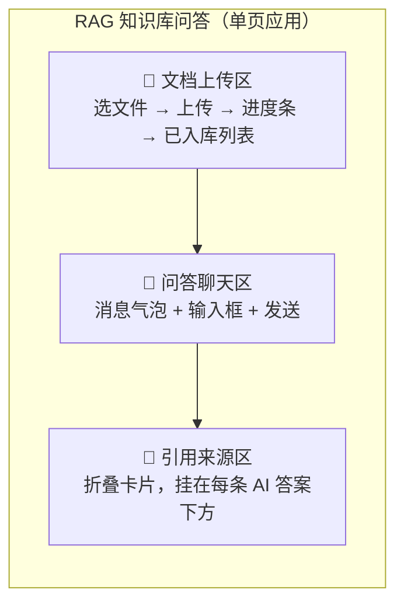
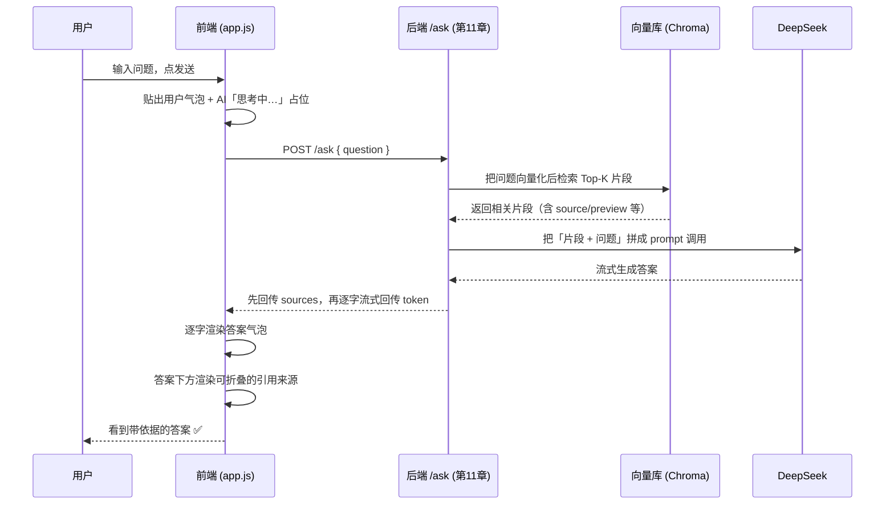

# 第 12 章 · 毕业项目② RAG 前端

> 本章目标：给上一章的 RAG 后端做一个完整、好看、能用的前端界面。
> 上传文档 → 提问 → 看到带「引用来源」的答案——你的毕业项目，到这一章就真正跑通了。

---

## 本章目标

- [ ] 用原生 HTML/CSS/JS 搭出三块区域：**文档上传区** + **问答聊天区** + **引用来源展示**
- [ ] 用 `FormData` 调 `POST /documents` 上传文档，并显示**上传进度**和入库结果
- [ ] 调 `POST /ask` 提问，**流式渲染**答案（复用第 05 章的读流技巧）
- [ ] 把后端返回的**来源片段**折叠展示在答案下方，让「答案有依据」看得见
- [ ] 用一点克制的 CSS 让界面简洁好看
- [ ] 收获一个能演示、能写进简历的完整作品

---

## 核心概念

你已经是熟手前端了，所以本章**不讲基础 JS**，只讲三件和 RAG 后端打交道时跟普通聊天前端不一样的事：**怎么上传文件、怎么把流式答案和引用来源拆开处理、怎么把来源渲染得有说服力。**

### 1. 页面布局：三个区域各司其职

一个 RAG 应用的前端，本质就是三块拼起来：



左边（或顶部）放上传区，管「知识从哪来」；中间放聊天区，管「问答交互」；引用来源不是独立一栏，而是**贴在每条 AI 答案下面的折叠块**——因为来源是「为这个答案服务的证据」，离答案越近越有说服力。

### 2. 上传文件：`FormData`，别手动设 `Content-Type`

普通聊天发的是 JSON，但**上传文件要用 `FormData`**。这是前后端协作里最容易踩坑的一点：

```js
const form = new FormData();
form.append("file", fileInput.files[0]);   // "file" 要和后端参数名一致

fetch("/documents", { method: "POST", body: form });
// ⚠️ 千万不要自己写 headers: { "Content-Type": "multipart/form-data" }
```

为什么不能手动设 `Content-Type`？因为 `multipart/form-data` 后面还要跟一个 `boundary`（分隔多个字段的随机分界字符串），这个 boundary 只有浏览器知道。**你只要把 `body` 设成 `FormData`，浏览器会自动带上正确的 `Content-Type` 和 boundary**；你一手动设，boundary 就丢了，后端会报「无法解析表单」。

> 记忆口诀：**传文件用 `FormData`，`Content-Type` 交给浏览器。**

### 3. 上传进度：用 `XMLHttpRequest`，不是 `fetch`

`fetch` 简洁，但有个短板：**它拿不到上传进度**（没有 `upload.onprogress`）。要显示进度条，得用老牌的 `XMLHttpRequest`：

```js
const xhr = new XMLHttpRequest();
xhr.upload.onprogress = (e) => {
  const percent = Math.round((e.loaded / e.total) * 100);
  // 更新进度条
};
```

文档通常不大，进度条体验加分但非必需。本章给完整实现，你可以按需取舍。

### 4. 流式答案 + 引用来源：两种数据，分开传

这是 RAG 前端和普通聊天前端**最大的区别**。普通聊天，流式过来的全是答案文字。但 RAG 的响应里有两种东西：

- **答案正文**：要一个字一个字流式显示（体验好）
- **引用来源**（哪几段文档支撑了这个答案）：是一坨结构化数据，没法「流式逐字显示」

怎么把它们一起传回来？后端常见两种做法，前端处理方式不同：

| 后端策略 | 响应形态 | 前端怎么收 |
|----------|----------|------------|
| **A. 非流式（先看懂）** | 一个 JSON：`{ answer, sources }` | `await res.json()` 一次拿到，直接渲染 |
| **B. 流式 + 来源（进阶）** | SSE 事件流：先发一个 `sources` 事件，再逐字发若干 `token` 事件，最后 `done` | 复用第 05 章读流，按事件类型分流 |

本章**两种都讲、都给代码**：先用方案 A 把流程跑通（最稳，先有成就感），再用方案 B 加上流式打字机效果。你的后端支持哪种就用哪种。

### 5. 引用来源长什么样

约定后端 `/ask` 返回的来源是一个数组，每个元素至少包含：

```json
{
  "answer": "RAG 是先检索再生成的技术……",
  "sources": [
    { "source": "产品手册.md", "chunk_index": 3, "preview": "本产品支持……" },
    { "source": "FAQ.md",      "chunk_index": 0, "preview": "退款政策为……" }
  ]
}
```

- `source`：来源文档名（让用户知道答案出自哪份资料）
- `chunk_index`：是该文档的第几块（可选展示）
- `preview`：被检索到的原文片段预览（第 11 章后端截取了前 80 字，这是 RAG「有依据」的核心证据）

> 这些字段名**和第 11 章后端 `/ask` 返回的 `sources` 完全一致**（`source` / `chunk_index` / `preview`）。前端只是「按约定的字段渲染」，下面代码里我会把读字段的地方标出来。

---

## 动手实践

我们做一个**单页应用**：一个 `index.html`（内联 CSS）+ 一个外链的 `app.js`。后端跑在第 11 章的 `http://127.0.0.1:8000`（跨域用 CORS 解决，原理见第 05 章；第 11 章后端已加 `CORSMiddleware`，确认开着即可）。和第 05 章一样，**用静态服务器打开页面**（如 VS Code Live Server / `python -m http.server`），别直接双击 `file://`。

### 第 1 步：HTML 骨架 + CSS

新建 `index.html`，先把三个区域和样式搭好：

```html
<!doctype html>
<html lang="zh-CN">
<head>
  <meta charset="utf-8" />
  <title>我的 RAG 知识库</title>
  <style>
    :root { --bg:#f6f7f9; --card:#fff; --line:#e5e7eb; --brand:#2563eb; --muted:#6b7280; }
    * { box-sizing: border-box; }
    body { margin:0; font-family: system-ui, -apple-system, "Microsoft YaHei", sans-serif;
           background:var(--bg); color:#111; display:flex; gap:16px; padding:16px; height:100vh; }

    /* 左侧：上传区 */
    .sidebar { width:300px; flex-shrink:0; display:flex; flex-direction:column; gap:12px; }
    .card { background:var(--card); border:1px solid var(--line); border-radius:12px; padding:16px; }
    .card h2 { margin:0 0 12px; font-size:15px; }
    .upload-btn { display:block; text-align:center; padding:10px; border:1.5px dashed var(--line);
                  border-radius:8px; color:var(--muted); cursor:pointer; }
    .upload-btn:hover { border-color:var(--brand); color:var(--brand); }
    .progress { height:6px; background:var(--line); border-radius:99px; overflow:hidden; margin-top:10px; display:none; }
    .progress > i { display:block; height:100%; width:0; background:var(--brand); transition:width .2s; }
    .doc-list { list-style:none; margin:12px 0 0; padding:0; font-size:13px; }
    .doc-list li { padding:6px 0; border-top:1px solid var(--line); color:#374151; }

    /* 右侧：聊天区 */
    .main { flex:1; display:flex; flex-direction:column; }
    .chat { flex:1; overflow-y:auto; display:flex; flex-direction:column; gap:14px; padding:4px; }
    .msg { max-width:80%; padding:10px 14px; border-radius:14px; line-height:1.6; white-space:pre-wrap; }
    .msg.user { align-self:flex-end; background:var(--brand); color:#fff; border-bottom-right-radius:4px; }
    .msg.ai   { align-self:flex-start; background:#fff; border:1px solid var(--line); border-bottom-left-radius:4px; }

    /* 引用来源：折叠块，挂在 AI 气泡下方 */
    .sources { margin-top:8px; font-size:13px; }
    .sources > summary { cursor:pointer; color:var(--brand); list-style:none; user-select:none; }
    .source-item { margin-top:8px; padding:8px 10px; background:#f9fafb; border:1px solid var(--line);
                   border-radius:8px; }
    .source-item .doc { font-weight:600; font-size:12px; color:#374151; }
    .source-item .chunk { color:#4b5563; margin-top:4px; }
    .source-item .score { float:right; font-size:11px; color:var(--muted); }

    /* 输入框 */
    .composer { display:flex; gap:8px; margin-top:12px; }
    .composer input { flex:1; padding:12px 14px; border:1px solid var(--line); border-radius:10px; font-size:14px; }
    .composer button { padding:0 20px; border:none; border-radius:10px; background:var(--brand); color:#fff;
                       font-size:14px; cursor:pointer; }
    .composer button:disabled { opacity:.5; cursor:not-allowed; }
  </style>
</head>
<body>
  <!-- 左侧：文档上传区 -->
  <aside class="sidebar">
    <div class="card">
      <h2>📁 知识库文档</h2>
      <label class="upload-btn">
        点击选择文件上传
        <input id="file" type="file" hidden accept=".txt,.md,.pdf" />
      </label>
      <div class="progress"><i></i></div>
      <ul id="docs" class="doc-list"></ul>
    </div>
  </aside>

  <!-- 右侧：问答聊天区 -->
  <main class="main">
    <div id="chat" class="chat"></div>
    <form id="composer" class="composer">
      <input id="q" placeholder="基于你上传的文档提问…" autocomplete="off" />
      <button id="send" type="submit">发送</button>
    </form>
  </main>

  <script src="app.js"></script>
</body>
</html>
```

这一步纯前端基础，不展开。关键看到三个区域已经各就各位，并且 **引用来源用的是 `<details>/<summary>` 原生折叠**（下面 JS 里生成），不用写一行 JS 就能折叠。

### 第 2 步：上传文档（`FormData` + 进度条）

新建 `app.js`，先写上传逻辑：

```js
// app.js —— RAG 前端
const API = "http://127.0.0.1:8000";   // 第 11 章后端地址

const fileInput = document.getElementById("file");
const progress  = document.querySelector(".progress");
const progressBar = document.querySelector(".progress > i");
const docList   = document.getElementById("docs");

// 选好文件就自动上传
fileInput.addEventListener("change", () => {
  const file = fileInput.files[0];
  if (file) uploadDocument(file);
});

function uploadDocument(file) {
  const form = new FormData();
  form.append("file", file);          // ← 参数名 "file" 要和后端 /documents 接收的一致

  const xhr = new XMLHttpRequest();
  xhr.open("POST", `${API}/documents`);

  // 进度条
  progress.style.display = "block";
  xhr.upload.onprogress = (e) => {
    if (e.lengthComputable) {
      progressBar.style.width = Math.round((e.loaded / e.total) * 100) + "%";
    }
  };

  // 上传完成
  xhr.onload = () => {
    progress.style.display = "none";
    progressBar.style.width = "0";
    if (xhr.status >= 200 && xhr.status < 300) {
      const data = JSON.parse(xhr.responseText);
      // 后端约定返回：{ filename, chunks } —— 文档名 + 切了多少块入库
      addDoc(data.filename || file.name, data.chunks);
    } else {
      alert("上传失败：" + xhr.responseText);
    }
  };
  xhr.onerror = () => { progress.style.display = "none"; alert("上传出错，检查后端是否启动"); };

  xhr.send(form);   // 注意：没有手动设任何 Content-Type
}

function addDoc(name, chunks) {
  const li = document.createElement("li");
  li.textContent = chunks ? `✅ ${name}（${chunks} 段）` : `✅ ${name}`;
  docList.appendChild(li);
}
```

打开 `index.html`，选一个 `.txt` 或 `.md` 文件，应该能看到进度条走完、文档名出现在列表里。**这一步通了，意味着前端已经能把知识「喂」给后端了。**

> 为什么用 `XMLHttpRequest` 不用 `fetch`？只为了那个进度条。如果你不在乎进度，用 `fetch(API+"/documents", {method:"POST", body: form})` 三行就够了——同样**不要手动设 `Content-Type`**。

### 第 3 步：提问 + 渲染答案（方案 A：非流式，先跑通）

继续在 `app.js` 里加聊天逻辑。先用最稳的非流式版本：

```js
const chat = document.getElementById("chat");
const composer = document.getElementById("composer");
const qInput = document.getElementById("q");
const sendBtn = document.getElementById("send");

composer.addEventListener("submit", async (e) => {
  e.preventDefault();
  const question = qInput.value.trim();
  if (!question) return;

  addMessage("user", question);     // 先把用户的问题贴上去
  qInput.value = "";
  sendBtn.disabled = true;

  const aiEl = addMessage("ai", "思考中…");   // 占位

  try {
    const res = await fetch(`${API}/ask`, {
      method: "POST",
      headers: { "Content-Type": "application/json" },   // 这次是 JSON，正常设
      body: JSON.stringify({ question }),
    });
    const data = await res.json();
    // 第 11 章 /ask 返回：{ answer, sources: [{source, chunk_index, preview}, ...] }
    aiEl.querySelector(".text").textContent = data.answer;
    renderSources(aiEl, data.sources);     // ← RAG 的灵魂：把来源挂上去
  } catch (err) {
    aiEl.querySelector(".text").textContent = "出错了：" + err.message;
  } finally {
    sendBtn.disabled = false;
  }
});

// 创建一条消息气泡，返回它的 DOM 以便后续填充
function addMessage(role, text) {
  const el = document.createElement("div");
  el.className = `msg ${role}`;
  el.innerHTML = `<span class="text"></span>`;
  el.querySelector(".text").textContent = text;
  chat.appendChild(el);
  chat.scrollTop = chat.scrollHeight;
  return el;
}
```

### 第 4 步：引用来源展示（RAG 的灵魂）

这是本章最该花心思的地方。RAG 的价值就是「答案有依据」，所以来源不能藏。用原生 `<details>` 做折叠卡片：

```js
function renderSources(aiEl, sources) {
  if (!sources || sources.length === 0) return;

  const details = document.createElement("details");
  details.className = "sources";
  details.open = false;   // 默认折叠，不干扰阅读；想看依据时点开

  const summary = document.createElement("summary");
  summary.textContent = `📑 查看 ${sources.length} 条引用来源`;
  details.appendChild(summary);

  sources.forEach((s, i) => {
    const item = document.createElement("div");
    item.className = "source-item";
    // 字段对齐第 11 章 /ask 返回的 sources：source（文件名）/ preview（片段预览）
    item.innerHTML = `
      <div class="doc">来源 ${i + 1}：${escapeHtml(s.source || "未知文档")}</div>
      <div class="chunk">${escapeHtml(s.preview || "")}</div>
    `;
    details.appendChild(item);
  });

  aiEl.appendChild(details);
  chat.scrollTop = chat.scrollHeight;
}

// 来源是文档原文，可能含特殊字符，渲染前转义防 XSS
function escapeHtml(str) {
  return String(str).replace(/[&<>"]/g, (c) =>
    ({ "&": "&amp;", "<": "&lt;", ">": "&gt;", '"': "&quot;" }[c]));
}
```

到这里方案 A 已经完整：**提问 → 看到答案 → 点开看到答案出自哪几段文档。** 你的毕业项目核心功能已经跑通了。

> 安全提醒：来源片段是文档**原文**，可能包含 `<`、`>` 等字符。直接 `innerHTML` 会有 XSS 风险，所以上面用 `escapeHtml` 转义。这是前端处理「外部文本」的基本功，RAG 场景尤其要记得——你的知识库里可能就有别人上传的内容。

### 第 5 步：流式渲染答案（方案 B，进阶，复用第 05 章）

如果你第 11 章的 `/ask` 做了流式（推荐），就能让答案像 ChatGPT 那样逐字蹦出来。**核心是复用第 05 章读流的那套 `ReadableStream` + `TextDecoder`**，只是这次要在流里区分「答案片段」和「来源数据」。

第 11 章的 `/ask/stream` 用 **SSE（Server-Sent Events）** 风格，每条 `data:` 是一个 JSON 事件，用 `type` 区分三种帧——注意它**先发 `sources`，再逐字发 `token`，最后发 `done`**（和第 11 章后端 `event_generator` 的发送顺序一致）：

```
data: {"type":"sources","data":[{"source":"手册.md","preview":"本产品支持…"}]}
data: {"type":"token","data":"RAG "}
data: {"type":"token","data":"是先检索"}
data: {"type":"token","data":"再生成…"}
data: {"type":"done"}
```

前端读流并按 `type` 分流：

```js
async function askStream(question, aiEl) {
  const res = await fetch(`${API}/ask/stream`, {   // ← 第 11 章的流式接口（不是 /ask）
    method: "POST",
    headers: { "Content-Type": "application/json" },
    body: JSON.stringify({ question }),            // 第 11 章 AskRequest 只认 question / top_k
  });

  const reader = res.body.getReader();      // ← 第 05 章学过的读流
  const decoder = new TextDecoder();
  const textEl = aiEl.querySelector(".text");
  textEl.textContent = "";                  // 清掉「思考中…」
  let buffer = "";

  while (true) {
    const { value, done } = await reader.read();
    if (done) break;

    buffer += decoder.decode(value, { stream: true });
    // 按行切：SSE 以换行分隔事件，最后一段可能不完整，留在 buffer 里
    const lines = buffer.split("\n");
    buffer = lines.pop();

    for (const line of lines) {
      const trimmed = line.replace(/^data:\s*/, "").trim();
      if (!trimmed) continue;
      let evt;
      try { evt = JSON.parse(trimmed); } catch { continue; }

      if (evt.type === "sources") {
        renderSources(aiEl, evt.data);            // 来源最先到，先渲染出来
      } else if (evt.type === "token") {
        textEl.textContent += evt.data;           // 答案：逐字追加
        chat.scrollTop = chat.scrollHeight;
      } else if (evt.type === "done") {
        return;                                   // 后端约定的结束帧
      }
    }
  }
}
```

然后把第 3 步 `submit` 里的非流式调用换成它：

```js
// 把 try 块里的 fetch + res.json() 那几行，替换为：
await askStream(question, aiEl);
```

效果：答案逐字打字机式出现，全部生成完后，下面自动浮现可折叠的引用来源。**这就是一个产品级 RAG 应用该有的样子。**

> 答案文字流式、来源最后一次性给——这样分工最自然：用户先看到答案在「思考着往外吐字」，读完后想追究依据，再点开来源。和方案 A 的区别仅在于「答案怎么填进气泡」，来源渲染（第 4 步）完全复用。

### 整条链路是怎么跑的

把前后端连起来看，提问到看到答案的完整时序：



注意看后端那两步（检索 + 拼 prompt）——那是第 10、11 章的内容，前端不用管。**前端只负责：把问题发出去、把答案和来源漂亮地展示出来。** 这正是前后端分工的意义。

---

## 常见报错

| 现象 | 原因 | 解决 |
|------|------|------|
| 上传报「无法解析表单 / 422」 | 手动设了 `Content-Type: multipart/form-data`，boundary 丢失 | 删掉手动 `headers`，`body` 设成 `FormData` 即可，浏览器自动加 |
| 上传参数后端收不到 | `form.append("file", ...)` 的字段名和后端参数名对不上 | 统一成同一个名字（本章用 `file`），对齐第 11 章 `/documents` 的参数 |
| 控制台 `CORS policy` 报错 | 后端没开跨域 | 第 11 章后端加 `CORSMiddleware` 放行前端来源（沿用第 05 章做法） |
| 进度条不动/没有 onprogress | 用了 `fetch`（不支持上传进度） | 要进度条就用 `XMLHttpRequest`；不要进度用 `fetch` 也行 |
| 答案出来了但没有来源 | 后端没返回 `sources`，或字段名不符 | 打印 `data` 看实际结构，把 `renderSources` 里读的 `source/preview` 对齐第 11 章后端 |
| 流式答案一次性全出现，没打字机效果 | 后端没真流式，或返回被某层代理缓冲了 | 确认后端 `StreamingResponse`；用方案 A 也完全可用，不必强求流式 |
| 来源里出现 `<` 被吃掉/页面变形 | 没转义就 `innerHTML` 了文档原文 | 用本章的 `escapeHtml` 转义后再插入 |
| 流式答案中文出现乱码/半个字 | 一个汉字被拆在两个数据块里 | `decoder.decode(value, { stream: true })` 的 `{ stream: true }` 不能漏，它会缓存半个字符 |

---

## 小结

- RAG 前端 = **上传区** + **聊天区** + **引用来源**三块拼装；来源贴在答案下方最有说服力
- 上传文件用 `FormData`，**绝不手动设 `Content-Type`**；要进度条就用 `XMLHttpRequest`
- 提问拿到 `{ answer, sources }`：答案渲染进气泡，`sources` 用 `<details>` 折叠卡片展示
- 流式答案复用第 05 章的 `getReader()` + `TextDecoder`，靠事件 `type` 把「答案片段」和「来源数据」分流
- 来源是外部原文，渲染前务必 `escapeHtml` 转义
- **到这里，你的毕业项目从后端到前端全部跑通了——上传文档、提问、看到带依据的答案。这是一个能拿去演示、能写进简历的完整 AI 应用。** 给自己鼓个掌 👏

## 下一章预告

作品做好了，但现在它只能跑在你自己电脑的 `127.0.0.1` 上——别人访问不到。要让它真正「上线」，得把后端和前端搬到一台公网服务器上，还要妥善管理 API Key、用 Docker 打包、配好环境变量。

下一章 🐍 是收尾的最后一块后端补给：**部署上线——环境变量管理、Docker 简介、把你的 RAG 应用部署到云上，让别人也能用。**

**← 上一章：[第 11 章：毕业项目① RAG 后端](../11-capstone-backend/README.md)**
**→ 下一章：[第 13 章：部署上线](../13-deployment/README.md)**
