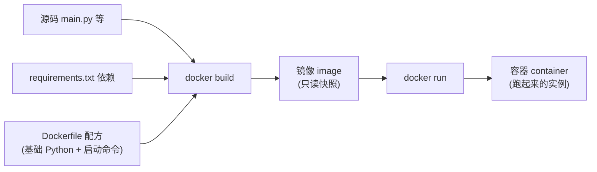
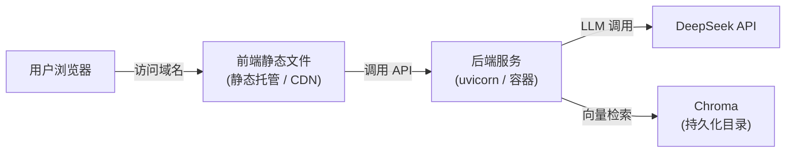

# 第 13 章 · 部署上线（后端基础③）

> 本章目标：把毕业项目从「**我本地能跑**」变成「**别人能访问**」。
> 这是后端基础的第三站，也是整门课的收尾——你将学会环境变量在服务器上怎么配、Docker 是什么、怎么把 RAG 系统部署到云上。

---

## 本章目标

- [ ] 说清楚「本地」和「生产」到底差在哪：端口、密钥、调试开关
- [ ] 会用 `requirements.txt` 锁定依赖（呼应第 01 章的 `pip`）
- [ ] 理解 Docker 的核心直觉：把**应用 + 运行环境**打包成镜像，到哪都一样跑
- [ ] 能写出一个最简 `Dockerfile`，并跑通 `docker build` / `docker run`
- [ ] 知道用 `uvicorn` / `gunicorn` 在生产怎么启动（`--host 0.0.0.0`、worker）
- [ ] 了解两条部署路线：云服务器 / VPS 与平台（Railway / Render），以及前端静态文件怎么托管
- [ ] 完成一份**上线安全检查清单**

---

## 核心概念

### 1. 本地和生产，到底差在哪？

你在第 11、12 章把毕业项目跑起来时，大概是这样的：后端 `uvicorn main:app --reload`，浏览器打开 `http://localhost:8000`，密钥放在根目录 `.env` 里。**这一切都只在你这台电脑上成立。**

「部署上线」要解决的，就是把它搬到一台**别人也能通过网络访问的机器**上。这中间有三个关键差异：

| 维度 | 本地（开发） | 生产（上线） |
|------|-------------|-------------|
| 访问地址 | `localhost` / `127.0.0.1`（只有本机能访问） | 公网 IP 或域名（全世界能访问） |
| 绑定地址 | `127.0.0.1`（默认，只听本机） | `0.0.0.0`（听所有网卡，外部才能连进来） |
| 密钥来源 | 项目里的 `.env` 文件 | 平台/服务器的**环境变量配置**，不放文件 |
| 调试开关 | `--reload` 开着，改代码自动重启 | **关掉** `--reload`，省资源、更安全 |
| CORS | 图省事开 `*`（允许所有来源） | 收紧到你**真实的前端域名** |

> **JS 类比**：这就像你前端项目里的 `npm run dev`（本地热更新）和 `npm run build` 后部署到 CDN 的区别。`dev` 是给你自己用的，`build` 产物才是给用户的。后端世界里，`--reload` 就是那个 `dev`。

### 2. `requirements.txt`：后端的「package.json 依赖清单」

前端有 `package.json` 记录你装了哪些 npm 包；Python 后端对应的是 **`requirements.txt`**——一个纯文本文件，一行一个依赖。

为什么部署时它至关重要？因为**你的电脑上装了什么包，服务器并不知道**。你 `pip install` 过的 `fastapi`、`uvicorn`、`openai`、`chromadb`……换到一台干净的服务器上，全都没有。`requirements.txt` 就是那张「请照着装」的清单。

> **JS 类比**：服务器上没有你的 `node_modules`，只能靠 `package.json` + `npm install` 重新装。`requirements.txt` + `pip install -r` 是一模一样的套路。

### 3. Docker：把「应用 + 环境」一起打包

到这里有个老大难问题：**「我电脑上明明能跑啊！」** 服务器的 Python 版本可能不一样、系统库缺了一个、环境变量没配对……于是同一份代码，本地好好的，一上线就崩。

**Docker 就是来根治这件事的。** 它的核心直觉只有一句话：

> 把你的**代码、Python 版本、所有依赖、启动命令**，全部打包进一个叫「**镜像（image）**」的东西。这个镜像扔到任何装了 Docker 的机器上，跑出来的环境**一模一样**。

三个词分清楚：

- **Dockerfile**：一张「配方」，写明「用哪个 Python、装哪些依赖、怎么启动」。
- **镜像（image）**：照着配方做出来的「打包好的快照」，只读、可分发。
- **容器（container）**：镜像「跑起来」的那个实例。一个镜像可以跑出很多个容器。

> **JS 类比**：你可以把镜像想成「**锁定了 Node 版本 + 全部 `node_modules` + 启动脚本的一个可移植压缩包**」。别人拿到它，不用关心装没装 Node、装的什么版本，解开就能原样运行。Dockerfile 就是生成这个包的构建脚本。

#### Docker 打包示意



「概念懂了就够」——本章不要求你精通 Docker，只要能跑通一个最简例子，理解它解决了什么问题即可。

### 4. 部署拓扑：用户的请求一路走到哪？

部署不是把后端扔上去就完事，整套系统是有「形状」的。先看清全貌，动手时才不会迷路：



记住这个图里的几个事实，后面就顺了：

- **前端**（第 12 章那些 HTML/JS）是一堆**静态文件**，可以单独托管（静态托管平台、对象存储 + CDN，甚至和后端放一起）。
- **后端**才是真正跑代码、保管密钥、调 DeepSeek、查 Chroma 的地方。
- **Chroma 的数据**存在一个目录里——这个目录在哪、会不会丢，是部署时最容易踩坑的点（后面「常见报错」会专门讲）。

---

## 动手实践

下面以毕业项目的**后端**为主线（前端静态托管在第 5 步单独说）。

### 步骤 1：生成 `requirements.txt`

进入后端项目目录，在你之前用的虚拟环境（venv，见第 01 章）里执行：

```bash
pip freeze > requirements.txt
```

`pip freeze` 会把当前环境装的所有包连版本号一起列出来，写进文件。打开看一眼，大概长这样：

```text
fastapi==0.115.0
uvicorn==0.30.6
openai==1.40.0
chromadb==0.5.5
sentence-transformers==3.0.1
python-dotenv==1.0.1
python-multipart==0.0.9
pypdf==4.3.1
```

> ⚠️ 别漏了 `sentence-transformers`（第 11 章 `rag.py` 顶层就 import 它，缺了容器一启动就崩）和 `python-multipart`（上传文件必需）。`pip freeze` 通常会自动带上它们，但如果你手动精简清单，务必保留这两个。

> ⚠️ `pip freeze` 会把环境里**所有**包都列出来，可能带一堆你没直接用的「依赖的依赖」。学习阶段这样够用；想更干净，可以手动只保留你确实 import 的那几个顶层包。

### 步骤 2：写一个最简 `Dockerfile`

在后端项目根目录（和 `main.py`、`requirements.txt` 同级）新建一个名为 `Dockerfile` 的文件（**没有扩展名**）：

```dockerfile
# Dockerfile —— 把 FastAPI 后端打包成镜像

# 1. 选一个官方 Python 基础镜像（slim 体积小，够用）
FROM python:3.12-slim

# 2. 容器内的工作目录，后续命令都在这里执行
WORKDIR /app

# 3. 先只拷依赖清单并安装（利用缓存：代码改了不必重装依赖）
COPY requirements.txt .
RUN pip install --no-cache-dir -r requirements.txt

# 4. 再把项目代码全部拷进镜像
COPY . .

# 5. 声明容器对外暴露的端口（仅文档作用，真正映射在 run 时）
EXPOSE 8000

# 6. 容器启动时运行的命令：用 uvicorn 起服务，监听所有网卡
CMD ["uvicorn", "main:app", "--host", "0.0.0.0", "--port", "8000"]
```

逐行对照一下，其实就是把你**本地手动做过的步骤**写成了脚本：选 Python → 进目录 → 装依赖 → 放代码 → 启动。

> ⚠️ **关键**：注意第 6 行是 `--host 0.0.0.0`，**没有** `--reload`。生产环境就该这样。

再加一个 `.dockerignore`（和 `.gitignore` 同理），免得把不该进镜像的东西打包进去——尤其是 `.env`：

```text
.env
__pycache__/
*.pyc
venv/
.git/
```

> ⚠️ **安全红线**：**绝不能把 `.env`（含真实密钥）打进镜像。** 镜像是会被分发的，密钥进了镜像 = 密钥泄露。密钥要在部署时用环境变量单独注入（步骤 5）。

### 步骤 3：本地构建并运行镜像

先确认装了 Docker（去 [docker.com](https://www.docker.com/) 装 Docker Desktop，装完 `docker --version` 能输出版本号即可）。

**构建镜像**（`-t` 给镜像起个名字，末尾的 `.` 表示「用当前目录的 Dockerfile」）：

```bash
docker build -t rag-backend .
```

**运行容器**：

```bash
docker run -p 8000:8000 -e DEEPSEEK_API_KEY=sk-你的密钥 -e DEEPSEEK_BASE_URL=https://api.deepseek.com -e DEEPSEEK_MODEL=deepseek-chat rag-backend
```

拆解一下这条命令：

- `-p 8000:8000`：端口映射，把**你电脑的 8000** 映射到**容器内的 8000**（左边宿主机，右边容器）。
- `-e DEEPSEEK_API_KEY=...`：用 `-e` **注入环境变量**——这就是「密钥不进镜像、运行时才给」的做法。
- `-e DEEPSEEK_BASE_URL=... -e DEEPSEEK_MODEL=...`：`llm.py` 里用 `os.getenv` 读这三个变量（第 02/11 章），容器内没有 `.env` 文件，所以三个都得用 `-e` 给齐——少给一个，启动时对应变量会是 `None` 直接报错。
- `rag-backend`：要运行的镜像名。

跑起来后，浏览器打开 `http://localhost:8000/docs`，能看到 FastAPI 自动文档，就说明镜像没问题。

> 这就是 Docker 的魅力：这个 `rag-backend` 镜像，**原封不动**扔到云服务器上 `docker run`，行为和你本地完全一致——「我电脑能跑」从此真的等于「哪都能跑」。

### 步骤 4：理解生产启动方式（uvicorn / gunicorn 与 worker）

`uvicorn main:app --host 0.0.0.0 --port 8000` 已经能在生产跑。但流量一大，单个 uvicorn 进程会成为瓶颈，这时引入 **worker（工作进程）** 概念：

- **worker** = 一个独立的服务进程。多开几个 worker，就能**同时处理多个请求**，吃满多核 CPU。
- 生产常用 **gunicorn** 做「进程管理器」，让它管理多个 uvicorn worker：

```bash
# 装 gunicorn（记得也加进 requirements.txt）
pip install gunicorn

# 用 gunicorn 管理 4 个 uvicorn worker
gunicorn main:app -w 4 -k uvicorn.workers.UvicornWorker --bind 0.0.0.0:8000
```

- `-w 4`：开 4 个 worker（经验值：CPU 核数 × 2 + 1，先用 4 别纠结）。
- `-k uvicorn.workers.UvicornWorker`：让每个 worker 用 uvicorn 来跑（FastAPI 是异步框架，必须用这个 worker 类型）。

> **JS 类比**：类似 Node 的 PM2 用 cluster 模式开多个进程吃满多核。学习/小流量阶段，**单个 uvicorn 就够**，不必上来就 gunicorn。
>
> ⚠️ **Windows 注意**：`gunicorn` 依赖 Unix 的 `fcntl` 模块，**在 Windows 本地装了也跑不起来**。这不影响部署——它只在 Linux 服务器/容器里用（Docker 基础镜像是 Linux），Windows 本地开发用单个 `uvicorn` 即可。

### 步骤 5：选一条部署路线

#### 路线 A：平台（PaaS，如 Railway / Render）—— 推荐新手

这类平台帮你把「服务器、网络、域名、HTTPS」都打理好，你只管交代码。典型流程：

1. 把后端项目推到 GitHub。
2. 在平台上「New Project」→ 连接你的 GitHub 仓库。
3. 平台会自动识别 `Dockerfile`（或 `requirements.txt`）并构建。
4. 在平台的 **「Environment Variables / Variables」** 面板里，添加 `DEEPSEEK_API_KEY`、`DEEPSEEK_BASE_URL`、`DEEPSEEK_MODEL`——**这就是生产里的「.env」，但它存在平台后台、不进代码、不进镜像**。
5. 平台分配一个公网域名（形如 `your-app.onrender.com`），打开就能访问。

> 这正是第 00 章那句话的兑现：「代码里只写 `os.getenv("DEEPSEEK_API_KEY")`」——本地它从 `.env` 读，生产它从平台环境变量读，**代码一个字都不用改**。这就是环境变量的意义。

#### 路线 B：云服务器 / VPS —— 更可控，但要自己动手

租一台云主机（阿里云 / 腾讯云 / 各类 VPS），拿到 IP 后用 SSH 登录，大致步骤：

1. 装好 Docker，把代码拉到服务器（`git clone`）。
2. `docker build -t rag-backend .`
3. `docker run -d -p 8000:8000 -e DEEPSEEK_API_KEY=sk-xxx -e DEEPSEEK_BASE_URL=https://api.deepseek.com -e DEEPSEEK_MODEL=deepseek-chat -v /data/chroma:/app/storage/chroma rag-backend`
   - `-d`：后台运行（detached）。
   - 三个 `-e`：和本地一样，把 DeepSeek 的 key / base_url / model 注入进去。
   - `-v /data/chroma:/app/storage/chroma`：**挂载卷**，把容器内 Chroma 目录（第 11 章 `rag.py` 用的是 `storage/chroma`）映射到服务器硬盘——这样**容器重启数据也不丢**（详见「常见报错」）。
4. （进阶）前面再架一层 **Nginx** 反向代理，负责 80/443 端口、HTTPS 证书、把请求转给 8000。

> 路线 B 灵活但杂事多（防火墙、证书、运维）。**第一次上线强烈建议走路线 A**，跑通闭环、建立信心后再折腾服务器。

#### 前端静态文件怎么托管？

第 12 章的前端是纯静态文件（HTML/CSS/JS）。三种常见做法：

1. **静态托管平台 / 对象存储 + CDN**：把构建产物上传上去，最省事、最快。
2. **和后端放一起**：用 FastAPI 的 `StaticFiles` 把前端目录挂载到后端，一个服务全包了（小项目最简单）。
3. **平台一并托管**：很多 PaaS 支持同仓库里前后端一起部署。

无论哪种，**记得把前端代码里的后端地址从 `http://localhost:8000` 改成线上后端域名**，否则上线后前端还在找你本地的后端（找不到，自然报错）。

### 步骤 6：安全收尾

上线意味着「全世界都能访问」，几条红线必须落实：

1. **生产关掉 `--reload`**：它会监听文件变化、吃资源，还可能暴露调试信息。Dockerfile 的 `CMD` 里本就没写它——保持这样。
2. **CORS 收紧到真实域名**：开发时为了省事可能写了 `allow_origins=["*"]`，生产必须改成你的前端域名：

   ```python
   # 第 05 章配过 CORS，生产环境收紧来源
   app.add_middleware(
       CORSMiddleware,
       allow_origins=["https://你的前端域名.com"],  # 不要再用 ["*"]
       allow_methods=["*"],
       allow_headers=["*"],
   )
   ```

3. **密钥只放环境变量**：永远 `os.getenv(...)`，永远不进代码、不进镜像、不进 Git（呼应第 00 章安全铁律）。
4. **限流（rate limit）概念**：你的后端替用户调 DeepSeek，等于**用你的余额付费**。若接口被恶意刷，钱包会哭。生产建议加「限流」——限制每个 IP / 每分钟的请求次数（如用 `slowapi` 这类库）。原理懂即可，本课不展开实现。

---

## 上线检查清单（Checklist）

正式对外前，逐项打勾：

- [ ] `requirements.txt` 已生成，且包含 `uvicorn`、`fastapi`、`openai`、`chromadb`、`sentence-transformers`、`python-multipart` 等全部依赖
- [ ] `Dockerfile` 启动命令是 `--host 0.0.0.0`，**没有** `--reload`
- [ ] `.dockerignore` / `.gitignore` 已忽略 `.env`，**密钥绝不进镜像、不进 Git**
- [ ] 生产密钥通过**平台环境变量 / `docker run -e`** 注入，代码里只有 `os.getenv(...)`
- [ ] `docker build` 与 `docker run` 在本地已跑通，`/docs` 能打开
- [ ] CORS 的 `allow_origins` 已从 `["*"]` 收紧为**真实前端域名**
- [ ] 前端代码里的后端地址已从 `localhost` 改为**线上后端域名**
- [ ] Chroma 数据目录已**挂载到持久化卷**（`-v`），重启不丢数据
- [ ] 已了解限流概念，知道后端调用会消耗 DeepSeek 余额
- [ ] 用手机流量（非本机 WiFi）访问一次线上地址，确认外网真能打开

---

## 常见报错

| 现象 | 原因 | 解决 |
|------|------|------|
| 镜像里发现真实密钥 / Git 提交了 `.env` | `.dockerignore` / `.gitignore` 漏配 | 把 `.env` 加进两个 ignore 文件；密钥改用 `-e` 或平台环境变量注入；已泄露的 Key 立刻去 DeepSeek 后台删除重建 |
| 外网访问不了，本地却正常 | 服务绑定了 `127.0.0.1`，只听本机 | 启动命令改成 `--host 0.0.0.0`；同时检查云平台/防火墙是否放行了对应端口 |
| `docker run` 后浏览器连不上 | 忘了做端口映射 | 加 `-p 8000:8000`（左宿主机、右容器） |
| 生产 CORS 报错、前端调不通 | `allow_origins` 没配真实前端域名 | 把线上前端域名加进 `allow_origins`，别再用 `["*"]` |
| 容器里 `ModuleNotFoundError` | 依赖没写进 `requirements.txt` | 补全依赖后 `pip freeze > requirements.txt` 并重新 `docker build` |
| 容器重启后上传的文档/向量全没了 | Chroma 数据写在容器内，容器销毁即丢 | 用 `-v 宿主目录:/app/storage/chroma` 挂载卷（路径要对准第 11 章 `rag.py` 的 `storage/chroma`），把数据存到容器外 |
| 前端线上访问报「连接 localhost 失败」 | 前端代码还指向 `http://localhost:8000` | 把后端地址改成线上后端域名后重新部署前端 |
| 平台构建失败 | 平台没识别到 `Dockerfile` 或依赖装不上 | 确认 `Dockerfile` 在仓库根目录、文件名无扩展名；检查 `requirements.txt` 版本是否冲突 |

---

## 小结

- **本地 vs 生产**的核心差异：绑定 `0.0.0.0`、密钥走环境变量、关 `--reload`、CORS 收紧。
- **`requirements.txt`** 是后端的依赖清单（对标 `package.json`），部署时靠它在干净机器上还原环境。
- **Docker** 把「代码 + 环境 + 启动命令」打包成镜像，根治「我电脑能跑」难题；记牢 `Dockerfile`（配方）→ 镜像（快照）→ 容器（实例）。
- **生产启动**用 `uvicorn --host 0.0.0.0`，流量大再上 `gunicorn` + 多 worker。
- **部署**首选 PaaS 平台（Railway/Render），密钥填在平台环境变量里，代码零改动；前端静态文件单独托管，记得改后端地址。
- **安全收尾**：关 reload、收紧 CORS、密钥只进环境变量、了解限流。
- 上线前对照**检查清单**逐项打勾，再用外网验证一次。

至此，你已经把毕业项目从「本地能跑」变成了「**别人能访问**」——从前端工程师到能独立交付一个全栈 AI 应用，这门课的主线到这里走完了。

## 下一章预告

正文部分完结，但学习不止于此。后端这一路你接触了 HTTP、FastAPI、SQLite、环境变量、Docker、部署……知识点不少。**附录**把它们汇成一张**后端知识地图**，并整理了一份贯穿全课的**常见报错速查手册**——遇到卡壳时，那里是你的「急救箱」。

**← 上一章：[第 12 章：毕业项目② RAG 前端](../12-capstone-frontend/README.md)**
**→ 附录：[后端知识地图与排错手册](../../appendix/backend-knowledge-map.md)**
