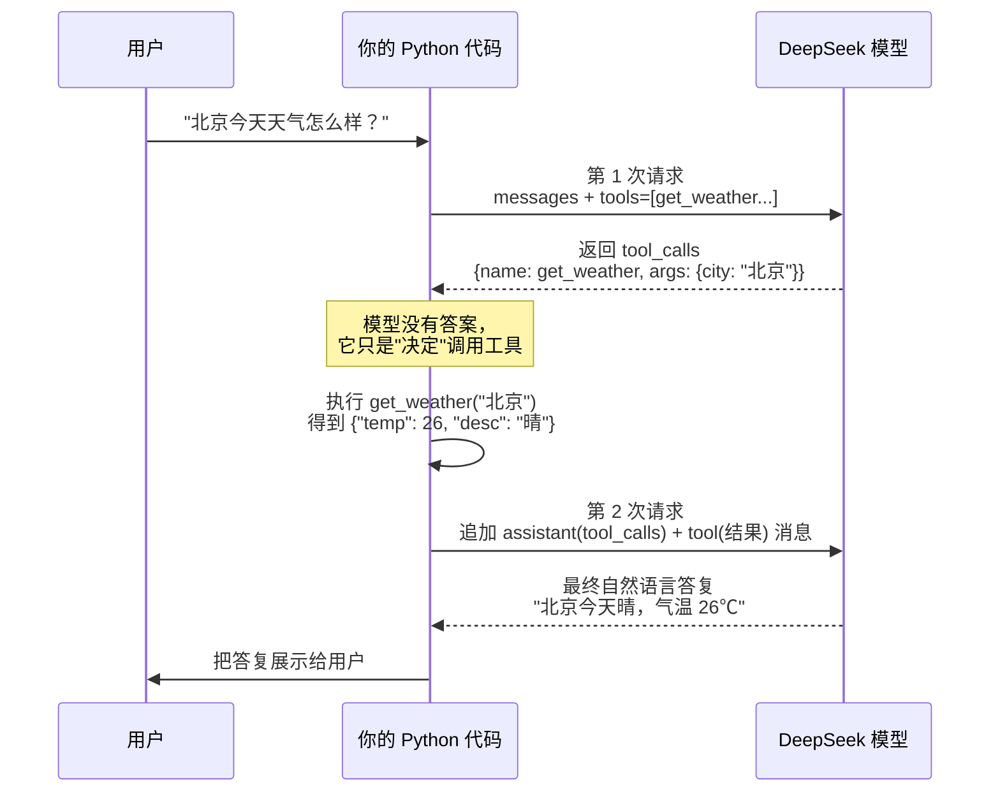

# 第 14 章 · Function Calling（工具调用）

> 本章目标：让大模型不只是「聊天」，而是能**决定调用你写的函数**——查天气、算数、查数据库。
> 这是 Agent（智能体）的地基：从「会说」到「会做」的关键一步。

---

## 本章目标

- [ ] 理解 function calling 的本质：模型只「决定调哪个工具、传什么参数」，**真正执行的是你的代码**
- [ ] 会用 JSON Schema 定义工具（`name` / `description` / `parameters`）
- [ ] 跑通完整闭环：请求 → 模型返回 `tool_calls` → Python 执行 → 结果回喂 → 模型给出自然语言答复
- [ ] 看懂多工具、多轮工具调用的处理方式
- [ ] 说清楚它和第 06 章「让模型输出 JSON」的区别

---

## 核心概念

### 1. 直觉：模型自己什么都干不了

到目前为止，你的模型是个「闭门造车」的天才：它读过海量文本，但**没法连接现实世界**。

- 你问它「北京现在几度？」——它不知道，因为它没有实时数据。
- 你问它「3847 × 2956 等于几？」——它会瞎猜一个数，因为它不是计算器。
- 你问它「我数据库里有几个订单？」——它更不可能知道。

但模型有一个超能力：**它能判断「这个问题需要什么工具」，并把调用工具所需的参数准确地组织出来。**

这就引出 function calling 的核心分工：

| 谁 | 负责什么 |
|------|----------|
| **模型** | 决定「要不要调工具、调哪个、传什么参数」 |
| **你的代码** | 真正去执行那个函数（查 API、算数、读数据库） |
| **模型（第二轮）** | 拿到执行结果后，组织成人话回答用户 |

> 关键认知：**模型从不亲自执行任何函数。** 它只是输出一个「我想调用 `get_weather(city='北京')`」的意图，由你的 Python 代码接住并执行。

### 2. JS 类比：注册事件处理器 / 回调

前端工程师对这个模式其实非常熟悉。回想你怎么给按钮注册点击事件：

```js
// 你"声明"了一个能力：当点击发生时，调用这个函数
button.addEventListener("click", handleClick);

function handleClick(event) {
  // 真正的逻辑在你这里执行
}
```

你并没有立刻调用 `handleClick`，而是把它**注册**给浏览器，告诉浏览器「满足条件时请调它」。function calling 一模一样：

- 你向模型**注册**一组工具（相当于 `addEventListener`）
- 模型在合适的时机**决定触发**某个工具（相当于浏览器派发 `click` 事件）
- 你的代码**接住并执行**它（相当于 `handleClick` 真正跑起来）

唯一区别：触发的「判断」不是靠固定规则，而是靠模型的语义理解。

### 3. tools 接口：用 JSON Schema 描述工具

DeepSeek 兼容 OpenAI 的 `tools` 接口。你要做的，是用一段 **JSON Schema** 把每个工具「说明书」一样描述清楚，模型才知道有哪些工具可用、每个工具要什么参数。

一个工具定义长这样：

```python
{
    "type": "function",
    "function": {
        "name": "get_weather",                       # 函数名（你的代码里也要有同名函数）
        "description": "查询某个城市的当前天气",        # 描述：模型靠它判断"什么时候该用"
        "parameters": {                              # 参数：用 JSON Schema 描述
            "type": "object",
            "properties": {
                "city": {
                    "type": "string",
                    "description": "城市名称，例如 北京、上海",
                }
            },
            "required": ["city"],                    # 哪些参数是必填的
        },
    },
}
```

三个字段最关键：

- **`name`**：函数名。模型返回时会原样带回这个名字，你据此找到要执行的 Python 函数。
- **`description`**：**最重要的一段**。模型完全靠它来判断「用户这个问题该不该用、该用哪个工具」。写得越清楚，模型选得越准。
- **`parameters`**：参数的 JSON Schema。`properties` 列出每个参数的类型和说明，`required` 标出必填项。

> JS 类比：这就像给函数写 TypeScript 类型声明 + JSDoc 注释。`description` 是给「读注释的人」（这里是模型）看的，让它知道这个函数干嘛、参数怎么传。

### 4. 完整闭环：一次问答其实是「两轮」对话

最容易让新手懵的地方在于：**带工具的问答，至少要和模型来回两次。** 流程如下：



拆开看这五步：

1. **发请求**：把用户问题 + `tools=[...]` 一起发给模型。
2. **模型返回 `tool_calls`**：模型判断需要工具，于是**不直接回答**，而是返回一个 `tool_calls` 列表，里面是「函数名 + 参数」。
3. **你的代码执行**：你按函数名找到对应 Python 函数，传入模型给的参数，真正跑出结果。
4. **结果回喂**：把「模型刚才那条带 `tool_calls` 的回复」和「你执行得到的结果」都追加进 `messages`，**再发一次**给模型。
5. **模型生成最终答复**：模型这次拿到了真实数据，组织成人话返回。

> 第 4 步是最关键也最易错的：你必须把模型那条 `tool_calls` 消息**原样塞回** `messages`，再跟上一条 `role: "tool"` 的结果消息——两条缺一不可，否则模型会「找不到自己刚才问了啥」而报错。

---

## 动手实践

> 以下代码沿用第 02 章的 DeepSeek 配置方式（从根目录 `.env` 读密钥、用 `openai` SDK 指向 DeepSeek）。但因为要传 `tools` 参数，这里直接用 `client.chat.completions.create`，不走 02 章封装的 `ask()`。请在已激活 venv 的环境里运行。

### 实践 1：定义工具 + 跑通单工具闭环

我们先定义一个 `get_weather`（用假数据模拟，省得真去申请天气 API）。新建 `weather_tool.py`：

```python
# weather_tool.py —— 跑通一个工具的完整调用闭环
from dotenv import load_dotenv
from openai import OpenAI
import os
import json

load_dotenv()
client = OpenAI(
    api_key=os.getenv("DEEPSEEK_API_KEY"),
    base_url=os.getenv("DEEPSEEK_BASE_URL"),
)
model = os.getenv("DEEPSEEK_MODEL")


# ---------- ① 真正要执行的 Python 函数 ----------
def get_weather(city: str) -> dict:
    """假数据：真实场景这里会去调天气 API。"""
    fake_db = {
        "北京": {"temp": 26, "desc": "晴"},
        "上海": {"temp": 23, "desc": "多云"},
        "广州": {"temp": 31, "desc": "雷阵雨"},
    }
    return fake_db.get(city, {"temp": 20, "desc": "未知"})


# ---------- ② 用 JSON Schema 把工具描述给模型 ----------
tools = [
    {
        "type": "function",
        "function": {
            "name": "get_weather",
            "description": "查询指定城市的当前天气情况",
            "parameters": {
                "type": "object",
                "properties": {
                    "city": {
                        "type": "string",
                        "description": "城市名称，例如 北京、上海、广州",
                    }
                },
                "required": ["city"],
            },
        },
    }
]

# 用一个字典把"函数名"映射到"真正的函数"，方便按名字调度
available_functions = {"get_weather": get_weather}


def run(user_question: str) -> str:
    messages = [{"role": "user", "content": user_question}]

    # ---------- ③ 第 1 次请求：带上 tools ----------
    first = client.chat.completions.create(
        model=model,
        messages=messages,
        tools=tools,          # ← 关键：把工具清单告诉模型
        tool_choice="auto",   # auto = 由模型自己决定要不要用工具
    )
    msg = first.choices[0].message

    # 模型没要求调工具？说明它直接答了，原样返回即可
    if not msg.tool_calls:
        return msg.content

    # ---------- ④ 把模型这条"带 tool_calls 的回复"原样塞回 messages ----------
    messages.append(msg)

    # ---------- ⑤ 逐个执行模型要求的工具调用，把结果作为 tool 消息追加 ----------
    for call in msg.tool_calls:
        fn_name = call.function.name
        fn_args = json.loads(call.function.arguments)  # 参数是 JSON 字符串，要先解析
        result = available_functions[fn_name](**fn_args)  # 真正执行

        messages.append({
            "role": "tool",                  # ← 角色固定为 tool
            "tool_call_id": call.id,         # ← 必须回带这个 id，让模型对上号
            "content": json.dumps(result, ensure_ascii=False),
        })

    # ---------- ⑥ 第 2 次请求：模型拿到真实结果，生成最终人话 ----------
    second = client.chat.completions.create(model=model, messages=messages)
    return second.choices[0].message.content


if __name__ == "__main__":
    print(run("北京今天天气怎么样？适合穿短袖吗？"))
```

运行：

```bash
python weather_tool.py
```

你会看到类似 `北京今天天气晴，气温 26℃，挺适合穿短袖的……` 的回答。**注意：天气数据是你的 `get_weather` 提供的，模型只负责「决定调它」和「把结果说成人话」。**

把问题换成 `1 加 1 等于几？` 再跑一次——模型会发现没有合适的工具、`msg.tool_calls` 为空，于是直接回答。这就是 `tool_choice="auto"` 的意义：**用不用工具由模型自己判断。**

### 实践 2：多工具 + 让模型自动选择

真实应用往往注册一堆工具，由模型按问题挑。我们再加一个 `calculate`，并把闭环抽成一个能处理多工具、多轮的通用循环。新建 `multi_tools.py`：

```python
# multi_tools.py —— 多工具 + 自动选择 + 多轮工具调用
from dotenv import load_dotenv
from openai import OpenAI
import os
import json

load_dotenv()
client = OpenAI(
    api_key=os.getenv("DEEPSEEK_API_KEY"),
    base_url=os.getenv("DEEPSEEK_BASE_URL"),
)
model = os.getenv("DEEPSEEK_MODEL")


# ---------- 两个工具的真实实现 ----------
def get_weather(city: str) -> dict:
    fake = {"北京": {"temp": 26, "desc": "晴"}, "上海": {"temp": 23, "desc": "多云"}}
    return fake.get(city, {"temp": 20, "desc": "未知"})


def calculate(expression: str) -> dict:
    """计算一个数学表达式。生产环境别用 eval，这里仅作演示。"""
    try:
        # 只允许数字和基本运算符，简单防注入
        if not all(c in "0123456789+-*/(). " for c in expression):
            return {"error": "表达式含非法字符"}
        return {"result": eval(expression)}
    except Exception as e:
        return {"error": str(e)}


available_functions = {"get_weather": get_weather, "calculate": calculate}

# ---------- 工具清单（JSON Schema）----------
tools = [
    {
        "type": "function",
        "function": {
            "name": "get_weather",
            "description": "查询指定城市的当前天气情况",
            "parameters": {
                "type": "object",
                "properties": {"city": {"type": "string", "description": "城市名称"}},
                "required": ["city"],
            },
        },
    },
    {
        "type": "function",
        "function": {
            "name": "calculate",
            "description": "计算一个数学表达式的结果，例如 (12+8)*3",
            "parameters": {
                "type": "object",
                "properties": {
                    "expression": {"type": "string", "description": "合法的数学表达式"}
                },
                "required": ["expression"],
            },
        },
    },
]


def run(user_question: str) -> str:
    messages = [{"role": "user", "content": user_question}]

    # ★ 用 while 循环：模型可能需要"连续调用好几轮工具"才给出最终答案
    while True:
        resp = client.chat.completions.create(
            model=model, messages=messages, tools=tools, tool_choice="auto"
        )
        msg = resp.choices[0].message

        # 模型不再要求调工具 → 拿到最终答复，跳出循环
        if not msg.tool_calls:
            return msg.content

        messages.append(msg)  # 把带 tool_calls 的回复塞回

        # 这一轮模型可能一次要求调用多个工具（并行工具调用），逐个执行
        for call in msg.tool_calls:
            fn = available_functions[call.function.name]
            args = json.loads(call.function.arguments)
            result = fn(**args)
            print(f"  🔧 模型调用了 {call.function.name}({args}) -> {result}")
            messages.append({
                "role": "tool",
                "tool_call_id": call.id,
                "content": json.dumps(result, ensure_ascii=False),
            })


if __name__ == "__main__":
    print(run("帮我算一下 (128+72)*5 是多少"))
    print("---")
    print(run("北京天气怎么样？另外帮我算 99*99 等于几"))
```

运行：

```bash
python multi_tools.py
```

观察输出：

- 第一个问题只用到 `calculate`，模型自动选对了工具。
- 第二个问题同时涉及天气和计算，模型可能**一次返回两个 `tool_calls`**（并行工具调用），我们的 `for` 循环把它们都执行掉，结果一起回喂。

> **为什么要用 `while` 循环？** 有些复杂任务模型会「分步走」：先调 A 拿到中间结果，再根据结果决定调 B……每调一轮就得回喂一轮。`while` 保证「只要模型还想调工具，就继续这个闭环」，直到它给出纯文本的最终答复。这其实已经是 **Agent 的雏形**——下一章会把它正式做成 Agent。

### 多工具与多轮，小结一句

- **多工具**：`tools` 列表里放多个定义，模型靠各自的 `description` 自动挑选。
- **并行工具调用**：一次 `tool_calls` 里可能有多个调用，全部执行后**一起**回喂。
- **多轮工具调用**：用 `while` 循环驱动，直到模型不再返回 `tool_calls`。

---

## function calling vs 第 06 章「输出 JSON」

第 06 章你也让模型产出过结构化数据，二者很像但**目的不同**，别搞混：

| 维度 | 第 06 章 `json_object` 模式 | 本章 function calling |
|------|------------------------------|------------------------|
| 目的 | 让模型**直接产出**一份数据给程序用 | 让模型**决定调用哪个函数、传什么参数** |
| 输出 | 一段 JSON 文本，由你 `json.loads` 解析 | 结构化的 `tool_calls`（函数名 + 参数 + id） |
| 可靠性 | 较好，但字段、结构仍需你校验 | 更强：参数被约束在 JSON Schema 内，结构由接口保证 |
| 后续 | 解析完就结束 | 还要**执行函数 + 回喂结果 + 再生成答复** |
| 比喻 | 「请按这个格式填一张表给我」 | 「请告诉我该调哪个 API、参数填什么，我去调」 |

一句话：**输出 JSON 是「让模型当数据生成器」；function calling 是「让模型当调度员」**——它不生产最终数据，而是指挥你的代码去生产。后者天然适配「模型 + 外部能力」的 Agent 架构，也比手写 prompt 要求输出 JSON 更结构化、更可靠。

---

## 常见报错

| 现象 | 原因 | 解决 |
|------|------|------|
| `400 ... messages with role 'tool' must be a response to a preceding message with 'tool_calls'` | 回喂时漏了那条带 `tool_calls` 的 assistant 消息，或顺序错了 | 先 `messages.append(msg)`（模型原回复），再追加 `role:"tool"` 结果 |
| `tool_call_id` 对不上 / 缺失 | `tool` 消息没回带 `call.id` | 每条 `tool` 消息必须带 `"tool_call_id": call.id` |
| `KeyError: 'get_weather'` | 模型返回的函数名在 `available_functions` 里找不到 | 确保字典里的 key 与工具定义里的 `name` 完全一致 |
| `json.JSONDecodeError`（解析 arguments 时） | 模型偶尔生成不完整参数 / 没解析就直接用 | `json.loads(call.function.arguments)` 外层加 `try/except` 兜底 |
| 模型死活不调用工具，自己瞎编答案 | `description` 写得太模糊，模型没意识到该用 | 把工具 `description` 写具体；必要时用 `tool_choice` 强制指定某工具 |
| 模型每次都调工具、连「你好」也调 | 工具描述过于宽泛，或 `tool_choice` 设成了 `"required"` | 用 `tool_choice="auto"` 交给模型判断；收窄 `description` 范围 |
| `TypeError: ... missing required argument` | 模型给的参数和函数签名不匹配 | 核对 JSON Schema 的 `properties`/`required` 与 Python 函数参数一致 |
| `AuthenticationError` / `Connection error` | 密钥或 base_url 问题 | 回看第 02 章「常见报错」，检查 `.env` |

---

## 小结

- **function calling 的本质是分工**：模型负责「决定调哪个工具、传什么参数」，**真正执行的是你的代码**，模型最后再把结果说成人话。
- 用 **JSON Schema** 定义工具：`name`（函数名）、`description`（模型选工具的依据，最重要）、`parameters`（参数约束）。
- 完整闭环是**两轮**对话：第 1 次发 `tools` → 模型返回 `tool_calls` → 你执行 → 把 `tool_calls` 消息和 `role:"tool"` 结果**都**回喂 → 第 2 次模型生成最终答复。
- **多工具**靠 `description` 自动选择；**并行调用**一次执行多个；**多轮调用**用 `while` 循环驱动到模型不再要工具为止。
- 它和第 06 章「输出 JSON」的区别：后者是「数据生成器」，前者是「调度员」——function calling 更结构化、更可靠，是 Agent 的地基。

## 下一章预告

你已经让模型「会决定调用工具」了。但目前还是我们手写 `while` 循环在「推着」它一步步走。

下一章我们把这套「思考 → 调工具 → 看结果 → 再思考」的循环**正式封装成 Agent（智能体）**：让模型拥有多个工具、自主规划多步任务、自己决定何时收尾。你会看到，本章的 `while` 闭环正是 Agent 的心跳。

**← 上一章：[第 13 章：部署上线](../13-deployment/README.md)**
**→ 下一章：[第 15 章：AI Agent 智能体](../15-ai-agent/README.md)**
