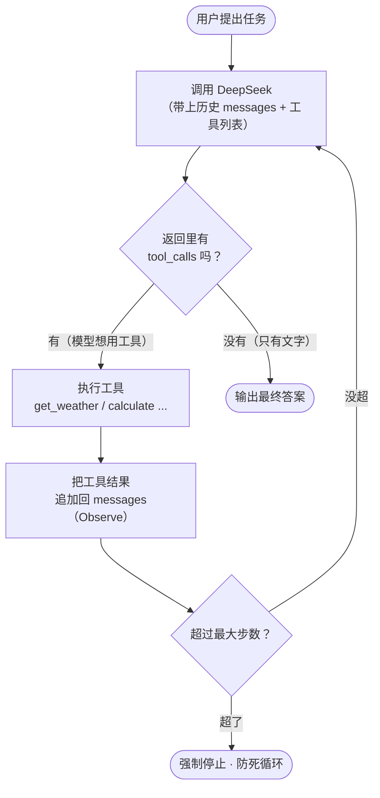

# 第 15 章 · 从零写一个 AI Agent（ReAct 循环）

> 本章目标：让 AI 不再只会「一问一答」，而是能自己**想清楚下一步、动手用工具、看结果、再继续想**——像一个有手有脚的小助手，自主把多步骤的任务做完。
> 这是建立在第 14 章「工具调用（Function Calling）」之上的关键一跃：工具调用是 Agent 的**基础动作**，而 Agent 是把这个动作**循环串起来**的大脑。

---

## 本章目标

- [ ] 说清楚 Agent 和「单次问答」「单次工具调用」到底差在哪
- [ ] 理解 **ReAct** 模式：Reason（想）→ Act（用工具）→ Observe（看结果）→ 再想……
- [ ] **从零手写一个最小 Agent 循环**，不依赖任何框架，只用一个 `while` 循环
- [ ] 给 Agent 配 2～3 个工具（计算、查天气假数据、查本地词典），跑通一个需要多步推理的真实任务
- [ ] 认清 Agent 的风险与边界（幻觉、死循环、工具误用、成本失控），并学会加护栏
- [ ] 知道主流 Agent 框架（LangGraph、OpenAI Agents SDK、CrewAI）的存在，为第 22 章做铺垫

---

## 核心概念

### 1. 从「问答」到「Agent」：三个台阶

我们一步步把模型的能力升级，你会清楚地看到 Agent 站在哪一级台阶上：

| 台阶 | 模型能做什么 | 类比 |
|------|--------------|------|
| **单次问答**（第 02 章） | 你问一句，它答一句，仅凭脑子里的知识 | 问一个无法上网的朋友 |
| **单次工具调用**（第 14 章） | 它能说「我需要调用 `get_weather('北京')`」，你执行后把结果喂回去，它再答一次 | 朋友让你帮他查一下，然后他基于结果回答你 |
| **Agent（本章）** | 它能**自己决定连续调用多个工具**，每一步看完结果再决定下一步，直到任务完成 | 朋友自己上网、自己查、自己算，最后只把结论告诉你 |

关键差别在**「自主」和「多步」**：

- 单次工具调用：模型说「调一次工具」，然后**必须**结束、给答案。中间过程由你（开发者）一步步手动驱动。
- Agent：模型可以说「先调 A，看完结果我再决定调不调 B」。**驱动这个连续过程的，是一个循环。**

> JS 类比：单次工具调用像一次 `await fetch()`——发一个请求、拿一个结果就完事。Agent 更像一个 **`while` 循环里反复 `await`**，每轮根据上一轮的返回决定下一轮干什么，直到满足退出条件。

### 2. 为什么需要多步：一个单步搞不定的任务

看这个任务：

> **「北京和上海现在的温差是多少？」**

模型脑子里**没有实时天气**，而且这需要**三步**才能回答：

1. 查北京的温度 → 需要调一次 `get_weather('北京')`
2. 查上海的温度 → 需要调一次 `get_weather('上海')`
3. 把两个温度相减 → 需要调一次 `calculate('|a - b|')`

单次工具调用做不到——它一次只调一个工具就得收尾。你需要让模型**调完天气、看到结果、再决定去调计算器**。这种「走一步、看一步、再走一步」的能力，正是 Agent 的核心。

### 3. ReAct 模式：Reason + Act 交替进行

ReAct 是 "**Rea**soning + **Act**ing" 的缩写，是目前最主流、也最容易手写的 Agent 范式。它的思想朴素到不能再朴素——**让模型「边想边做」**：

```
Reason（推理）：模型先想——「要算温差，我得先知道两个城市各自的温度」
Act（行动）   ：模型决定调用工具——get_weather('北京')
Observe（观察）：我们执行工具，把结果「北京 12°C」喂回给模型
Reason        ：模型再想——「还差上海的，继续查」
Act           ：get_weather('上海')
Observe       ：「上海 18°C」喂回去
Reason        ：「两个都有了，该相减了」
Act           ：calculate('|12 - 18|')
Observe       ：「6」喂回去
Reason        ：「够了，可以回答了」
最终答案       ：北京和上海的温差是 6°C。
```

注意这个**循环节奏**：想 → 做 → 看 → 想 → 做 → 看……每一轮模型都基于「目前观察到的所有结果」来决定下一步。直到它觉得信息够了，就不再调用工具，而是直接给出最终答案——**这就是循环的退出信号**。

> 好消息：第 14 章的工具调用接口**天然就支持这个模式**。模型返回里如果带 `tool_calls`，就代表它想「Act」；如果没有 `tool_calls`、只有文字，就代表它想直接给「最终答案」。我们要做的，只是把这个判断塞进一个循环里。

### 4. ReAct 循环流程图

把上面的节奏画成图，这就是本章要手写的全部逻辑：



把它和你熟悉的东西对照：

- **`Call` → `Check` → `Act` → `Obs` → 回到 `Call`**：就是一个 `while` 循环体。
- **`Check` 判断有没有 `tool_calls`**：就是循环的 `if` 分支——决定「继续转」还是「跳出」。
- **`Guard` 最大步数**：就是给 `while` 加的 `if (step >= MAX) break;`，**防止模型陷进死循环**（递归忘了写终止条件会爆栈，Agent 忘了设步数上限会烧钱）。

---

## 动手实践

> 以下代码全部复用第 02 章的 DeepSeek 调用方式：从根目录 `.env` 读取密钥、用 `openai` SDK 指向 DeepSeek。请在已激活 venv 的环境里运行。DeepSeek 兼容 OpenAI 的工具调用接口（第 14 章已讲），所以我们直接用。

### 实践 1：先把工具准备好

Agent 的「手脚」就是工具。我们准备三个**纯 Python 函数**，故意做得简单（天气用假数据），重点是让你看清 Agent 怎么把它们串起来。新建 `tools.py`：

```python
# tools.py —— Agent 能调用的三个工具
import json

# --- 工具 1：计算器（用 eval 仅作演示，生产环境要换成安全的表达式解析） ---
def calculate(expression: str) -> str:
    """计算一个数学表达式，比如 '12 - 18' 或 'abs(12 - 18)'。"""
    try:
        result = eval(expression, {"__builtins__": {}}, {"abs": abs, "round": round})
        return str(result)
    except Exception as e:
        return f"计算出错：{e}"

# --- 工具 2：查天气（假数据，真实项目里这里会去调天气 API） ---
_FAKE_WEATHER = {"北京": 12, "上海": 18, "广州": 25, "哈尔滨": -8}

def get_weather(city: str) -> str:
    """查询某个城市当前的温度（摄氏度）。"""
    if city in _FAKE_WEATHER:
        return f"{city}当前温度 {_FAKE_WEATHER[city]}°C"
    return f"抱歉，没有 {city} 的天气数据"

# --- 工具 3：查本地词典（解释术语） ---
_DICT = {
    "RAG": "检索增强生成：先从知识库检索相关内容，再让模型基于这些内容回答。",
    "Agent": "能自主进行「思考-行动-观察」循环、多步完成任务的 AI 程序。",
    "Token": "模型处理文本的最小单位，计费和长度限制都按 token 算。",
}

def lookup_term(term: str) -> str:
    """在本地词典里查一个技术术语的解释。"""
    return _DICT.get(term, f"词典里没有「{term}」这个词条")


# --- 把工具描述成模型能看懂的 JSON Schema（第 14 章讲过的格式） ---
TOOLS_SCHEMA = [
    {
        "type": "function",
        "function": {
            "name": "calculate",
            "description": "计算一个数学表达式，支持 + - * / 和 abs()、round()",
            "parameters": {
                "type": "object",
                "properties": {
                    "expression": {"type": "string", "description": "数学表达式，如 'abs(12 - 18)'"}
                },
                "required": ["expression"],
            },
        },
    },
    {
        "type": "function",
        "function": {
            "name": "get_weather",
            "description": "查询某个城市当前的温度（摄氏度）",
            "parameters": {
                "type": "object",
                "properties": {
                    "city": {"type": "string", "description": "城市名，如 '北京'"}
                },
                "required": ["city"],
            },
        },
    },
    {
        "type": "function",
        "function": {
            "name": "lookup_term",
            "description": "在本地词典里查一个技术术语的解释",
            "parameters": {
                "type": "object",
                "properties": {
                    "term": {"type": "string", "description": "要查的术语，如 'RAG'"}
                },
                "required": ["term"],
            },
        },
    },
]

# 名字到函数的映射表：模型说要调哪个，我们就从这里找出来执行
TOOL_FUNCTIONS = {
    "calculate": calculate,
    "get_weather": get_weather,
    "lookup_term": lookup_term,
}
```

> 这里有两份东西，别混淆：`TOOLS_SCHEMA` 是**给模型看的「菜单」**（告诉它有哪些工具、怎么用）；`TOOL_FUNCTIONS` 是**给我们自己用的「后厨」**（模型点了菜，我们照着名字找到真正的函数去执行）。

> ⚠️ `calculate` 里用 `eval` 只是为了教学简洁。`eval` 执行任意代码是有安全风险的，这里已经把 `__builtins__` 清空、只放行 `abs`/`round` 做了基本收口。真实项目请改用 `ast.literal_eval` 或专门的表达式库。

### 实践 2：手写最小 Agent 循环

这是本章的核心，全部精华就在一个 `while` 循环里。新建 `agent.py`：

```python
# agent.py —— 从零手写的最小 ReAct Agent，不依赖任何框架
from dotenv import load_dotenv
from openai import OpenAI
import os
import json

from tools import TOOLS_SCHEMA, TOOL_FUNCTIONS

load_dotenv()
client = OpenAI(
    api_key=os.getenv("DEEPSEEK_API_KEY"),
    base_url=os.getenv("DEEPSEEK_BASE_URL"),
)
MODEL = os.getenv("DEEPSEEK_MODEL")

SYSTEM_PROMPT = """你是一个会使用工具的助手。
- 当你需要实时数据、计算或查术语时，调用相应的工具，不要自己编造。
- 可以分多步：先调用一个工具，看到结果后再决定是否调用下一个。
- 当信息足够时，直接用一句话给出最终答案，不要再调用工具。
"""


def run_agent(task: str, max_steps: int = 6) -> str:
    """运行一个 ReAct Agent，自主多步完成 task。max_steps 是护栏，防死循环。"""
    # messages 就是 Agent 的「记忆」，每一步的思考和观察都追加进来
    messages = [
        {"role": "system", "content": SYSTEM_PROMPT},
        {"role": "user", "content": task},
    ]

    for step in range(1, max_steps + 1):
        print(f"\n===== 第 {step} 步：Reason（让模型思考下一步） =====")

        # —— Reason：调用模型，带上历史 messages 和工具菜单 ——
        response = client.chat.completions.create(
            model=MODEL,
            messages=messages,
            tools=TOOLS_SCHEMA,
            temperature=0,        # 任务型，要稳定可复现
        )
        msg = response.choices[0].message

        # —— Check：模型想调工具，还是想直接回答？ ——
        if not msg.tool_calls:
            # 没有 tool_calls，说明模型认为信息够了 → 给最终答案，退出循环
            print("模型不再调用工具，给出最终答案。")
            return msg.content

        # 模型想用工具：先把它这条「我要调工具」的消息原样存进记忆
        messages.append(msg)

        # —— Act + Observe：逐个执行模型点名的工具，把结果喂回去 ——
        for call in msg.tool_calls:
            name = call.function.name
            args = json.loads(call.function.arguments)   # 模型给的参数是 JSON 字符串
            print(f"  Act    → 调用 {name}({args})")

            func = TOOL_FUNCTIONS[name]
            result = func(**args)                         # 真正执行工具
            print(f"  Observe→ {result}")

            # 把工具结果作为一条 role=tool 的消息追加回 messages（关键！）
            messages.append({
                "role": "tool",
                "tool_call_id": call.id,    # 必须对上模型那次调用的 id
                "content": result,
            })
        # 循环回到顶部：模型会看到刚才的工具结果，继续 Reason

    # —— Guard：跑满 max_steps 还没结束，强制收尾，防止无限烧钱 ——
    return "（已达到最大步数，任务未在限定步数内完成）"


if __name__ == "__main__":
    answer = run_agent("北京和上海现在的温差是多少摄氏度？")
    print("\n========== 最终答案 ==========")
    print(answer)
```

运行：

```bash
python agent.py
```

你会看到类似这样的多步过程被一步步打印出来：

```
===== 第 1 步：Reason =====
  Act    → 调用 get_weather({'city': '北京'})
  Observe→ 北京当前温度 12°C
  Act    → 调用 get_weather({'city': '上海'})
  Observe→ 上海当前温度 18°C
===== 第 2 步：Reason =====
  Act    → 调用 calculate({'expression': 'abs(12 - 18)'})
  Observe→ 6
===== 第 3 步：Reason =====
模型不再调用工具，给出最终答案。
========== 最终答案 ==========
北京和上海现在的温差是 6°C。
```

**停下来体会一下：你没有写「先查天气再算减法」的流程，是模型自己规划出这个顺序的。** 你写的只是一个会反复「调模型→执行工具→喂回结果」的循环。这就是 Agent。

> 注意第 1 步里模型一次就点了两个 `get_weather`——现代模型支持**并行工具调用**，所以 `msg.tool_calls` 是个**列表**，我们用内层 `for` 把每个都执行掉。这也是为什么代码里有两层循环：外层是 ReAct 的「步」，内层是「这一步要调的多个工具」。

### 实践 3：换个任务，验证它真的「通用」

不用改任何代码，只换 `run_agent` 的输入，看它能不能自主选不同的工具组合：

```python
# 试试这几个任务（在 agent.py 的 __main__ 里逐个替换）
run_agent("帮我解释一下 RAG 是什么，然后告诉我哈尔滨现在多少度。")
run_agent("广州比哈尔滨高多少度？")
run_agent("（123 + 877）再除以 4 等于多少？")
```

- 第一个任务：模型会先调 `lookup_term('RAG')`，再调 `get_weather('哈尔滨')`，最后综合成一段话。
- 第二个任务：模型会查两个城市天气，再调 `calculate`。
- 第三个任务：模型直接调 `calculate`，一步搞定。

**同一个循环、同一套工具，能应对完全不同的任务**——因为「怎么组合工具」这件事是模型在运行时决定的，不是你写死的。这正是 Agent 比传统「写死流程」的程序灵活的地方。

### 实践 4：给循环加上护栏（重要）

上面的 `max_steps` 已经是最基础的一道护栏。在真实项目里，还应该至少再加两道。下面是加固版的循环片段（在实践 2 基础上修改）：

```python
def run_agent(task: str, max_steps: int = 6) -> str:
    messages = [
        {"role": "system", "content": SYSTEM_PROMPT},
        {"role": "user", "content": task},
    ]

    # 护栏 A：高风险工具需要人工确认（这里用计算器举例，真实场景是「发邮件」「删文件」这类）
    DANGEROUS = {"calculate"}   # 演示用；实际换成有副作用的工具名

    for step in range(1, max_steps + 1):
        response = client.chat.completions.create(
            model=MODEL, messages=messages, tools=TOOLS_SCHEMA, temperature=0,
        )
        msg = response.choices[0].message
        if not msg.tool_calls:
            return msg.content

        messages.append(msg)
        for call in msg.tool_calls:
            name = call.function.name
            args = json.loads(call.function.arguments)

            # 护栏 A：危险操作前先问人
            if name in DANGEROUS:
                ok = input(f"⚠️ 模型想执行 {name}({args})，是否允许？(y/n) ")
                if ok.lower() != "y":
                    result = "用户拒绝了该操作"
                    messages.append({"role": "tool", "tool_call_id": call.id, "content": result})
                    continue

            # 护栏 B：工具执行本身要兜底，绝不能让一个工具异常炸掉整个循环
            try:
                result = TOOL_FUNCTIONS[name](**args)
            except Exception as e:
                result = f"工具执行失败：{e}"   # 把错误也喂回去，让模型自己想办法换路

            messages.append({"role": "tool", "tool_call_id": call.id, "content": result})

    return "（已达到最大步数，任务未在限定步数内完成）"
```

三道护栏对应三类风险：

- **`max_steps`（防死循环 / 控成本）**：模型可能因为搞不定而反复调工具，每一步都是一次付费请求。步数上限是兜底。
- **人工确认（防工具误用）**：发邮件、转账、删数据这类**有副作用、不可逆**的工具，执行前必须让人点头。
- **`try/except` 兜底（防一炸全崩）**：单个工具报错时，把错误信息当作 Observe 喂回模型，它往往能自我纠正、换条路走——这正是「Fix, Don't Hide」：不藏错误，而是显式处理并让流程继续。

---

## 常见报错

| 现象 | 原因 | 解决 |
|------|------|------|
| `KeyError: 'tool_call_id'` 或接口报 messages 顺序错误 | 执行完工具忘了把 `role=tool` 的结果追加回 `messages`，或 `tool_call_id` 没对上模型那次调用的 `id` | 每个 `tool_call` 执行后，必须追加一条带**相同 `call.id`** 的 `tool` 消息 |
| `400 ... messages with role 'tool' must be a response to ...` | 把 `tool` 结果加进去之前，没有先把模型那条带 `tool_calls` 的 `assistant` 消息（`msg`）追加进去 | 顺序要对：先 `messages.append(msg)`，再追加各个 `tool` 结果 |
| 循环一直转、停不下来，token 哗哗烧 | 没设 `max_steps`，或 system prompt 没说「信息够了就直接回答」 | 加 `max_steps` 护栏；在 system 里明确「够了就别再调工具」 |
| `json.JSONDecodeError`（解析 `call.function.arguments` 时） | 个别情况下模型给的参数 JSON 不完整（常因 `max_tokens` 太小被截断） | 调大 `max_tokens`；对 `json.loads` 包一层 `try/except` 兜底 |
| `KeyError`（在 `TOOL_FUNCTIONS[name]` 处） | 模型「幻觉」出一个你没提供的工具名 | 执行前先判断 `name in TOOL_FUNCTIONS`，否则把「无此工具」当结果喂回去 |
| 模型不调用工具、直接瞎编答案（如编造温度） | system 没强调「需要实时数据/计算时必须用工具」，或工具 `description` 写得太模糊 | 在 system 里明确「不要编造，需要数据就调工具」；把每个工具的 `description` 写清楚 |
| `AuthenticationError` / `Connection error` | 密钥或 base_url 问题 | 回看第 02 章「常见报错」，检查根目录 `.env` |

---

## 小结

- **Agent = 会自主多步的 AI**：相比单次问答和单次工具调用，它能「想一步、做一步、看一步、再想一步」，直到把任务完成。
- **ReAct 模式 = Reason + Act 交替**：模型推理出下一步该干啥（Reason）→ 调工具（Act）→ 我们执行并喂回结果（Observe）→ 循环，直到模型不再调工具、直接给最终答案。
- **手写 Agent 的本质就是一个 `while` 循环**：调模型 → 看有没有 `tool_calls` → 有就执行并把结果追加回 `messages` → 继续 → 没有就退出给答案。核心代码不到 30 行。
- **`messages` 是 Agent 的记忆**：每一步的工具调用和结果都要原样追加回去，模型才能基于「目前已知的一切」决定下一步。`role=tool` 的消息要带对 `tool_call_id`。
- **护栏不可省**：`max_steps` 防死循环和成本失控、人工确认防工具误用、`try/except` 防单点崩溃。还要在 system 里约束模型「需要数据就调工具，别编」以压制幻觉。
- **框架是后话**：真实复杂的 Agent（多分支、状态机、多 Agent 协作）可以用 **LangGraph**、**OpenAI Agents SDK**、**CrewAI** 这类框架，但它们内核跑的也是你今天手写的这个循环。**先懂循环，再用框架**，你才不会被框架黑盒住——第 22 章会专门讲它们。

## 下一章预告

你已经能让 AI 自己调用「你本地的几个函数」了。但现实里，工具往往散落在各种服务、各种公司手里——每个都有自己的接口格式，难道每接一个工具都要手写一份 Schema 和适配代码？

下一章我们认识 **MCP（Model Context Protocol）**：一个正在成为业界标准的「工具接入协议」。它让工具像 USB 设备一样**即插即用**——你的 Agent 可以连上别人写好的 MCP 服务器，直接获得一整套工具，不用自己一个个去包。

**← 上一章：[第 14 章：Function Calling（工具调用）](../14-function-calling/README.md)**
**→ 下一章：[第 16 章：MCP（Model Context Protocol）](../16-mcp/README.md)**
