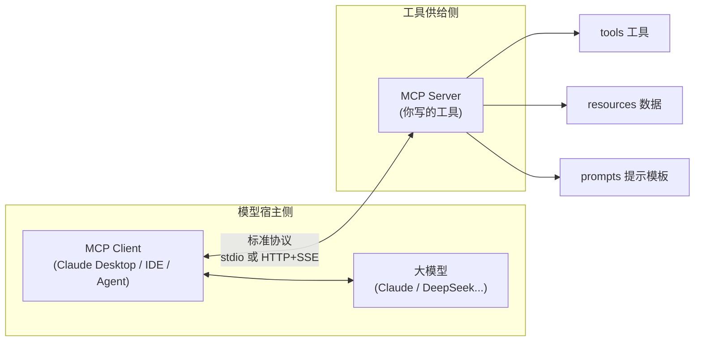
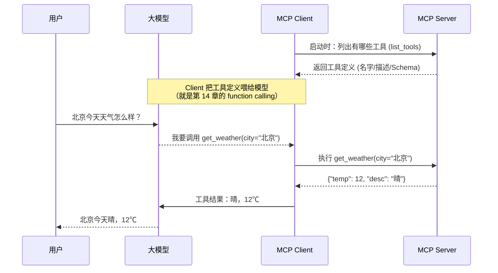

# 第 16 章 · MCP（Model Context Protocol）入门

> 本章目标：理解 MCP 这个 2024 年底由 Anthropic 提出、2025–2026 迅速成为事实标准的「工具/上下文接入协议」，并亲手写一个最小可用的 MCP Server。
> 这是进阶篇里「把工具规范化、可复用」的关键一章。

---

## 本章目标

- [ ] 说清楚第 14（Function Calling）/ 第 15（Agent）章留下的痛点：**每个工具都要为每个应用重写一遍接入代码**
- [ ] 理解 MCP 是什么：一个把「给模型提供工具/数据/上下文」标准化的开放协议
- [ ] 搞懂三个核心角色：**MCP Server**、**MCP Client**、**传输层（stdio / HTTP+SSE）**
- [ ] 厘清 MCP 与 Function Calling 的关系：MCP **不取代** function calling，而是规范了工具的「供给侧」
- [ ] 用官方 Python SDK 写一个最小 MCP Server，暴露一个工具，并接入 Claude Desktop
- [ ] 知道有哪些现成的 MCP Server 可以直接用（GitHub、Notion、文件系统、浏览器……）

---

## 核心概念

### 1. 痛点：没有标准，就要重复造接入代码

回忆一下你在第 14、15 章做的事：你给模型定义了一个工具（比如「查天气」），写好 JSON Schema，在 Agent 循环里手动 `if tool_name == "get_weather": ...` 地把调用接进去。

问题来了——**这套接入代码是「一次性」的**：

- 你在自己的聊天应用里接了「查天气」，换到另一个项目又得**重写一遍**
- 你的同事想在他的 Agent 里用你的「查数据库」工具，他**没法直接拿来用**，得照着你的代码再实现一遍
- 工具方（比如 GitHub、Notion）想让自己的能力被 AI 调用，得为**每一个** AI 应用单独适配

这就是典型的 **N×M 问题**：有 N 个应用、M 个工具，理论上要写 N×M 套接入代码。

> 前端类比：想象一下如果**没有 USB 标准**，你的鼠标要为戴尔笔记本写一版驱动、为联想写一版、为苹果再写一版……每多一个品牌就多一份重复劳动。USB-C 出现后，鼠标厂商只做**一个** USB-C 接口，所有支持 USB-C 的电脑都能用。MCP 之于 AI 工具，就是 USB-C 之于外设。

### 2. MCP 是什么：给「工具供给」定一个统一接口

**MCP（Model Context Protocol，模型上下文协议）** 是一个**开放标准**，它把「如何给大模型提供工具、数据、上下文」这件事标准化了。

核心思路非常像 Web 开发里的 **REST**：

| 类比对象 | 它统一了什么 | 结果 |
|----------|--------------|------|
| **REST / HTTP** 之于 API | 请求/响应的格式（URL、方法、JSON body） | 任何语言写的前端都能调任何语言写的后端 |
| **USB-C** 之于硬件 | 物理接口和通信协议 | 一个充电器给所有设备充电 |
| **MCP** 之于 AI 工具 | 「暴露工具/数据」的接口约定 | 工具方写**一次** Server，任何 MCP 客户端都能用 |

一句话：**工具方写一次 MCP Server，任何支持 MCP 的客户端**（Claude Desktop、Claude Code、Cursor、各类 IDE 和 Agent 框架）**都能直接接入使用**，不用为每个应用重新适配。

这样 N×M 就变成了 **N+M**：N 个应用各自实现一次 MCP Client，M 个工具各自实现一次 MCP Server，中间用统一协议对接。

```mermaid
graph TB
    subgraph 没有 MCP：N×M 重复接入
        A1[聊天应用] -.单独适配.-> T1[天气]
        A1 -.单独适配.-> T2[数据库]
        A1 -.单独适配.-> T3[GitHub]
        A2[IDE 插件] -.单独适配.-> T1
        A2 -.单独适配.-> T2
        A2 -.单独适配.-> T3
        A3[Agent] -.单独适配.-> T1
        A3 -.单独适配.-> T2
        A3 -.单独适配.-> T3
    end
```

```mermaid
graph TB
    subgraph 有 MCP：N+M，中间统一协议
        C1[聊天应用<br/>MCP Client]
        C2[IDE 插件<br/>MCP Client]
        C3[Agent<br/>MCP Client]
        S1[天气<br/>MCP Server]
        S2[数据库<br/>MCP Server]
        S3[GitHub<br/>MCP Server]
        C1 ===|MCP| P((统一协议))
        C2 ===|MCP| P
        C3 ===|MCP| P
        P ===|MCP| S1
        P ===|MCP| S2
        P ===|MCP| S3
    end
```

左图每条虚线都是一份要单独编写、单独维护的接入代码；右图所有连接都走同一套协议，新增一个应用或一个工具，只需对接协议本身。

### 3. 三个核心角色：Server / Client / 传输



**① MCP Server（工具供给侧）**——你这一章要写的东西。它向外暴露三类能力：

| 能力 | 是什么 | 类比 |
|------|--------|------|
| **tools** | 模型可以**调用**的函数（有副作用、要执行动作） | 后端的 `POST` 接口（查天气、发邮件） |
| **resources** | 模型可以**读取**的数据（只读、提供上下文） | 后端的 `GET` 接口（读文件、读数据库记录） |
| **prompts** | 预设的提示模板，供用户/客户端选用 | 一段可复用的 prompt 片段 |

> 本章只动手实现最常用的 **tools**，理解了它，resources 和 prompts 是一样的套路。

**② MCP Client（模型宿主侧）**——是「装」在大模型旁边的连接器。Claude Desktop、Claude Code、各类支持 MCP 的 IDE 和 Agent 都内置了 MCP Client。它负责：连接 Server、把 Server 暴露的工具列表「翻译」成模型能理解的工具定义、在模型决定调用时去执行、把结果回传给模型。

**③ 传输（Transport）**——Client 和 Server 怎么通信。主要两种：

- **stdio（标准输入输出）**：Server 作为一个本地子进程运行，Client 通过它的 stdin/stdout 收发消息。**适合本地工具**（读你电脑上的文件、跑本地脚本），配置最简单，本章用它。
- **Streamable HTTP**：Server 是一个网络服务，通过 HTTP 收发消息（旧版 MCP 规范里叫 HTTP+SSE，现已统一为 Streamable HTTP，也就是下面代码里的 `transport="streamable-http"`）。**适合远程/云端工具**（一个团队共用的在线 Server）。

> 你在第 04 章把流式做成 SSE 接口时见过这种「一段一段往回推」的机制，MCP 的 HTTP 传输也是类似思路。

### 4. 和 Function Calling 是什么关系？

这是初学者最容易绕晕的点，一句话讲清：

> **MCP 不取代 Function Calling，它规范的是工具的「供给侧」。模型那一侧，依然是工具调用。**

拆开看这条链路：



- **第 14 章的 Function Calling**：解决的是「模型怎么表达『我想调用某个工具』」——这个**没变**，模型侧依旧是输出一个工具调用请求。
- **MCP 新增的**：解决「这些工具定义从哪来、谁去执行、怎么标准化地拿到」——把原本散落在每个应用里的接入代码，收敛成「Client 连 Server」这一套标准动作。

所以：**Function Calling 是模型的「嘴」（表达调用意图），MCP 是工具的「插座」（标准化地提供和执行工具）。** 两者配合，缺一不可。

---

## 动手实践

### 准备：安装官方 Python SDK

官方提供了 `mcp` 这个 Python 包，里面带了一个叫 **FastMCP** 的高层封装，写 Server 非常简洁（风格很像你之前用的 FastAPI）。

```bash
# 确保已激活 venv（第 01 章）
pip install "mcp[cli]"
```

> `mcp[cli]` 会顺带装上命令行工具，方便后面调试。这个包是 **MCP 协议本身**的官方实现，和你调用哪个大模型（DeepSeek / Claude）无关——它只负责「把工具按协议暴露出去」。

### 实践 1：写一个最小 MCP Server

我们做一个「本地笔记 + 假天气」的 Server，暴露两个工具。新建 `note_server.py`：

```python
# note_server.py —— 一个最小 MCP Server
from mcp.server.fastmcp import FastMCP

# 创建一个 Server，名字会显示在客户端里
mcp = FastMCP("my-notes")

# 用一个 Python dict 当作「本地笔记本」（真实项目里可换成数据库/文件）
_notes: dict[str, str] = {}


@mcp.tool()
def save_note(title: str, content: str) -> str:
    """保存一条笔记。

    Args:
        title: 笔记标题，作为唯一标识
        content: 笔记正文内容
    """
    _notes[title] = content
    return f"已保存笔记《{title}》"


@mcp.tool()
def read_note(title: str) -> str:
    """按标题读取一条笔记。

    Args:
        title: 要读取的笔记标题
    """
    if title not in _notes:
        return f"没有找到标题为《{title}》的笔记"
    return _notes[title]


@mcp.tool()
def get_weather(city: str) -> str:
    """查询某个城市的天气（演示用，返回假数据）。

    Args:
        city: 城市名，例如「北京」
    """
    # 真实项目里这里会去调天气 API；演示就返回固定假数据
    fake = {"北京": "晴，12℃", "上海": "多云，18℃", "广州": "小雨，24℃"}
    return fake.get(city, f"{city}：暂无数据（这是演示用的假数据）")


# 以 stdio 方式运行：作为本地子进程，通过标准输入输出和客户端通信
if __name__ == "__main__":
    mcp.run(transport="stdio")
```

几个关键点：

- `@mcp.tool()` 装饰器把一个普通 Python 函数**自动变成一个 MCP 工具**。它会读取你的**函数签名**（参数名、类型注解）和**文档字符串（docstring）**，自动生成模型需要的工具定义（名字、描述、参数 Schema）。
- 这正是 MCP 省事的地方：你只管写函数，**不用手写 JSON Schema**（对比第 14 章你要手动拼 schema 的麻烦）。
- docstring 很重要——它就是给模型看的「工具说明书」，模型靠它判断什么时候该调用这个工具。请写清楚。
- `transport="stdio"` 表示用标准输入输出通信，适合本地接入 Claude Desktop。

> 类比：`@mcp.tool()` 之于 MCP，很像 FastAPI 里 `@app.get("/...")` 之于 HTTP 接口——一个装饰器就把普通函数「暴露」成了对外能力，框架帮你处理掉协议细节。

### 实践 2：本地自测 Server

写完先别急着接客户端，用官方 CLI 跑个调试界面确认它能正常工作：

```bash
mcp dev note_server.py
```

这会启动一个本地调试器（MCP Inspector），你能在网页里看到 `save_note`、`read_note`、`get_weather` 三个工具，并手动填参数调用它们、看返回结果。**确认工具都能跑通，再去接客户端。**

### 实践 3：接入 Claude Desktop

Claude Desktop（Anthropic 官方桌面客户端）内置了 MCP Client。接入只需在它的配置文件里登记你的 Server。

配置文件位置：

- **Windows**：`%APPDATA%\Claude\claude_desktop_config.json`
- **macOS**：`~/Library/Application Support/Claude/claude_desktop_config.json`

打开（没有就新建）这个文件，填入：

```json
{
  "mcpServers": {
    "my-notes": {
      "command": "python",
      "args": ["D:\\project\\study\\ai\\chapters\\16-mcp\\note_server.py"]
    }
  }
}
```

逐项解释：

- `"my-notes"`：你给这个 Server 起的名字（任意，重复了会冲突）。
- `"command"` + `"args"`：告诉 Claude Desktop **怎么把你的 Server 当子进程启动**——这里就是「用 python 运行那个脚本」。这正对应了 stdio 传输：客户端启动这个进程，然后通过它的标准输入输出对话。
- 路径要写**绝对路径**，Windows 下注意用 `\\`（双反斜杠）转义。

> ⚠️ 实战提醒：`"command": "python"` 要求系统 `python` 能直接找到你装了 `mcp` 的那个环境。如果用了 venv，更稳的写法是把 `command` 指向 venv 里的 python 绝对路径（例如 `D:\\...\\.venv\\Scripts\\python.exe`），否则容易出现「Server 启动失败」。

保存后**完全退出并重启 Claude Desktop**。重启后在输入框附近能看到工具图标，里面列出了 `my-notes` 的三个工具。这时你直接对 Claude 说：

> 帮我把这条笔记存下来，标题叫「本章重点」，内容是「MCP 把工具供给标准化」。

Claude 就会自动调用你写的 `save_note` 工具。再问「读一下『本章重点』那条笔记」，它会调 `read_note` 把内容拿回来。

**你刚刚做的事**：写了一份 Server，**没有为 Claude Desktop 写任何专门的适配代码**，它就直接能用了。这就是 MCP 的价值——同一个 `note_server.py`，明天你换 Cursor、换 Claude Code，照样能用。

### 实践 4：（了解）远程 Server 用 HTTP

如果工具不是本地脚本，而是一个团队共用的在线服务，就把传输换成 HTTP：

```python
# 把最后一行改成：
if __name__ == "__main__":
    mcp.run(transport="streamable-http")  # 启动一个 HTTP 服务
```

客户端配置时就不再用 `command`，而是填一个 `url` 指向这个服务地址。本地学习阶段用 stdio 足够，远程方式知道有这回事即可。

---

## 常见报错

| 现象 | 原因 | 解决 |
|------|------|------|
| `ModuleNotFoundError: No module named 'mcp'` | 没装包 / 没激活 venv | 确认 `(.venv)` 后 `pip install "mcp[cli]"` |
| Claude Desktop 里看不到你的 Server | 没重启 / 配置文件路径或格式错 | 完全退出并重启；用 JSON 校验工具检查 `claude_desktop_config.json` 没有多余逗号 |
| Server 显示「failed」/ 启动失败 | `command` 里的 python 找不到 `mcp` 包 | 把 `command` 换成 venv 里 python 的**绝对路径** |
| 路径报错（Windows） | 单反斜杠被当转义符 | JSON 里路径用双反斜杠 `\\`，或用正斜杠 `/` |
| 工具调用了但模型「不知道该传什么」 | docstring 写得太简略 | 给函数和每个参数写清楚 docstring，这是模型唯一的工具说明 |
| `mcp dev` 打不开调试界面 | 端口被占 / 没装 `mcp[cli]` | 确认装的是 `mcp[cli]`；换个端口或关掉占用进程 |

---

## 小结

- 第 14/15 章的工具接入是「一次性」的，存在 **N×M 重复劳动**；MCP 用一套标准协议把它收敛成 **N+M**。
- MCP 是个**开放标准**，类比 USB-C / REST：**工具方写一次 Server，任何 MCP 客户端都能用**。
- 三个角色：**MCP Server**（暴露 tools / resources / prompts）、**MCP Client**（模型宿主侧）、**传输**（本地用 stdio、远程用 Streamable HTTP）。
- MCP **不取代** Function Calling：模型侧依旧是工具调用，MCP 规范的是工具的「供给侧」——定义从哪来、谁去执行。
- 用官方 `mcp` SDK（FastMCP）几行就能写出 Server：`@mcp.tool()` 装饰一个函数，自动从签名和 docstring 生成工具定义，无需手写 Schema。
- 在 `claude_desktop_config.json` 里登记 `command`/`args` 即可把本地 Server 接进 Claude Desktop。
- 生态已经很丰富——很多工具有**现成的官方 MCP Server**，直接配置就能用，比如：**文件系统**（读写本地文件）、**GitHub**（管理仓库、提 PR）、**Notion**（读写文档）、**浏览器/Puppeteer**（自动化网页操作）、数据库（Postgres/SQLite）等。需要的能力，往往不用自己写。
- MCP 仍在快速演进，权威信息以官方为准：协议官网与规范见 **[modelcontextprotocol.io](https://modelcontextprotocol.io)**（含 spec、Python/TypeScript SDK 文档、官方 Server 列表）。

## 下一章预告

你现在能把「工具供给」标准化了。但回到本课的主线——**RAG 知识库问答**：当知识库越来越大、文档越来越杂，简单的「检索 top-k 片段拼进 prompt」开始不够用了：检索不准、片段太碎、答非所问。

下一章我们回到 RAG 的核心，做一次升级：**进阶 RAG**——更聪明的切分、检索重排（rerank）、查询改写、混合检索等手段，让知识库问答的质量更上一层楼。

**← 上一章：[第 15 章：AI Agent](../15-ai-agent/README.md)**

**→ 下一章：[第 17 章：进阶 RAG](../17-advanced-rag/README.md)**
