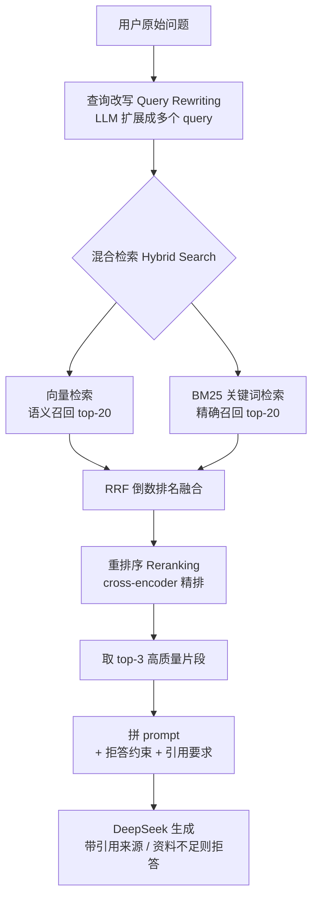

# 第 17 章 · 进阶 RAG

> 本章目标：把基础 RAG 从「能跑」升级到「好用」。
> 真实文档上，基础 RAG 经常召回不准、答非所问、甚至一本正经地胡说。本章解决这些问题。

---

## 本章目标

- [ ] 想清楚**为什么基础 RAG 不够用**：漏召回、关键词命中不了、检索到无关片段导致幻觉
- [ ] 用 **Reranking 重排序**：先粗召回 top-20，再用 cross-encoder 精排取 top-3
- [ ] 用 **Hybrid Search 混合检索**：向量检索 + BM25 关键词检索，用 RRF 融合结果
- [ ] 用 **Query Rewriting 查询改写**：让 LLM 把口语化问题扩展成多个检索友好的 query
- [ ] 用**更好的切分**：按标题/语义切、保留元数据、了解父子分块（small-to-big）
- [ ] 做**拒答与防幻觉**：资料不足时让模型回答「资料中没有」，并强制给出引用来源
- [ ] 用**元数据过滤**按文档/时间筛选检索范围

> 前置知识：第 08 章（embedding）、第 09 章（Chroma 向量库）、第 10 章（基础 RAG 链路）、第 11 章（RAG 后端）。本章假设你已经能跑通「切分 → 向量化 → 检索 → 拼 prompt → 生成」这条基础链路。

---

## 核心概念

### 1. 为什么基础 RAG 不够用

基础 RAG 的检索只有一招：把问题变成向量，去库里找**语义最接近**的几个片段。这一招在玩具数据上够用，但真实文档一上来就露馅：

| 问题 | 表现 | 根因 |
|------|------|------|
| **漏召回** | 明明文档里有答案，却没被检索到 | 向量只抓「语义相似」，问法和原文用词差太远时分数就低 |
| **关键词命中不了** | 问「错误码 E1003」，向量检索完全抓瞎 | 专有名词、编号、缩写这类「精确 token」恰恰是向量的弱项 |
| **检索到无关片段 → 幻觉** | 拼进 prompt 的片段不相关，模型照着瞎编 | top-k 里混入噪声，模型分不清「相关」和「凑数」 |
| **答非所问** | 用户问得模糊，检索方向跑偏 | 一句口语化的问题，未必是好的检索 query |

一句话总结：**基础 RAG 把所有压力都压在「一次向量检索」上，而这一步本身就不可靠。** 进阶 RAG 的思路是——在检索前后各加几道工序，让每一步都更稳。

### 2. 进阶 RAG 管线全景

我们要搭的不再是「检索一次就拼 prompt」，而是一条多级流水线：



每道工序解决一个具体问题：

- **查询改写**：解决「一种问法漏召回」——多角度发问，提高命中率。
- **混合检索**：解决「关键词命中不了」——向量管语义，BM25 管精确词。
- **RRF 融合**：把两路结果公平地合并成一个排名。
- **重排序**：解决「无关片段混入」——用更精确的模型把真正相关的顶到前面。
- **拒答 + 引用**：解决「幻觉」——没料就别编，有料就标出处。

下面逐个拆开讲，每个都给可运行代码。

### 3. 粗召回 vs 精排：为什么要两步走

这是进阶 RAG 最核心的一个直觉，单独拎出来说：

- **向量检索（bi-encoder，双塔）**：问题和文档**分别**编码成向量，比对余弦相似度。优点是文档可以提前算好向量存库，检索时只算问题向量，**极快**，适合从上万片段里**粗召回** top-20。缺点是问题和文档「各编各的」，没有交叉比对，**精度有限**。
- **重排序（cross-encoder，交叉编码）**：把「问题 + 某个文档」**拼在一起**喂给模型，输出一个相关度分数。问题和文档充分交互，**精度高**。缺点是每对都要现算，**慢**，只能对少量候选用。

所以标准套路是：**向量先快速粗召回 top-20（保证不漏），cross-encoder 再精排取 top-3（保证准）。** 鱼和熊掌兼得。

---

## 动手实践

> 本章代码复用第 02 章封装的 `llm.py`（DeepSeek 调用）、第 08 章的 BGE embedding、第 09 章的 Chroma。先装新依赖：

```bash
# 确保已激活 venv
pip install sentence-transformers rank-bm25
```

> `sentence-transformers` 同时提供 embedding 模型和 CrossEncoder 重排序模型；`rank-bm25` 是纯 Python 的 BM25 关键词检索实现，轻量无依赖。

为了让代码聚焦在「进阶技术」本身，先建一个 `retriever.py`，把第 11 章毕业项目的 `rag.py` **适配**成本章统一要用的接口。第 11 章的 `search()` 返回的是**扁平字段** `{text, source, chunk_index, distance}`，而本章后续（重排序、混合检索、引用展示）统一用 `{id, text, metadata, score}` 结构，所以这里做一层字段对齐：

```python
# retriever.py —— 把第 11 章的 rag.py 适配成本章统一接口
from rag import search          # 复用第 11 章毕业项目的向量检索

def vector_search(query: str, k: int) -> list[dict]:
    """调第 11 章 search()，补齐 id / metadata，统一成 {id, text, metadata, score}。"""
    hits = search(query, top_k=k)
    return [
        {
            "id": f"{h['source']}::{h['chunk_index']}",   # 与第 11 章入库 id 规则一致
            "text": h["text"],
            "metadata": {"source": h["source"], "chunk_index": h["chunk_index"]},
            "score": -h["distance"],   # distance 越小越相似 → 取负，使「分数越大越相似」
        }
        for h in hits
    ]
```

> ⚠️ **务必先过这层适配**：第 11 章 `search()` 没有 `id` 字段、来源放在扁平的 `source` 而非 `metadata["source"]`。本章后面会用到 `doc["id"]`（RRF 去重）和 `c["metadata"]["source"]`（引用展示），不适配会直接 `KeyError`。如果你跳过了第 11 章，也可以把第 10 章的检索函数整理成同样返回 `{id, text, metadata, score}` 的 `vector_search`。

### 实践 1：重排序 Reranking（提升精度的第一步）

先做收益最大、改动最小的一步——给现有向量检索**加一层重排序**。

新建 `rerank.py`：

```python
# rerank.py —— 用 cross-encoder 对粗召回结果精排
from sentence_transformers import CrossEncoder
from retriever import vector_search

# bge-reranker-base 是中文友好的轻量重排序模型，首次运行会自动下载
_reranker = CrossEncoder("BAAI/bge-reranker-base")


def search_with_rerank(query: str, recall_k: int = 20, top_k: int = 3) -> list[dict]:
    """先向量粗召回 recall_k，再用 cross-encoder 精排取 top_k。"""
    # 第一步：向量粗召回（快，宁可多召回也别漏）
    candidates = vector_search(query, k=recall_k)
    if not candidates:
        return []

    # 第二步：把 (问题, 候选文本) 一对对喂给 cross-encoder，得到精确相关度分数
    pairs = [(query, c["text"]) for c in candidates]
    scores = _reranker.predict(pairs)  # 返回每对的相关度分数

    # 第三步：按新分数排序，取 top_k
    for c, s in zip(candidates, scores):
        c["rerank_score"] = float(s)
    candidates.sort(key=lambda c: c["rerank_score"], reverse=True)
    return candidates[:top_k]


if __name__ == "__main__":
    results = search_with_rerank("怎么重置我的登录密码？")
    for i, r in enumerate(results, 1):
        print(f"[{i}] 分数={r['rerank_score']:.3f}  {r['text'][:50]}...")
```

```bash
python rerank.py
```

你会发现：哪怕向量检索把无关片段塞进了 top-20，重排序也能把它们沉下去，让真正相关的浮到前 3。**这是性价比最高的一次升级。**

> CrossEncoder 的分数没有固定范围（不是 0~1 的概率），它只在**同一个 query 的候选之间**比较大小有意义，别拿不同 query 的分数互相比。

### 实践 2：混合检索 Hybrid Search（向量 + BM25 + RRF）

向量检索抓语义，BM25 抓精确词，两者各有盲区，合起来才全面。

**BM25 是什么**：一种经典的关键词检索算法（搜索引擎用了几十年）。它统计「query 里的词在文档中出现的频率」，词命中得越多、越稀有，分数越高。它天生擅长**专有名词、编号、缩写**这种向量抓不住的精确匹配。

**RRF（Reciprocal Rank Fusion，倒数排名融合）**：怎么把「向量排名」和「BM25 排名」两个榜单公平地合并？RRF 的办法极简——只看**排名**不看原始分数（两者的分数量纲根本没法比）。某文档的融合分 = 在各榜单里 `1 / (k + 排名)` 之和（`k` 通常取 60，用来削弱靠后名次的权重）。在两个榜单里都靠前的文档，融合后自然最高。

新建 `hybrid.py`：

```python
# hybrid.py —— 向量检索 + BM25 关键词检索，用 RRF 融合
from rank_bm25 import BM25Okapi
from retriever import vector_search

# 假设这是你的全部文档片段（实际从 Chroma 里把 documents 拉出来即可）
CORPUS = [
    {"id": "d1", "text": "登录失败错误码 E1003 表示密码连续输错超过 5 次，账号被临时锁定。", "metadata": {"source": "FAQ.md"}},
    {"id": "d2", "text": "重置密码请进入「账号设置 - 安全」，点击「忘记密码」并验证邮箱。", "metadata": {"source": "FAQ.md"}},
    {"id": "d3", "text": "系统会在每天凌晨 3 点自动备份数据库。", "metadata": {"source": "运维手册.md"}},
    # ... 实际从第 11 章 Chroma 用 _collection.get() 拉出 documents/ids/metadatas 构造，
    #     结构与上面一致（id / text / metadata），后面的融合、引用展示才对得上
]


def _tokenize(text: str) -> list[str]:
    """极简中文分词：按字切。生产可换 jieba 等分词器以提升 BM25 效果。"""
    return list(text.replace(" ", ""))


# 预先为整个语料建好 BM25 索引（只需建一次）
_bm25 = BM25Okapi([_tokenize(d["text"]) for d in CORPUS])


def bm25_search(query: str, k: int = 20) -> list[dict]:
    """BM25 关键词检索，返回 top-k。"""
    scores = _bm25.get_scores(_tokenize(query))
    ranked = sorted(zip(CORPUS, scores), key=lambda x: x[1], reverse=True)
    return [doc for doc, _ in ranked[:k]]


def rrf_fuse(rank_lists: list[list[dict]], k: int = 60) -> list[dict]:
    """RRF 倒数排名融合：输入多个已排序的结果列表，输出融合后的列表。"""
    scores: dict[str, float] = {}
    docs: dict[str, dict] = {}
    for ranked in rank_lists:
        for rank, doc in enumerate(ranked):  # rank 从 0 开始
            doc_id = doc["id"]
            scores[doc_id] = scores.get(doc_id, 0.0) + 1.0 / (k + rank + 1)
            docs[doc_id] = doc
    fused = sorted(scores.items(), key=lambda x: x[1], reverse=True)
    return [docs[doc_id] for doc_id, _ in fused]


def hybrid_search(query: str, k: int = 20) -> list[dict]:
    """混合检索：向量 + BM25，RRF 融合。"""
    vec = vector_search(query, k=k)   # 语义召回
    kw = bm25_search(query, k=k)      # 关键词召回
    return rrf_fuse([vec, kw])


if __name__ == "__main__":
    # 这个 query 里的「E1003」是向量检索的软肋，但 BM25 能精确命中
    for r in hybrid_search("E1003 是什么意思")[:3]:
        print(r["id"], r["text"][:40])
```

```bash
python hybrid.py
```

试着对比一下：纯向量检索对「E1003」这类编号往往找不准，加了 BM25 后立刻命中 `d1`。**这就是混合检索的价值——补上向量的盲区。**

> 把 `hybrid_search` 接到实践 1 的重排序前面，就得到了「混合召回 → 重排序」的完整管线。

### 实践 3：查询改写 Query Rewriting（多角度发问）

用户问得越口语化、越简短，越容易漏召回。我们让 LLM 先把问题**扩展成多个**检索友好的 query，分别检索后再合并——这叫 **multi-query**。

新建 `query_rewrite.py`：

```python
# query_rewrite.py —— 用 LLM 把一个问题改写成多个检索 query
import json
from llm import ask  # 第 02 章封装好的 DeepSeek 调用

REWRITE_SYSTEM = """你是检索查询改写助手。把用户的问题改写成 3 个不同角度、\
更适合检索的查询语句（同义替换、补全省略、换种问法）。\
只返回 JSON 数组，例如：["查询1", "查询2", "查询3"]，不要任何多余文字。"""


def rewrite_query(question: str) -> list[str]:
    """把一个问题扩展成多个检索 query（含原始问题）。"""
    raw = ask(question, system=REWRITE_SYSTEM)
    try:
        queries = json.loads(raw)
    except json.JSONDecodeError:
        queries = []  # LLM 偶尔不听话，降级为只用原始问题
    # 始终保留原始问题，去重
    return list(dict.fromkeys([question] + queries))


if __name__ == "__main__":
    for q in rewrite_query("密码忘了咋办"):
        print("-", q)
```

把它和混合检索拼起来，就是完整的「改写 → 多路检索 → 融合」：

```python
# multi_query_search.py —— 查询改写 + 混合检索 + RRF 融合
from query_rewrite import rewrite_query
from hybrid import hybrid_search, rrf_fuse


def multi_query_search(question: str, k: int = 20) -> list[dict]:
    queries = rewrite_query(question)          # 1 → 多个 query
    rank_lists = [hybrid_search(q, k=k) for q in queries]  # 每个 query 各检索一次
    return rrf_fuse(rank_lists)                # 所有结果用 RRF 融合
```

> 注意：改写会**多调几次 LLM、多检索几次**，有成本。简单问题可以跳过改写，只对召回效果差的复杂问题启用——别无脑全开。

### 实践 4：更好的切分（切分质量决定召回上限）

再强的检索也救不了烂切分。第 10 章用的是「按固定字数硬切」，进阶要点：

**a) 按结构/标题切，而不是按字数硬切**。Markdown、规章、手册这类文档天然有标题层级，沿标题边界切能保证每块语义完整：

```python
# split_by_heading.py —— 按 Markdown 标题切分，保留标题作为上下文
def split_by_heading(markdown: str) -> list[dict]:
    chunks, current_title, buffer = [], "", []
    for line in markdown.splitlines():
        if line.startswith("#"):  # 遇到标题，先把上一段落盘
            if buffer:
                chunks.append({"title": current_title, "text": "\n".join(buffer)})
                buffer = []
            current_title = line.lstrip("# ").strip()
        else:
            buffer.append(line)
    if buffer:
        chunks.append({"title": current_title, "text": "\n".join(buffer)})
    return chunks
```

**b) 保留元数据**。入库时给每块带上来源信息，检索后既能做引用、又能做过滤：

```python
# 入库时为每个 chunk 附带元数据
chunk = {
    "text": "重置密码请进入「账号设置 - 安全」...",
    "metadata": {
        "source": "用户手册.md",   # 来自哪个文档（用于引用）
        "title": "找回密码",        # 所属章节
        "date": "2026-01-15",       # 文档日期（用于时间过滤）
    },
}
```

**c) 父子分块（small-to-big）简述**。一个两难：切**小**块检索更准（语义集中），但喂给 LLM 时上下文太碎、信息不全。父子分块的解法是——**用小块去检索，命中后却把它所在的「父块」（更大的上下文）喂给模型**。即：检索用小，生成用大。Chroma 里实现起来很简单：给每个小 chunk 的 metadata 存一个 `parent_id`，命中后按 `parent_id` 取回完整父块即可。本章不展开代码，记住这个思路即可。

### 实践 5：拒答、引用与元数据过滤（防幻觉的最后一道闸）

检索做得再好，也可能遇到「库里压根没有答案」的情况。这时**绝不能让模型硬编**——要么明确拒答，要么给出有据可查的引用。

新建 `answer.py`，把前面所有工序串成最终的问答函数：

```python
# answer.py —— 进阶 RAG 的最终生成：拒答 + 强制引用 + 元数据过滤
from llm import ask
from multi_query_search import multi_query_search
from rerank import _reranker  # 复用实践 1 的重排序模型

# 关键：用约束性 system prompt 强制「无据则拒答」「有据必引用」
ANSWER_SYSTEM = """你是严谨的知识库问答助手。只能依据【参考资料】回答，规则：
1. 如果资料中没有相关信息，必须回答「资料中没有相关内容」，禁止编造。
2. 回答末尾必须用 [来源: 文件名] 标注每条信息的出处。
3. 不要输出资料之外的任何推测。"""

REL_THRESHOLD = 0.0  # 重排序分数阈值，低于此值视为「不相关」（按你的模型实测调整）


def build_context(chunks: list[dict]) -> str:
    """把检索片段拼成带来源标注的参考资料。"""
    lines = []
    for c in chunks:
        source = c.get("metadata", {}).get("source", "未知来源")
        lines.append(f"【来源: {source}】{c['text']}")
    return "\n\n".join(lines)


def rag_answer(question: str, doc_filter: str | None = None) -> str:
    # 1. 多查询 + 混合检索，拿到候选
    candidates = multi_query_search(question, k=20)

    # 2. 元数据过滤：只保留指定文档/时间范围的片段
    if doc_filter:
        candidates = [c for c in candidates
                      if c.get("metadata", {}).get("source") == doc_filter]

    # 3. 重排序精排
    if candidates:
        pairs = [(question, c["text"]) for c in candidates]
        scores = _reranker.predict(pairs)
        for c, s in zip(candidates, scores):
            c["rerank_score"] = float(s)
        candidates.sort(key=lambda c: c["rerank_score"], reverse=True)

    # 4. 拒答闸门：没有候选，或最高分都低于阈值 → 直接拒答，不调用生成
    if not candidates or candidates[0]["rerank_score"] < REL_THRESHOLD:
        return "资料中没有相关内容。"

    top = candidates[:3]

    # 5. 拼 prompt 并生成（约束在 system 里，引用要求强制执行）
    context = build_context(top)
    prompt = f"【参考资料】\n{context}\n\n【问题】{question}"
    return ask(prompt, system=ANSWER_SYSTEM)


if __name__ == "__main__":
    print(rag_answer("E1003 是什么意思"))
    print("---")
    print(rag_answer("公司食堂今天吃什么"))  # 库里没有 → 应拒答
    print("---")
    # 元数据过滤：只在「用户手册.md」里找答案
    print(rag_answer("怎么重置密码", doc_filter="用户手册.md"))
```

```bash
python answer.py
```

三个关键点回看：

- **拒答闸门**（第 4 步）：在调用 LLM **之前**就用相关度阈值卡掉低质量检索，从源头堵住幻觉——比指望模型「自觉拒答」更可靠。
- **强制引用**（system prompt + `build_context`）：每块资料都带 `【来源: xxx】`，并要求回答里标注。用户能溯源，可信度大幅提升（呼应第 12 章前端的「引用来源展示」）。
- **元数据过滤**（第 2 步）：`doc_filter` 把检索范围限定到某个文档；同理可按 `date` 做时间过滤。实际项目里更高效的做法是把过滤条件直接传给 Chroma 的 `where` 参数，在数据库层就筛掉，而不是检索后再过滤。

---

## 常见报错

| 现象 | 原因 | 解决 |
|------|------|------|
| `ModuleNotFoundError: sentence_transformers` / `rank_bm25` | 没装依赖 | `pip install sentence-transformers rank-bm25` |
| 首次运行卡在下载、`ConnectionError` / `HFValidationError` | 在线拉 `BAAI/bge-reranker-base` 失败 | 换国内镜像：PowerShell 在**同一终端**先 `$env:HF_ENDPOINT="https://hf-mirror.com"` 再重跑（Mac/Linux 用 `export HF_ENDPOINT=https://hf-mirror.com`） |
| 重排序非常慢 | cross-encoder 是逐对计算的 | 别对 top-20 之外重排；`recall_k` 别开太大；可考虑 GPU |
| `json.JSONDecodeError`（查询改写） | LLM 没按 JSON 格式返回 | 代码已 `try/except` 降级为原始问题；可在 prompt 里更强调「只返回 JSON」 |
| BM25 对中文几乎无效、命中很差 | 「按字切」分词太粗糙 | 换 `jieba` 分词：`pip install jieba`，用 `jieba.lcut` 替换 `_tokenize` |
| 该拒答时却瞎编 | 阈值没调好 / system 约束不够强 | 用真实数据实测 `rerank_score` 分布来定 `REL_THRESHOLD`；强化 system prompt 措辞 |
| 加了重排序但效果没变好 | 粗召回阶段就把答案漏了（top-20 里根本没有） | 重排序救不了漏召回，要回头优化召回（混合检索 / 查询改写 / 切分） |

---

## 小结

- **基础 RAG 的瓶颈**在「单次向量检索」：会漏召回、抓不住精确词、混入无关片段导致幻觉。
- **重排序 Reranking**：向量粗召回 top-20 → cross-encoder（`BAAI/bge-reranker-base`）精排 top-3，性价比最高的一次升级。
- **混合检索 Hybrid Search**：向量管语义、BM25 管精确词，用 **RRF** 按排名融合两路结果，补齐盲区。
- **查询改写 Query Rewriting**：LLM 把一个口语问题扩展成多个 query（multi-query），多路检索再融合，提升召回。
- **更好的切分**：按标题/语义切、保留元数据、父子分块（small-to-big，检索用小块、生成喂父块）。
- **防幻觉三板斧**：用相关度阈值**拒答**、用 system prompt **强制引用来源**、用元数据**过滤**检索范围。
- 核心心法：**进阶 RAG = 在检索前后加工序，让每一步都更稳**，而不是指望某个模型一招制胜。

## 下一章预告

现在你的 RAG 召回准、不瞎编、还能给出处了。但一个尖锐的问题来了：**你怎么知道改进真的有效？** 「感觉变好了」不算数——换个重排序模型、调个阈值，到底是变好还是变差？

下一章我们补上工程化最关键的一环：**怎么科学地评测一个 RAG / LLM 应用**。你会学到用什么指标衡量召回质量和回答质量、怎么搭一套自动化评测集，让每次改动都有数据说话。

**← 上一章：[第 16 章：MCP](../16-mcp/README.md)**

**→ 下一章：[第 18 章：评估与测试](../18-evaluation-and-testing/README.md)**
