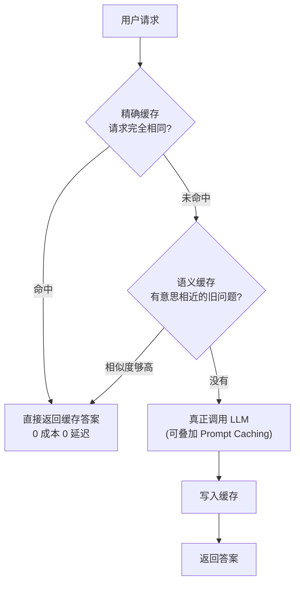

# 第 20 章 · 生产化：成本、性能与可观测

> 本章目标：让你的 AI 应用上线后**又快、又省钱、又能排查问题**。
> 第 13 章解决了「别人能不能访问」，本章解决「访问量大了之后，会不会贵到肉疼、慢到劝退、崩了都不知道为什么」。

---

## 本章目标

- [ ] 学会从 **Token 层面省钱**：精简 prompt、模型分级路由、限制 `max_tokens`、压缩历史/RAG 上下文
- [ ] 搞懂三种**缓存**：精确缓存、Prompt Caching（上下文缓存）、语义缓存，并自己写一个最简缓存
- [ ] 给 LLM 调用加上**可靠性**保障：超时、重试（指数退避）、降级备用模型、限流
- [ ] 用**异步 / 批处理 / 流式**提升并发与体感性能
- [ ] 建立**可观测性**：结构化日志记录 token/耗时/成本，了解 tracing 与 Langfuse/LangSmith/Helicone
- [ ] 把上面这些揉成一个**「带重试 + 超时 + 日志 + 成本统计」的健壮 LLM 封装**，升级第 02 章的 `llm.py`

---

## 核心概念

第 02 章的 `ask()` 函数能跑，但它是个「Demo 级」调用：没超时、没重试、不知道花了多少钱、崩了不留痕。生产环境会无情地教育它。本章就是把它从「能跑」改造成「扛得住生产」。

我们分四块讲：**省钱（成本）、缓存、可靠性、性能**，最后用**可观测性**把这一切串起来。

### 1. 成本：你花的每一分钱都是 token

回顾第 02 章：**输入（你的 messages）+ 输出（AI 的回答）都按 token 计费**，`response.usage` 能拿到本次用量。生产省钱的全部招数，归根结底就一句话——**让花钱的 token 变少，或让贵的 token 变便宜**。

四个抓手：

| 招数 | 做什么 | 前端类比 |
|------|--------|----------|
| **精简 prompt** | system prompt 别写小作文，去掉废话和重复说明 | 压缩 HTTP 请求体，别传一堆没用的字段 |
| **模型分级路由** | 简单任务用便宜模型，难任务才上贵模型 | CDN 分级：静态资源走便宜节点，动态请求才回源 |
| **限制 `max_tokens`** | 给输出设上限，避免模型「话痨」烧钱 | 后端分页 `limit`，不让一次返回全表 |
| **压缩上下文** | 多轮历史只留近几轮 + 摘要；RAG 只塞最相关的几段 | 列表虚拟滚动，只渲染可视区域那几条 |

> **模型分级路由**是性价比之王。比如「判断用户这句话是不是在骂人」这种简单分类，用最便宜的小模型就够了；只有「根据检索到的资料写一段总结」才值得上更强的模型。DeepSeek 自己也有 `deepseek-chat`（通用、便宜）和 `deepseek-reasoner`（推理强、更贵）之分，按任务难度挑。

#### 怎么把 token 换算成钱

各家定价不同，但算法一样：**输入 token 数 × 输入单价 + 输出 token 数 × 输出单价**。单价通常以「每百万 token 多少钱」标注。我们在动手实践里会把这个换算写进封装，每次调用直接打印「这次花了 ¥0.0003」。

> ⚠️ 模型的**单价随时会变**，下文代码里的价格只是占位示例。真实价格请以 [DeepSeek 官方定价页](https://platform.deepseek.com/) 为准，写进配置而不是散落在代码里。

### 2. 缓存：算过的别再花钱算第二遍

LLM 调用又慢又贵。如果同样的问题反复来，每次都真去调一次模型，纯属浪费。缓存就是「**把答案存下来，下次直接拿**」。三个层次，从简单到智能：



**① 精确缓存（exact cache）**
最简单：用「请求内容」当 key，「答案」当 value。下次来一个一模一样的请求，直接返回，**零延迟零成本**。
> 前端类比：浏览器的强缓存。同一个 URL，资源没变就直接读本地，不发请求。

**② Prompt Caching（上下文缓存）**
这是各家厂商（DeepSeek、OpenAI 等）提供的**服务端能力**，原理值得理解：
- 你的请求里往往有一大段**固定不变的前缀**——比如长长的 system prompt、RAG 塞进去的大段资料。
- 厂商把这段前缀的计算结果**缓存在它的服务器上**。下次你发来相同前缀，它不用重新「读」一遍，直接复用。
- 效果：**命中缓存的输入 token 大幅降价**（DeepSeek 命中缓存的输入价可低至未命中的几分之一），延迟也更低。
- 你几乎不用改代码——只要保证**把固定不变的内容放在 messages 前面、把变化的部分放后面**，命中率自然就高。

> 前端类比：HTTP 协商缓存里的「公共部分」。把不变的大块内容稳定地放在前缀，就像把公共依赖打成一个长效缓存的 vendor chunk，每次只变业务代码那一小块。

**③ 语义缓存（semantic cache）**
精确缓存有个死穴：「什么是 RAG？」和「RAG 是啥意思？」是两个不同的字符串，精确缓存认为它们不一样，于是各调一次模型。**语义缓存**用第 08 章学的 **embedding** 解决：把问题转成向量，新问题来了先算向量相似度，**够相似就复用旧答案**。
> 前端类比：防抖（debounce）的思路——意思差不多的连续操作，合并成一次真正的执行。

### 3. 可靠性：网络会抖，模型会超时，钱包不会等

调外部 API 永远要假设「**它随时可能失败或变慢**」。四道防线：

| 防线 | 解决什么 | 做法 |
|------|----------|------|
| **超时（timeout）** | 模型卡住，请求挂死 | 给调用设一个最长等待时间，超了就放弃 |
| **重试 + 指数退避（backoff）** | 偶发网络抖动、限流 | 失败后等一会儿再试，等待时间逐次翻倍 |
| **降级 / 备用模型（fallback）** | 主模型挂了或额度用尽 | 自动切到备用模型，保证「有总比没有强」 |
| **限流（rate limiting）** | 接口被刷爆、烧光余额 | 限制每个用户/IP 单位时间的请求数（呼应第 19 章安全） |

**指数退避**是关键概念：第一次失败等 1 秒重试，再失败等 2 秒，再失败等 4 秒……为什么不固定等 1 秒？因为如果是「服务端过载」导致的失败，大家都死命固定间隔重试，只会让它更崩。退避就是给对方喘息空间。

> 前端类比：你写前端请求时大概用过 `axios-retry`，或者 fetch 失败后 `setTimeout` 重试——指数退避就是把「重试间隔越来越长」这件事做对。限流则呼应第 19 章：后端替用户调 DeepSeek 等于用你的余额付费，不限流 = 钱包敞开给人刷。

### 4. 性能：让用户少等

| 手段 | 作用 | 呼应 |
|------|------|------|
| **流式（streaming）** | 不等全部生成完，先吐第一个字，**首字延迟（TTFT）大幅下降** | 第 04 章已做过流式接口 |
| **异步（async）** | 一个请求等 LLM 时，CPU 去处理别的请求，吞吐量上去 | FastAPI 原生支持 `async def` |
| **批处理（batching）** | 多个独立任务（如批量打标签）并发发出，而不是一个个排队 | 类似前端 `Promise.all` |

> **流式**对体感的提升最划算：模型生成 10 秒的回答，流式让用户在第 0.5 秒就看到字开始动，等待焦虑消失大半。这就是为什么第 04、05 章一路坚持做流式。

### 5. 可观测性（Observability）：上线后你的眼睛

本地调试有 `print`，生产环境呢？请求在服务器上跑，出了问题你**看不见**。可观测性就是给系统装「监控摄像头」，三件套：

- **结构化日志（structured logging）**：每次调用都记一条**机器可读**的日志（JSON），含：请求内容摘要、用了哪个模型、token 数、耗时、成本、成功/失败。
- **链路追踪（tracing）**：一次 RAG 问答可能跨「检索 → 拼 prompt → 调 LLM」多步，tracing 把这几步串成一条**带时间轴的链路**，一眼看出慢在哪。
- **监控指标（metrics）**：把日志聚合成图表——今天调了多少次、平均耗时、总花了多少钱、失败率多高。

> 前端类比：这就是前端的**埋点 + APM（性能监控）**。你给按钮加埋点、用 Sentry 收集报错、看 PV/UV 曲线——后端 AI 应用一样需要这套「数据眼睛」。

**现成工具**（不用自己造轮子）：

| 工具 | 定位 | 特点 |
|------|------|------|
| **Langfuse** | 开源 LLM 可观测平台 | 可自托管，记录 trace、token、成本，社区活跃 |
| **LangSmith** | LangChain 官方平台 | 与 LangChain（第 21 章）深度集成，调试链路强 |
| **Helicone** | 代理式监控 | 改一行 `base_url` 即可接入，几乎零侵入 |

> 学习阶段，**先把结构化日志写好**（下面就做），就已经覆盖了 80% 的排查需求。等应用真正长大、链路变复杂，再接 Langfuse 这类平台看可视化面板。

---

## 动手实践

我们把第 02 章的 `llm.py` 升级成生产级的 `robust_llm.py`：**超时 + 重试退避 + 备用模型降级 + 精确缓存 + 结构化日志 + 成本统计**，一应俱全。代码较长，但每一块都对应上面讲的一个概念，照着读下来就懂。

### 步骤 1：准备配置（价格与模型分级）

价格、模型名这些「会变的东西」要放配置，别写死在逻辑里。在 `.env`（第 00 章那份）里补几行：

```bash
# 模型分级：简单任务用便宜的，难任务用强的
DEEPSEEK_MODEL=deepseek-chat
DEEPSEEK_MODEL_CHEAP=deepseek-chat
DEEPSEEK_MODEL_STRONG=deepseek-reasoner

# 价格（元 / 百万 token，占位示例，以官方为准）
PRICE_INPUT_PER_M=1.0
PRICE_OUTPUT_PER_M=2.0
```

### 步骤 2：成本计算 + 结构化日志（两个小工具）

新建 `observability.py`，把「算钱」和「记日志」单独抽出来，职责清晰：

```python
# observability.py —— 成本计算与结构化日志
import os
import json
import logging
from dotenv import load_dotenv

load_dotenv()

# 配置一个最简的结构化日志器：每条日志是一行 JSON，方便机器解析/采集
logging.basicConfig(level=logging.INFO, format="%(message)s")
_logger = logging.getLogger("llm")

# 从配置读单价（元 / 每百万 token）
_PRICE_IN = float(os.getenv("PRICE_INPUT_PER_M", "0"))
_PRICE_OUT = float(os.getenv("PRICE_OUTPUT_PER_M", "0"))


def calc_cost(prompt_tokens: int, completion_tokens: int) -> float:
    """根据 token 用量算出这次调用花了多少钱（元）。"""
    return (prompt_tokens * _PRICE_IN + completion_tokens * _PRICE_OUT) / 1_000_000


def log_call(record: dict) -> None:
    """把一次调用的关键信息记成一行 JSON 日志。"""
    # ensure_ascii=False 让中文正常显示而不是 \uXXXX
    _logger.info(json.dumps(record, ensure_ascii=False))
```

> 为什么日志要写成 **JSON 一行**而不是随手 `print`？因为生产环境的日志会被采集工具（如 Loki、ELK）抓走做检索和聚合——**结构化**才能按 `model`、`cost`、`error` 等字段过滤统计。这就像前端埋点上报的是结构化事件，而不是一句句大白话。

### 步骤 3：健壮的 LLM 封装

新建 `robust_llm.py`。这是本章的核心产出：

```python
# robust_llm.py —— 生产级 LLM 调用封装
# 在第 02 章 llm.py 基础上加：超时 + 重试退避 + 降级 + 精确缓存 + 日志 + 成本
import os
import time
import hashlib
import json
from dotenv import load_dotenv
from openai import OpenAI, APITimeoutError, APIConnectionError, RateLimitError
from observability import calc_cost, log_call

load_dotenv()

_client = OpenAI(
    api_key=os.getenv("DEEPSEEK_API_KEY"),
    base_url=os.getenv("DEEPSEEK_BASE_URL"),
    timeout=30.0,        # ← 防线①：单次请求最多等 30 秒，超了抛 APITimeoutError
    max_retries=0,       # 关掉 SDK 内置重试，我们自己控制退避逻辑
)

_MODEL_DEFAULT = os.getenv("DEEPSEEK_MODEL", "deepseek-chat")
_MODEL_STRONG = os.getenv("DEEPSEEK_MODEL_STRONG", "deepseek-reasoner")

# ---------- 防线②：精确缓存（进程内，最简实现）----------
# 真实生产会用 Redis 等共享缓存，这里用字典演示原理足够
_cache: dict[str, str] = {}


def _cache_key(messages: list, model: str, max_tokens: int) -> str:
    """把决定结果的所有输入拼起来做哈希，作为缓存 key。"""
    raw = json.dumps([messages, model, max_tokens], ensure_ascii=False, sort_keys=True)
    return hashlib.sha256(raw.encode("utf-8")).hexdigest()


def chat(
    messages: list,
    model: str | None = None,
    max_tokens: int = 1024,   # ← 防线③：限制输出长度，避免话痨烧钱
    use_cache: bool = True,
    max_attempts: int = 3,    # 最多尝试 3 次
) -> str:
    """生产级对话调用：带缓存、重试退避、超时、降级、日志、成本统计。"""
    model = model or _MODEL_DEFAULT

    # 1) 先查精确缓存：命中就直接返回，0 成本 0 延迟
    key = _cache_key(messages, model, max_tokens)
    if use_cache and key in _cache:
        log_call({"event": "cache_hit", "model": model, "cost": 0})
        return _cache[key]

    # 2) 重试循环：指数退避
    last_error = None
    for attempt in range(1, max_attempts + 1):
        start = time.time()
        try:
            resp = _client.chat.completions.create(
                model=model,
                messages=messages,
                max_tokens=max_tokens,
            )
            answer = resp.choices[0].message.content
            usage = resp.usage
            cost = calc_cost(usage.prompt_tokens, usage.completion_tokens)

            # 成功：记结构化日志（含 token / 耗时 / 成本）
            log_call({
                "event": "success",
                "model": model,
                "attempt": attempt,
                "prompt_tokens": usage.prompt_tokens,
                "completion_tokens": usage.completion_tokens,
                "latency_ms": int((time.time() - start) * 1000),
                "cost": round(cost, 6),
            })

            if use_cache:
                _cache[key] = answer
            return answer

        except (APITimeoutError, APIConnectionError, RateLimitError) as e:
            # 这些是「可重试」的错误（超时/网络/限流）
            last_error = e
            log_call({
                "event": "retryable_error",
                "model": model,
                "attempt": attempt,
                "error": type(e).__name__,
            })
            if attempt < max_attempts:
                # 指数退避：1s, 2s, 4s...
                time.sleep(2 ** (attempt - 1))

    # 3) 防线④：重试都失败 → 降级到备用模型（只降级一次，避免无限递归）
    #    这里用 _MODEL_STRONG 只是演示「切换到另一个模型」这一机制本身；
    #    生产中备用模型应选更稳定/同级的（reasoner 更慢，超时场景下反而更易再超时），
    #    可单独配一个 DEEPSEEK_MODEL_FALLBACK。
    if model != _MODEL_STRONG:
        log_call({"event": "fallback", "from": model, "to": _MODEL_STRONG})
        # 注意 use_cache 照常，但关掉重试里再降级（已是备用模型）
        return chat(messages, model=_MODEL_STRONG, max_tokens=max_tokens,
                    use_cache=use_cache, max_attempts=1)

    # 4) 实在不行：抛出最后一次错误，让上层决定怎么提示用户
    log_call({"event": "give_up", "error": type(last_error).__name__})
    raise last_error


# 兼容第 02 章的简单接口：ask() 内部走 chat()
def ask(question: str, system: str = "你是一个乐于助人的助手") -> str:
    return chat([
        {"role": "system", "content": system},
        {"role": "user", "content": question},
    ])


if __name__ == "__main__":
    # 自测：连问两次同样的问题，第二次应命中缓存（看日志里的 cache_hit）
    print(ask("用一句话解释什么是缓存"))
    print(ask("用一句话解释什么是缓存"))
```

运行：

```bash
python robust_llm.py
```

你会看到**两行答案 + 三行 JSON 日志**：第一次是 `success`（带 token 和 cost），第二次直接 `cache_hit`（cost 为 0）。这就是缓存省钱的直观体现。

> 把第 02 章的 `from llm import ask` 换成 `from robust_llm import ask`，后面所有章节的调用就**自动获得**了超时、重试、降级、缓存、成本统计——一次升级，全课受益。这正是「封装」的价值。

### 步骤 4（选做）：模型分级路由

省钱的大头是「简单任务别用贵模型」。加一个极简路由：

```python
# 在 robust_llm.py 里加：按任务复杂度选模型
def smart_chat(messages: list, complex_task: bool = False) -> str:
    """简单任务走便宜模型，复杂任务走强模型。"""
    model = _MODEL_STRONG if complex_task else os.getenv("DEEPSEEK_MODEL_CHEAP", "deepseek-chat")
    return chat(messages, model=model)
```

判断 `complex_task` 可以简单粗暴（比如「输入很长 / 要求推理」就为 True），也可以再花一次极便宜的小模型调用来分类——权衡「分类的成本」和「省下的成本」即可。

### 步骤 5（选做）：异步与批处理

要并发处理多个独立任务（如给 100 条评论批量打标签），用异步客户端 + `asyncio.gather`，效果类似前端 `Promise.all`：

```python
# 批处理示例：并发给多条文本分类，而不是一条条排队
import asyncio
from openai import AsyncOpenAI

_aclient = AsyncOpenAI(
    api_key=os.getenv("DEEPSEEK_API_KEY"),
    base_url=os.getenv("DEEPSEEK_BASE_URL"),
    timeout=30.0,
)


async def _classify(text: str) -> str:
    resp = await _aclient.chat.completions.create(
        model=os.getenv("DEEPSEEK_MODEL_CHEAP", "deepseek-chat"),
        messages=[{"role": "user", "content": f"这句话情绪是正面还是负面，只回一个词：{text}"}],
        max_tokens=5,
    )
    return resp.choices[0].message.content.strip()


async def classify_batch(texts: list[str]) -> list[str]:
    # 同时发出所有请求，总耗时≈最慢的一条，而不是全部相加
    return await asyncio.gather(*[_classify(t) for t in texts])


# 用法：asyncio.run(classify_batch(["太好用了", "垃圾，退款"]))
```

> 注意：批处理时仍要受**限流**约束——别一口气并发几千个请求把账号刷限流了。生产里常用「信号量（`asyncio.Semaphore`）」控制最大并发数，原理懂即可。

---

## 常见报错

| 现象 | 原因 | 解决 |
|------|------|------|
| `APITimeoutError` 频繁出现 | `timeout` 设太短，或网络/模型确实慢 | 适当调大 `timeout`（如 60s）；确认本身就用了重试退避兜底 |
| 重试反而更慢、把人等崩 | `max_attempts` 太大 + 退避叠加，总等待时间过长 | 限制次数（3 次内）；给整体调用也设上限；对用户侧及时降级提示 |
| `cache_hit` 永远不出现 | 请求里带了变动内容（如时间戳、随机 id）导致 key 每次都不同 | 缓存 key 只纳入**真正决定结果**的字段，剔除噪声 |
| Prompt Caching 没省到钱 | 把变化的内容放在了 messages 前面，前缀不稳定 | 固定不变的大段内容（system、资料）放前面，变化部分放后面 |
| 成本算出来是 0 或离谱 | `.env` 里价格没配 / 配错单位 | 检查 `PRICE_*_PER_M`，确认单位是「每百万 token」，以官方价为准 |
| 降级后还是失败并报错 | 备用模型也挂了 / 额度也用尽 | 这是「最后防线」，应在上层 `try/except` 给用户友好提示，而非把异常直接抛给前端 |
| `RateLimitError` / 429 | 并发太高或触发账号限流 | 降低并发（信号量）、加退避；自己也对用户侧加限流（呼应第 19 章） |
| 异步代码报 `RuntimeError: event loop` | 在已有事件循环里又 `asyncio.run()` | 在 FastAPI 这类异步框架里直接 `await`，不要再开新循环 |

---

## 小结

- **成本**的本质是 token：精简 prompt、**模型分级路由**（简单任务用便宜模型）、限制 `max_tokens`、压缩历史/RAG 上下文，用 `usage` 把每次调用换算成钱。
- **缓存**三层：精确缓存（相同请求直接返回）、**Prompt Caching**（把固定前缀放前面，命中厂商服务端缓存大幅降本）、语义缓存（用 embedding 命中相似问题）。
- **可靠性**四防线：超时、重试 + **指数退避**、降级备用模型、限流（呼应第 19 章安全）。
- **性能**：流式降首字延迟、异步提吞吐、批处理并发——延续第 04 章的流式思路。
- **可观测性**：结构化日志（记 token/耗时/成本）是排查地基，链路 tracing 看慢在哪，再用 **Langfuse / LangSmith / Helicone** 做可视化监控——就是后端版的「埋点 + APM」。
- 产出了 `robust_llm.py`：**一次封装，全课调用都自动获得超时、重试、降级、缓存、成本统计**。

至此，你的 AI 应用不只是「能上线」，而是「上线后扛得住、省得下、看得见」——具备了真正的生产素质。

## 下一章预告

到这里你已经手写了 RAG 的每一个环节、调用的每一道防线。你会发现很多模式（链式调用、记忆管理、检索、可观测）是**反复出现的通用套路**——既然这么通用，自然有人把它们做成了框架。

下一章我们认识两个主流的 LLM 应用框架 **LangChain** 与 **LlamaIndex**：看看它们如何把你这一路手搓的东西标准化，以及——什么时候该用框架、什么时候手写反而更清爽。

**← 上一章：[第 19 章：安全与提示注入防护](../19-security-prompt-injection/README.md)**
**→ 下一章：[第 21 章：框架入门 LangChain 与 LlamaIndex](../21-frameworks-langchain-llamaindex/README.md)**
